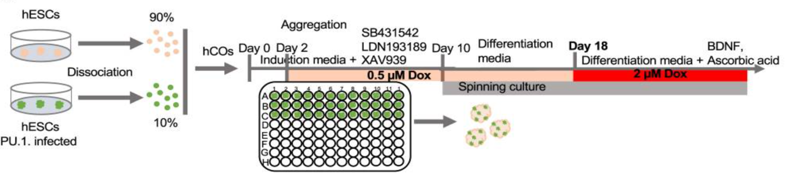
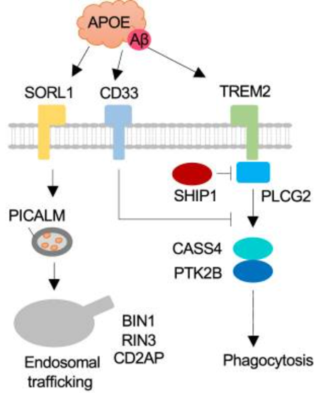
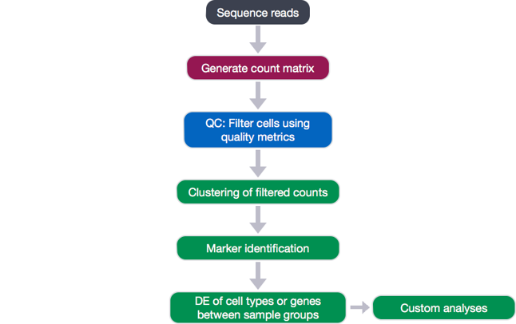
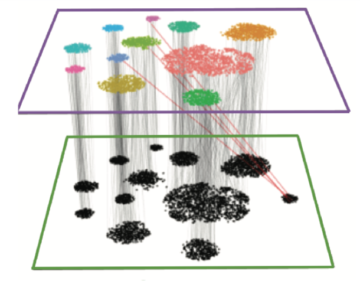

# scRNA-seq exploring microglia role in Alzheimer disease
This repository contains the analyses of transcriptomic data, derived from functional microglia in human cortical organoids (hCOs), derived from human embryonic stem cells (hESCs) to study the role of microglia during inflammation induced by amyloid-β (Aβ) in Alzheimer's disease(AD).

See [hCO+hCO_aβ](hCO+hCOab_GitHubMD.md) for an example of the detailed analyses.

reference: Cakir, Bilal et al.,
[“Expression of the transcription factor PU.1 induces the generation of microglia-like cells in human cortical organoids.”](https://www.nature.com/articles/s41467-022-28043-y)
, Nature communications vol. 13,1 430. 20 Jan. 2022

## Introduction
Alzheimer's disease is the most common cause of dementia and currently, more than 55 million people live with dementia worldwide. AD may contribute to 60-70% of cases, and it is currently the seventh leading cause of death among all diseases. The accumulation of Aβ peptides, and their aggregation and deposition in amyloid plaques, is a key pathogenic mechanism in AD. Currently, there is no treatment that cures Alzheimer's disease or alters the disease process in the brain. Drugs targeting amyloid-β have been unsuccessful. Therefore, it is important to study microglia and dissect their role in the disease state.

## Purpose
The purpose of this project is to investigate the human microglia functions in the context of Alzheimer's disease. To achieve this, we collected transcriptomic data, coming from functional microglia in human cortical organoids (hCOs), derived from human embryonic stem cells (hESCs) to study the role of microglia during inflammation induced by amyloid-β (Aβ).
  
   
  

  
                                                                      
                                                                                                                                            

## Methodology

We explored the role of AD-linked genes in responding to Aβ treatment using mhCO cells. CRISPRi (CRISPR interference) coupled with CRISPR  droplet sequencing (CROP-seq) format was used to suppress the expression of AD-linked genes,involved in endocytic trafficking, degradation, and phagocytosis of Aβ. 

We retrieved data from GEO [GSE175722](https://www.ncbi.nlm.nih.gov/geo/query/acc.cgi?acc=GSE175722), which contains, among others: 
* GSM5345017	hCO
* GSM5345018	hCO+Aβ
* GSM5345019	mhCO
* GSM5345020	mhCO+Aβ
* GSM5345024	mhCO+Aβ [CROP-seq]

Even though in the article, the repression of AD-associated genes did not alter the expression of microglia markers in mhCOs, suggesting a successful formation of cortical organoids with microglia, our results do not seem to agree with the researcher's data. In fact, we found little to no sign of microglia activation in engineered mhCOs. We used that finding to assess the removal of microglial protective role on mhCOs parenchyma homeostasis.

## Workflow

   

 

### Integration

Our motivation for integrating diverse datasets lies in the potential for the information present in one experiment to inform the interpretation of another. In order to relate different experiments to each other, we assume that there are correspondences between datasets and that at least a subset of cells represent a shared biological state.

## Conclusion
This repository contains the analyses of transcriptomic data, derived from functional microglia in human cortical organoids (hCOs), derived from human embryonic stem cells (hESCs) to study the role of microglia during inflammation induced by amyloid-β (Aβ) in AD. 
### Results
* Single-cell transcriptomics reveals that microglia in mhCOs protect parenchyma from cellular and molecular damage caused by Aβ. 
* Furthermore, in mhCOs, was observed reduced expression of Aβ-induced expression of genes associated with apoptosis, ferroptosis, and Alzheimer’s disease (AD).
* Finally, the protective role microglia was assessed in AD in response to Aβ thanks to single-cell RNA sequencing on mhCOs that underwent pooled CRISPR, suppressing the formation of microglia and restored the absence of microglia phenotype present in hCOs.
* Importantly, we also found correlation between Alzheimer’s, Parkinson’s and Huntington's diseases.

## Next steps
To this day, no effective cure for Alzheimer’s disease exists. Drugs targeting amyloid-β has been unsuccessful and maintenance of still vital synapses and their functionality does not propose a long-term solution. The perspective could be to inhibit microglia cells inflammation so it will destroy only damaged neurons. To manipulate microglia functions we need to flawlessly understand these cells and their role.

Further studies with organoids containing microglia-like cells could be carried out. It is necessary to continue it by integrating data with transcriptomic data profiles coming from AD patients or by engrafting cells in the mouse brain to produce an in-vivo model.

