Human cortical organoids derived from human embryonic stem cells with
and without Aβ treatment: scRNA seq analysis.
================
Mirco Macchi & Ugne Kisieliute

- tissue: human cortical organoids (hCOs) derived from human embryonic
  stem cells (hESCs) and treated Aβ. 
- Platforms Illumina HiSeq 4000
- species: *Homo sapiens*
- Source: GEO
  [GSE175722](https://www.ncbi.nlm.nih.gov/geo/query/acc.cgi?acc=GSE175722)

contact: <mirco.macchi@live.it>

###### The goal of the project is to assess the induction of inflammation within the CNS, such as during inflammation induced by amyloid-β (Aβ), in human cortical organoid derived from hESCs.

Load the libraries and the files needed

``` r
{
  library(DESeq2)
  library(ggplot2)
  library(Seurat)
  library(dplyr)
  library(patchwork)
  library(Matrix)
  library(tibble)
  
}
```

``` r
setwd("D:/OneDrive - Università degli Studi di Milano/PoliMirco/Secondo anno/Primo semestre/Neurogenomics/Exam/microglia-like/hCO/")

hCO <- ReadMtx(mtx = "GSM5345017_hCO_matrix.mtx.gz", 
               features = "GSM5345017_hCO_features.tsv.gz",
               cells = "GSM5345017_hCO_barcodes.tsv.gz")

hCO_b <- ReadMtx(mtx = "hCO+AB/GSM5345018_hCOAB_matrix.mtx", 
                 features = "hCO+AB/GSM5345018_hCOAB_features.tsv",
                 cells = "hCO+AB/GSM5345018_hCOAB_barcodes.tsv")


hCO <- CreateSeuratObject(counts = hCO, project = "hCO",
                          min.cells = 3, min.features = 200)
```

    ## Warning: Feature names cannot have underscores ('_'), replacing with dashes
    ## ('-')

``` r
hCO
```

    ## An object of class Seurat 
    ## 23840 features across 13414 samples within 1 assay 
    ## Active assay: RNA (23840 features, 0 variable features)

``` r
hCO_b <- CreateSeuratObject(counts = hCO_b, project = "hCO_b",
                            min.cells = 3, min.features = 200)
```

    ## Warning: Feature names cannot have underscores ('_'), replacing with dashes
    ## ('-')

``` r
hCO_b
```

    ## An object of class Seurat 
    ## 24604 features across 9559 samples within 1 assay 
    ## Active assay: RNA (24604 features, 0 variable features)

Adding metadata

``` r
hCO$type = "hCO_ctrl"
hCO_b$type = "hCO+b.amyloid"
```

Merge both samples into one data.frame

``` r
hCOall <- merge(hCO, y = hCO_b, add.cell.ids = c("hCO", "hCO_b"), project = "Exam")
head(hCOall)
```

    ##                        orig.ident nCount_RNA nFeature_RNA     type
    ## hCO_AAACCCAAGACATAAC-1        hCO       7141         2985 hCO_ctrl
    ## hCO_AAACCCAAGAGAGCAA-1        hCO       6719         2798 hCO_ctrl
    ## hCO_AAACCCAAGCTAATGA-1        hCO        618          494 hCO_ctrl
    ## hCO_AAACCCAAGTCATACC-1        hCO        834          579 hCO_ctrl
    ## hCO_AAACCCACAAATTGGA-1        hCO        869          643 hCO_ctrl
    ## hCO_AAACCCACAAGGTACG-1        hCO       8724         3548 hCO_ctrl
    ## hCO_AAACCCACAATAAGGT-1        hCO       6238         2813 hCO_ctrl
    ## hCO_AAACCCACACGTGTGC-1        hCO       3545         2098 hCO_ctrl
    ## hCO_AAACCCACATAGCTGT-1        hCO       6503         2522 hCO_ctrl
    ## hCO_AAACCCAGTAGTGCGA-1        hCO        510          419 hCO_ctrl

``` r
tail(hCOall)
```

    ##                          orig.ident nCount_RNA nFeature_RNA          type
    ## hCO_b_TTTGTTGAGATGTTGA-1      hCO_b       1341          615 hCO+b.amyloid
    ## hCO_b_TTTGTTGAGGCTATCT-1      hCO_b      20810         4340 hCO+b.amyloid
    ## hCO_b_TTTGTTGAGTTTGTCG-1      hCO_b       2259         1425 hCO+b.amyloid
    ## hCO_b_TTTGTTGCAGTATTCG-1      hCO_b       3954         2255 hCO+b.amyloid
    ## hCO_b_TTTGTTGCATATGGCT-1      hCO_b       1860         1170 hCO+b.amyloid
    ## hCO_b_TTTGTTGGTAAGCGGT-1      hCO_b       6437         3012 hCO+b.amyloid
    ## hCO_b_TTTGTTGGTATCGATC-1      hCO_b        605          429 hCO+b.amyloid
    ## hCO_b_TTTGTTGGTGAGTGAC-1      hCO_b       6154         2597 hCO+b.amyloid
    ## hCO_b_TTTGTTGTCGGTCTGG-1      hCO_b       8140         3880 hCO+b.amyloid
    ## hCO_b_TTTGTTGTCTGTAAGC-1      hCO_b       5043         2614 hCO+b.amyloid

remove all objects that will not be used.

``` r
rm(hCO,hCO_b)
gc()
```

    ##             used   (Mb) gc trigger   (Mb)  max used   (Mb)
    ## Ncells   7845552  419.0   12414528  663.1  11584736  618.7
    ## Vcells 173879538 1326.6  419639163 3201.6 336494355 2567.3

Check first ten genes counts across the first two columns(cells).

``` r
as.data.frame(hCOall@assays$RNA@counts[1:10, 1:2])
```

    ##               hCO_AAACCCAAGACATAAC-1 hCO_AAACCCAAGAGAGCAA-1
    ## RP11-34P13.7                       0                      0
    ## RP11-34P13.8                       0                      0
    ## AL627309.1                         0                      0
    ## RP11-34P13.9                       0                      0
    ## AP006222.2                         0                      2
    ## RP4-669L17.10                      0                      0
    ## RP5-857K21.4                       0                      0
    ## RP11-206L10.3                      0                      0
    ## RP11-206L10.5                      0                      0
    ## RP11-206L10.4                      0                      0

Adding a tag containing information about MT and ribosomal genes

``` r
hCOall <- PercentageFeatureSet(hCOall, "^MT-", col.name = "percent_mito")
hCOall <- PercentageFeatureSet(hCOall, "^RP[SL]", col.name = "percent_ribo")
head(hCOall)
```

    ##                        orig.ident nCount_RNA nFeature_RNA     type percent_mito
    ## hCO_AAACCCAAGACATAAC-1        hCO       7141         2985 hCO_ctrl     4.537180
    ## hCO_AAACCCAAGAGAGCAA-1        hCO       6719         2798 hCO_ctrl     9.331746
    ## hCO_AAACCCAAGCTAATGA-1        hCO        618          494 hCO_ctrl     2.588997
    ## hCO_AAACCCAAGTCATACC-1        hCO        834          579 hCO_ctrl     1.678657
    ## hCO_AAACCCACAAATTGGA-1        hCO        869          643 hCO_ctrl     4.602992
    ## hCO_AAACCCACAAGGTACG-1        hCO       8724         3548 hCO_ctrl     0.217790
    ## hCO_AAACCCACAATAAGGT-1        hCO       6238         2813 hCO_ctrl     5.402373
    ## hCO_AAACCCACACGTGTGC-1        hCO       3545         2098 hCO_ctrl     4.315938
    ## hCO_AAACCCACATAGCTGT-1        hCO       6503         2522 hCO_ctrl    14.900815
    ## hCO_AAACCCAGTAGTGCGA-1        hCO        510          419 hCO_ctrl     1.372549
    ##                        percent_ribo
    ## hCO_AAACCCAAGACATAAC-1    11.665033
    ## hCO_AAACCCAAGAGAGCAA-1    11.980950
    ## hCO_AAACCCAAGCTAATGA-1     3.721683
    ## hCO_AAACCCAAGTCATACC-1     2.637890
    ## hCO_AAACCCACAAATTGGA-1     6.559264
    ## hCO_AAACCCACAAGGTACG-1    15.508941
    ## hCO_AAACCCACAATAAGGT-1    10.804745
    ## hCO_AAACCCACACGTGTGC-1     6.431594
    ## hCO_AAACCCACATAGCTGT-1    17.345840
    ## hCO_AAACCCAGTAGTGCGA-1     4.705882

We will then retrieve every feature pointing at ribosomial information
and store it into a vector.

``` r
ribo_genes <- rownames(hCOall)[grep("^RP[SL]", rownames(hCOall))]
head(ribo_genes, 10)
```

    ##  [1] "RPL22"   "RPL11"   "RPS6KA1" "RPS8"    "RPL5"    "RPS27"   "RPS10P7"
    ##  [8] "RPS6KC1" "RPS7"    "RPS27A"

# Quality Control

## QC - I

As a first proxy for quality control, we will inspect the transcipt
abundance, and relative percentage of mitochondrial transcript in our
samples of interest.

``` r
feats <- c("nFeature_RNA", "nCount_RNA", "percent_mito", "percent_ribo")
VlnPlot(hCOall, group.by = "orig.ident", features = feats, pt.size = 0.1, ncol = 3) +
  NoLegend()
```

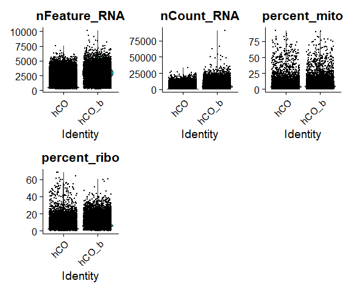<!-- -->

hCO_b sample has higher trascriptional activity

The number of features (nrow) and cells (ncol).

``` r
dim(hCOall)
```

    ## [1] 25374 22973

numer of cells/sample

``` r
table(hCOall$orig.ident)
```

    ## 
    ##   hCO hCO_b 
    ## 13414  9559

Additionally, we can also see which genes contribute the most to such
reads transcriptional activity.

For instance, we will plot the percentage of counts per gene.

``` r
par(mar = c(4, 8, 2, 1))
C <- hCOall@assays$RNA@counts
C <- Matrix::t(Matrix::t(C)/Matrix::colSums(C)) * 100
most_expressed <- order(apply(C, 1, median), decreasing = T)[20:1]
```

    ## Warning in asMethod(object): sparse->dense coercion: allocating vector of size
    ## 4.3 GiB

``` r
boxplot(as.matrix(t(C[most_expressed, ])), cex = 0.1, las = 1, xlab = "% total count per cell",
        col = (scales::hue_pal())(20)[20:1], horizontal = TRUE)
```

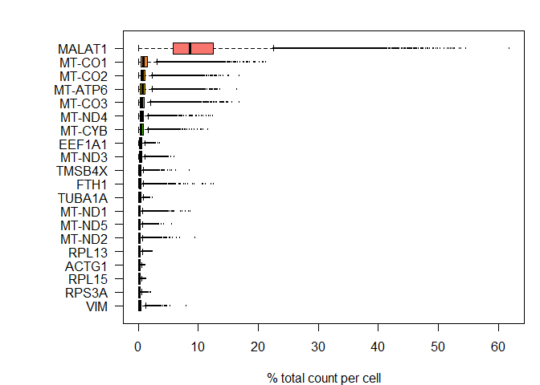

As you can see, MALAT1 constitutes up to 50% (and even 60%) of the UMIs
from a single cell and the other top genes are mitochondrial and
ribosomal genes. It is quite common that nuclear lincRNAs have
correlation with poor quality and mitochondrial reads, so high detection
of MALAT1 may be a technical issue.

Looking at the plots, we can make reasonable decisions on where to draw
the cutoff. In this case, the bulk of the cells are below 30%
mitochondrial reads and that will be used as a cutoff. We chose this
threshold, although highly permissiv and recommend to be stricter, to
avoid cutting off cells that may indeed be useful in the further steps.

We will also remove cells with less than 2.5% ribosomal reads.

``` r
hCOall <- subset(hCOall, subset = nFeature_RNA > 200 & nFeature_RNA < 7500 &
                      percent_mito < 30 & nCount_RNA < 35000 & percent_ribo > 0.025)
```

Let’s count how many cells we have left in every sample

``` r
table(hCOall$orig.ident)
```

    ## 
    ##   hCO hCO_b 
    ## 13174  9266

## Quality Control - II

We might repeat our visual inspection of the transcriptional activity
and % of mitochondrial transcripts in our sample

``` r
feats <- c("nFeature_RNA", "nCount_RNA", "percent_mito", "percent_ribo")
VlnPlot(hCOall, group.by = "orig.ident", features = feats, pt.size = 0.1, ncol = 3) +
  NoLegend()
```

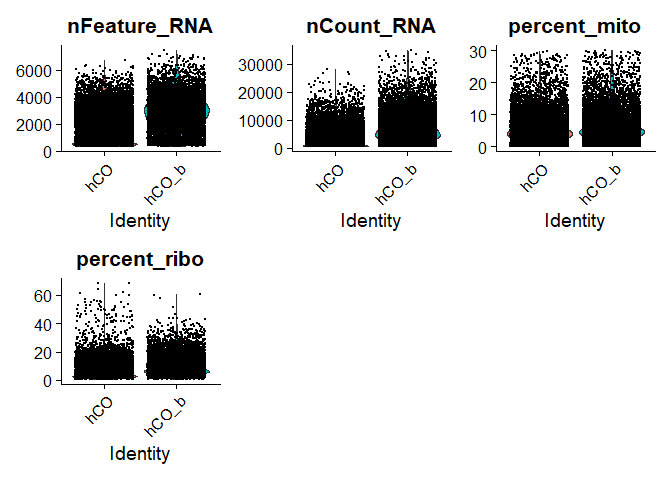

``` r
dim(hCOall)
```

    ## [1] 25374 22440

Filter MALAT1 to avoid skewing our analyses:

``` r
hCOall <- hCOall[!grepl("MALAT1", rownames(hCOall)), ]
```

We don’t flush out MT and Ribosomial reads beacuse it didn’t affect the
differential expression substantially, even though you may want to check
also this step and see how the result are affected.

\#Filter Mitocondrial \#hCOall \<- hCOall\[!grepl(“^MT-”,
rownames(hCOall)), \]

\#Filter Ribosomal gene \#hCOall \<- hCOall\[ ! grepl(‘^RP\[SL\]’,
rownames(hCOall)), \]

``` r
dim(hCOall)
```

    ## [1] 25373 22440

## - Data splitting:

split the dataset in two different seurat objects which can be recalled
thanks to their original identifier.

``` r
hCO.split <- SplitObject(hCOall, split.by = "orig.ident")
```

normalize and identify variable features for each dataset independently.

``` r
hCO.split <- lapply(X = hCO.split, FUN = function(x) {
  x <- NormalizeData(x)
  x <- FindVariableFeatures(x, selection.method = "vst", nfeatures = 2500)
})
```

select features that are repeatedly variable across datasets for
integration.

``` r
features <- SelectIntegrationFeatures(object.list = hCO.split)
```

## Calculate cell-cycle scores:

``` r
hCOall <- CellCycleScoring(object = hCOall, g2m.features = cc.genes$g2m.genes,
                              s.features = cc.genes$s.genes)
```

``` r
VlnPlot(hCOall, features = c("S.Score", "G2M.Score"), group.by = "orig.ident",
        ncol = 4, pt.size = 0.1)
```

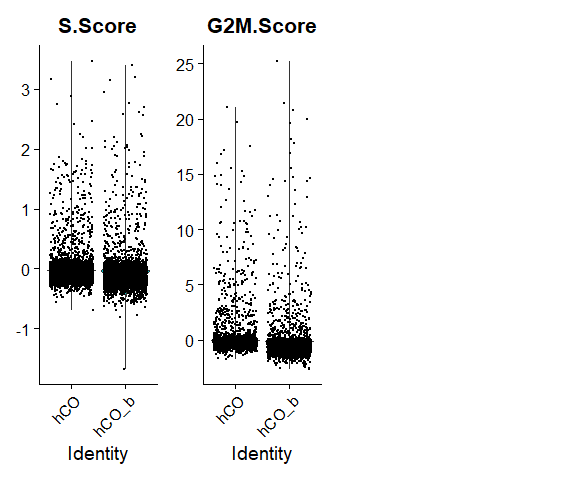<!-- -->

In this case it looks like we only have a few cycling cells in the
datasets.

# - Perform integration

We then identify anchors using the FindIntegrationAnchors() function,
which takes a list of Seurat objects as input, and use these anchors to
integrate the datasets together with IntegrateData().

``` r
hCO.anchors <- FindIntegrationAnchors(object.list = hCO.split, anchor.features = features)
```

    ## Scaling features for provided objects

    ## Finding all pairwise anchors

    ## Running CCA

    ## Merging objects

    ## Finding neighborhoods

    ## Finding anchors

    ##  Found 16213 anchors

    ## Filtering anchors

    ##  Retained 9011 anchors

this command creates an ‘integrated’ data assay.

``` r
hCO.combined <- IntegrateData(anchorset = hCO.anchors)
```

    ## Merging dataset 2 into 1

    ## Extracting anchors for merged samples

    ## Finding integration vectors

    ## Finding integration vector weights

    ## Integrating data

``` r
rm(hCO.anchors, hCOall, C, hCO.split)
```

## - Perform an integrated analysis

Now we can run a single integrated analysis on all cells. Specify that
we will perform downstream analysis on the integrated data:

``` r
DefaultAssay(hCO.combined) <- "integrated"
```

## Workflow for visualization and clustering

``` r
hCO.combined <- ScaleData(hCO.combined, verbose = FALSE)
hCO.combined <- RunPCA(hCO.combined, npcs = 30, verbose = FALSE)
hCO.combined[["pca"]] #' MOST VARIABLE FREATURES
```

    ## A dimensional reduction object with key PC_ 
    ##  Number of dimensions: 30 
    ##  Projected dimensional reduction calculated:  FALSE 
    ##  Jackstraw run: FALSE 
    ##  Computed using assay: integrated

``` r
print(hCO.combined[["pca"]], dims = 1:5, nfeatures = 5)
```

    ## PC_ 1 
    ## Positive:  STMN2, DCX, GRIA2, INA, NSG2 
    ## Negative:  SPARC, B2M, IFITM3, CD63, ZFP36L1 
    ## PC_ 2 
    ## Positive:  MKI67, TOP2A, NUF2, UBE2C, NUSAP1 
    ## Negative:  COL1A2, COL1A1, COL3A1, S100A11, DCN 
    ## PC_ 3 
    ## Positive:  NTRK2, GPM6B, TTYH1, CLU, MGST1 
    ## Negative:  COL1A1, COL3A1, DCN, COL6A3, COL1A2 
    ## PC_ 4 
    ## Positive:  EDNRB, TTYH1, GPM6B, PTPRZ1, PTN 
    ## Negative:  TRPM3, HTR2C, FOLR1, TTR, PCP4 
    ## PC_ 5 
    ## Positive:  GAP43, PKIA, STMN2, CNTNAP2, INA 
    ## Negative:  GNRH2, TEAD4, NEAT1, TSPAN8, CDH17

``` r
VizDimLoadings(hCO.combined, dims = 1:2, reduction = "pca")
```

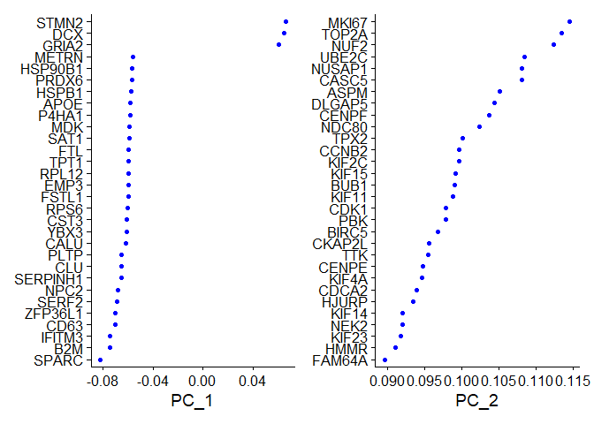

``` r
DimPlot(hCO.combined, reduction = "pca")
```

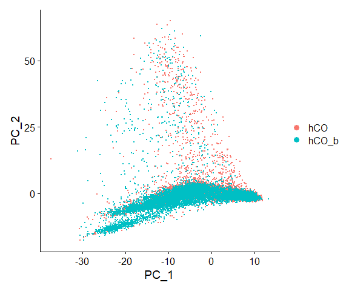

``` r
DimPlot(hCO.combined, reduction = "pca", dims = c(3,4))
```

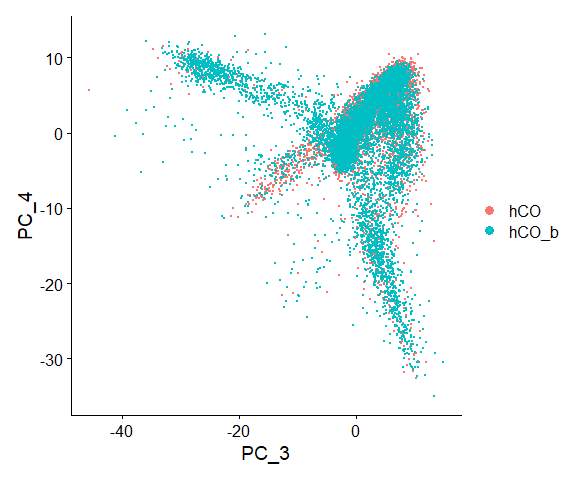

Plotting heatmaps for each PC:

``` r
DimHeatmap(hCO.combined, dims = 1, cells = 500, balanced = TRUE)
```

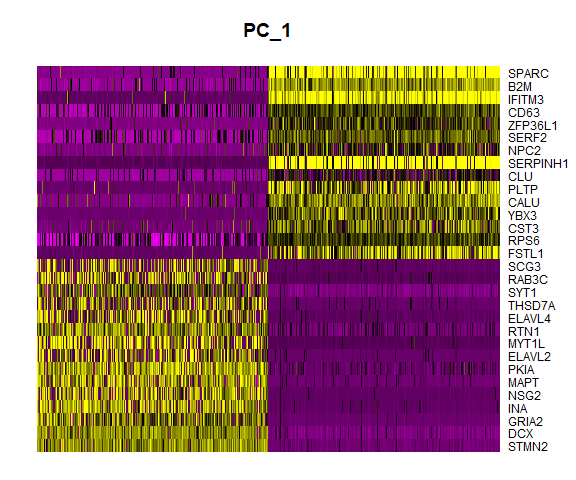

``` r
DimHeatmap(hCO.combined, dims = 1:9, cells = 500, balanced = TRUE)
```

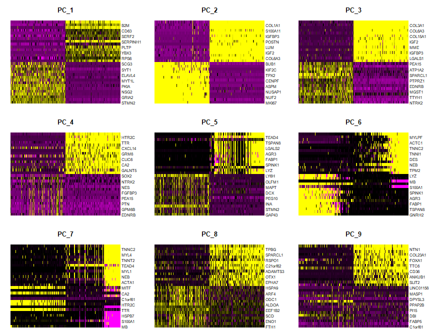

Next we will employ an elbow plot to chose the optimal number of
dimensions. Elbow plot in an informative tool to get optimal trade-off
to identify the majority of variation, avoiding overfitting.

``` r
ElbowPlot(hCO.combined)
```

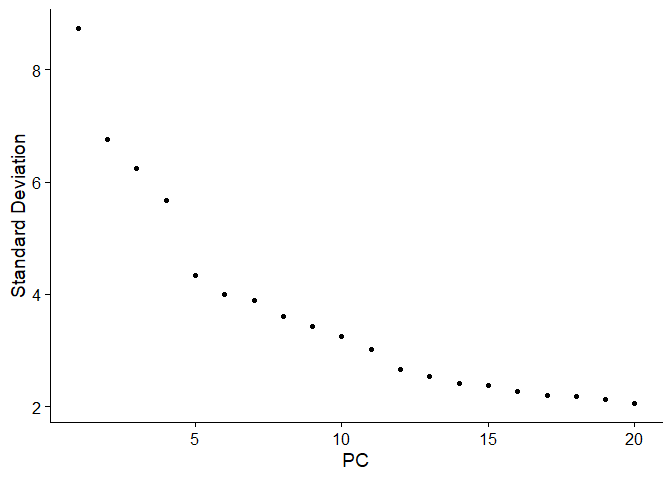<!-- -->

And we will 8 as dimenstions to run FindNeighbors() function, as it
appears an optimal number of clusters based on the above elbow plot

``` r
hCO.combined <- FindNeighbors(hCO.combined, reduction = "pca", dims = 1:8)
```

    ## Computing nearest neighbor graph

    ## Computing SNN

``` r
hCO.combined <- FindClusters(hCO.combined, resolution = 0.4)
```

    ## Modularity Optimizer version 1.3.0 by Ludo Waltman and Nees Jan van Eck
    ## 
    ## Number of nodes: 22440
    ## Number of edges: 701938
    ## 
    ## Running Louvain algorithm...
    ## Maximum modularity in 10 random starts: 0.9157
    ## Number of communities: 12
    ## Elapsed time: 4 seconds

Get the number of cells contained in each cluster

``` r
summary(hCO.combined@meta.data$seurat_clusters)
```

    ##    0    1    2    3    4    5    6    7    8    9   10   11 
    ## 4356 3975 2625 2345 2283 2159 1309 1029  911  850  373  225

Finally run UMAP

And subsequently visualize:

- the overlap between the two samples
- the cluster of cells, in the integrated dataset.

``` r
hCO.combined <- RunUMAP(hCO.combined, reduction = "pca", dims = 1:30)
```

    ## Warning: The default method for RunUMAP has changed from calling Python UMAP via reticulate to the R-native UWOT using the cosine metric
    ## To use Python UMAP via reticulate, set umap.method to 'umap-learn' and metric to 'correlation'
    ## This message will be shown once per session

    ## 15:38:52 UMAP embedding parameters a = 0.9922 b = 1.112

    ## 15:38:52 Read 22440 rows and found 30 numeric columns

    ## 15:38:52 Using Annoy for neighbor search, n_neighbors = 30

    ## 15:38:52 Building Annoy index with metric = cosine, n_trees = 50

    ## 0%   10   20   30   40   50   60   70   80   90   100%

    ## [----|----|----|----|----|----|----|----|----|----|

    ## **************************************************|
    ## 15:38:55 Writing NN index file to temp file C:\Users\Mirco\AppData\Local\Temp\Rtmp8u7ZKd\file41c8343570da
    ## 15:38:55 Searching Annoy index using 1 thread, search_k = 3000
    ## 15:39:01 Annoy recall = 100%
    ## 15:39:01 Commencing smooth kNN distance calibration using 1 thread with target n_neighbors = 30
    ## 15:39:03 Initializing from normalized Laplacian + noise (using irlba)
    ## 15:39:04 Commencing optimization for 200 epochs, with 1010128 positive edges
    ## 15:39:24 Optimization finished

``` r
p1 <- DimPlot(hCO.combined, reduction = "umap", group.by = "orig.ident")
p2 <- DimPlot(hCO.combined, reduction = "umap", label = TRUE, repel = TRUE)
p1
```

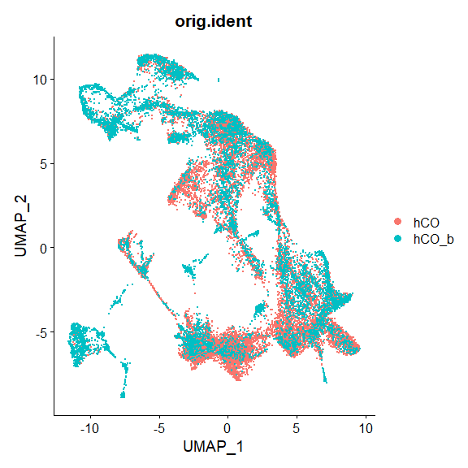

``` r
p2
```

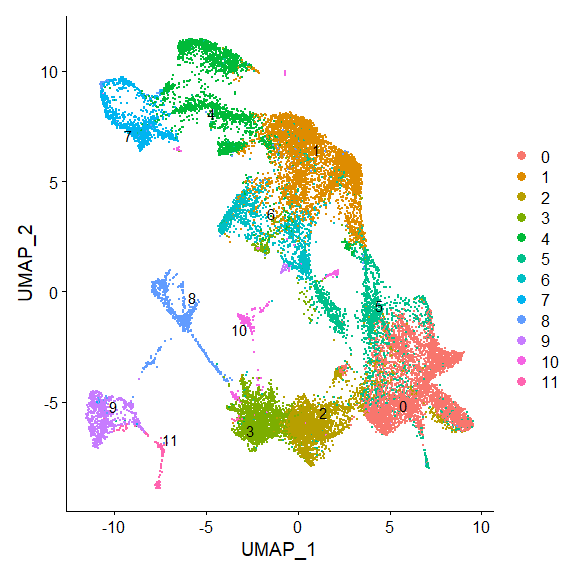

To visualize the two conditions side-by-side, we can use the split.by
argument to show each condition colored by cluster.

``` r
DimPlot(hCO.combined, reduction = "umap", split.by = "orig.ident")
```

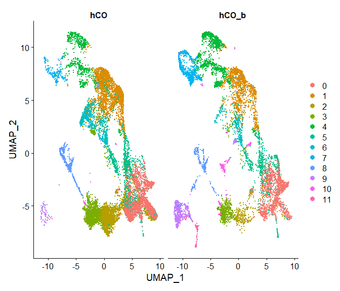

To perform differential expression of marker genes after integration, we
switch back to the original data as follows:

``` r
DefaultAssay(hCO.combined) <- "RNA"
```

We can explore these marker genes for each cluster and use them to
annotate our clusters as specific cell types.

- Cortical Neurons(CN), Interneurons(IN) and Neurons

``` r
FeaturePlot(hCO.combined, features = c("STMN2", "GAP43"), split.by = "orig.ident", max.cutoff = 3,
           cols = c("grey", "red"))
```

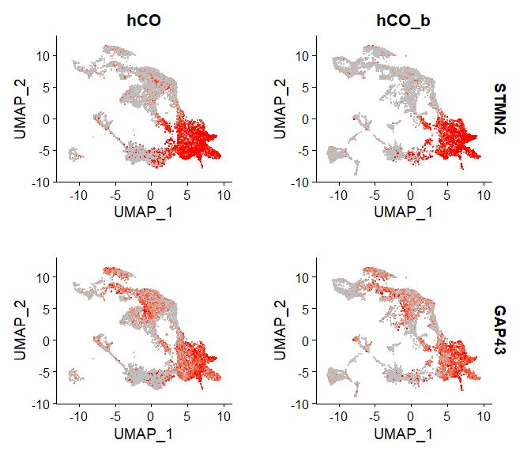

- Neuron progenitor cells(NPC)

``` r
FeaturePlot(hCO.combined, features = c("SOX2", "TOP2A", "MKI67", "SLC1A3"), split.by = "orig.ident", max.cutoff = 3,cols = c("grey", "red"))
```

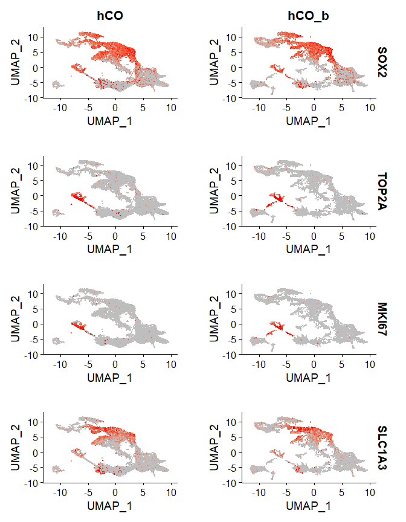

- Astrocytes(AS)

``` r
FeaturePlot(hCO.combined, features = c("GFAP", "SLC1A3"), split.by = "orig.ident", max.cutoff = 3,
             cols = c("grey", "red"))
```

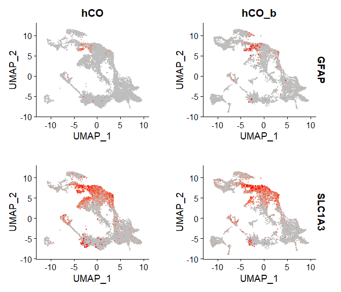

- Glia progenitor cells(GPC)/ BMP responsible cell(BRC)

``` r
FeaturePlot(hCO.combined, features = c("SOX2","BMP4"), split.by = "orig.ident", max.cutoff = 3,
             cols = c("grey", "red"))
```


- Proteoglycan-expressing cells (PGC)

``` r
FeaturePlot(hCO.combined, features = c("FLT1", "KDR", "RUNX1", "NFKB1", "CXCL1"), split.by = "orig.ident", max.cutoff = 3,
             cols = c("grey", "red"))
```

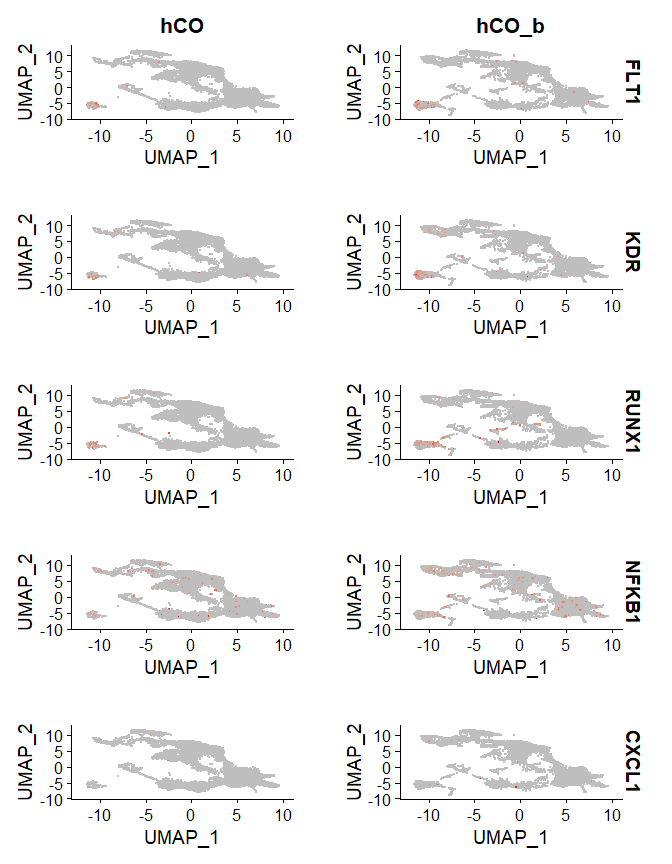

- Microglia (MG)

``` r
FeaturePlot(hCO.combined, features = c("IRF8", "C1QA", "C1QC", "CCL3", "CSF1R", "CYBB", "CTSZ", "CTSS", "TREM1", "CXCL1"), split.by = "orig.ident", max.cutoff = 3,
             cols = c("grey", "red"))
```

    ## Warning in FeaturePlot(hCO.combined, features = c("IRF8", "C1QA", "C1QC", : All
    ## cells have the same value (0) of C1QA.

    ## Warning in FeaturePlot(hCO.combined, features = c("IRF8", "C1QA", "C1QC", : All
    ## cells have the same value (0) of C1QC.

    ## Warning in FeaturePlot(hCO.combined, features = c("IRF8", "C1QA", "C1QC", : All
    ## cells have the same value (0) of CCL3.


- Microglia progenitors cluster A2(MGPA2)

``` r
FeaturePlot(hCO.combined, features = c("RUNX1", "IRF8", "CTSZ", "CTSS", "EDN1", "PYCARD", "ST14", "NFKB1", "CXCL1", "MYB"), split.by = "orig.ident", max.cutoff = 3,
             cols = c("grey", "red"))
```

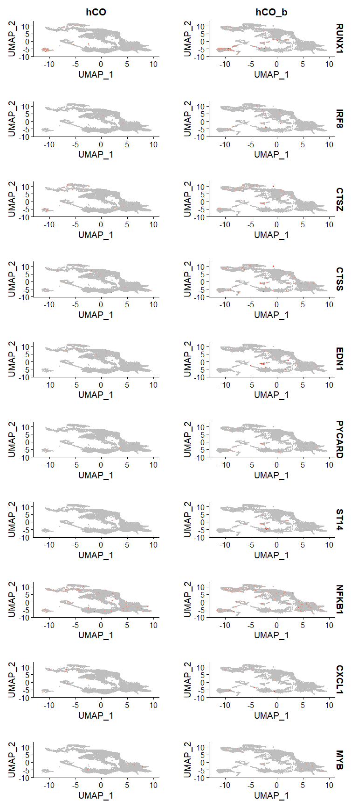

Microglia progenitors cluster A1(MGPA1)

``` r
FeaturePlot(hCO.combined, features = c("RUNX1", "ST14", "TREM1", "NFKB1"), split.by = "orig.ident", max.cutoff = 3,
             cols = c("grey", "red")) 
```

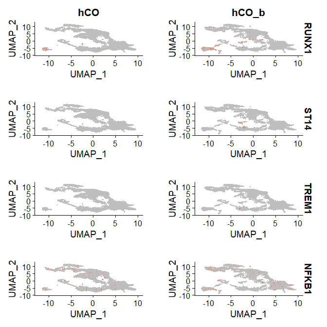

###### for AB treatment MG activation can be assessed

``` r
FeaturePlot(hCO.combined, features = c("AIF1", "C1QC", "CSF1R", "LCP1", "PTPRC", "CTSS"), split.by = "orig.ident", max.cutoff = 3,
            cols = c("grey", "red"))
```

    ## Warning in FeaturePlot(hCO.combined, features = c("AIF1", "C1QC", "CSF1R", :
    ## All cells have the same value (0) of C1QC.

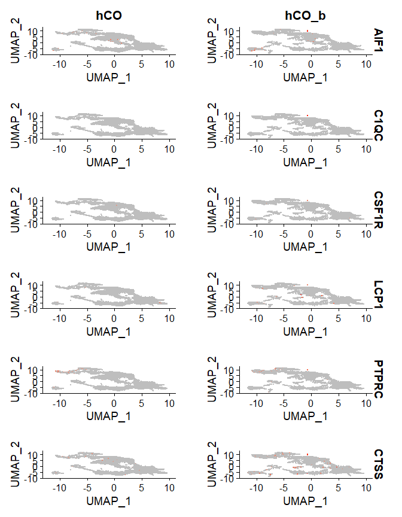

# Labelling clusters

``` r
hCO.combined <- RenameIdents(hCO.combined, '0' = 'CN', "1"= "AS", "2"="IN",
                             "3"="Inter", "4"= "GPC","5"= "BRC", "6"="AS",
                             "7" = "Neuron", "8" = "NPC", "9" = "PGC",  "10" = "MGPA2", "11"="MG")
DimPlot(hCO.combined, label = TRUE, split.by="orig.ident")
```

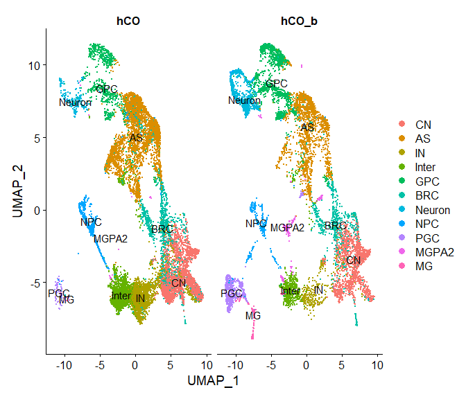<!-- -->

# Gene markers extraction

Since we have samples representing different conditions in our dataset,
our best option is to find conserved markers. This function internally
separates out cells by sample group/condition, and then performs
differential gene expression testing for a single specified cluster
against all other clusters.

------------------------------------------------------------------------

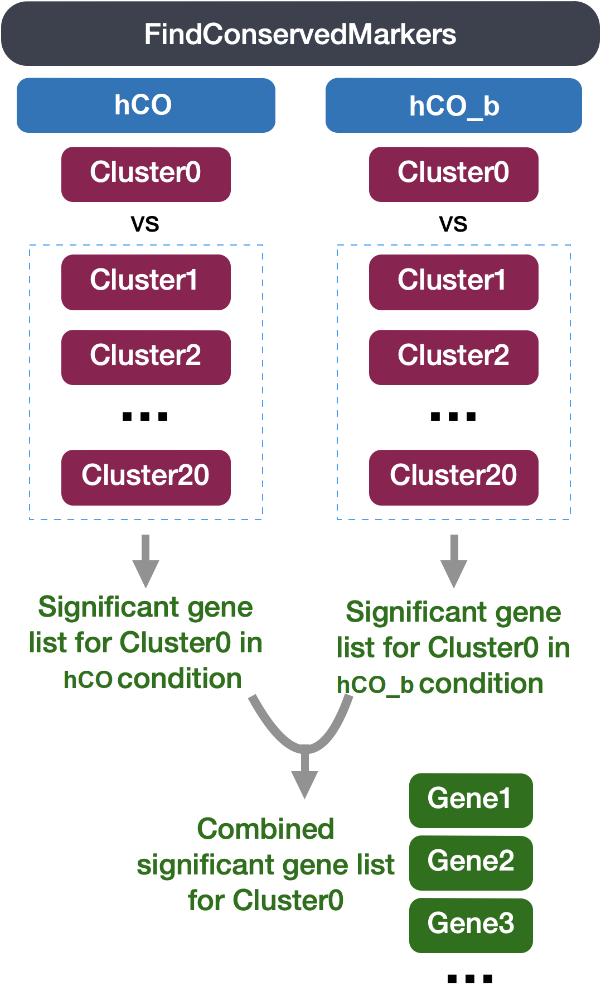<!-- -->

<p class="caption">
FindConserverdMarkers function
</p>

</div>

------------------------------------------------------------------------

The function accepts a single cluster at a time, so if we want to have
the function run on all clusters, then we can use the map family of
functions to iterate across clusters.

Create function to get conserved markers for any given cluster:

``` r
get_conserved <- function(cluster){
  FindConservedMarkers(hCO.combined,
                       ident.1 = cluster,
                       grouping.var = "orig.ident",
                       only.pos = TRUE) %>%
    rownames_to_column(var = "gene") %>%
    cbind(cluster_id = cluster, .)
}
```

Since we want the output of the map family of functions to be a
dataframe with each cluster output bound together by rows, we will use
the map_dfr() function. Iterate function across desired clusters

``` r
conserved_markers <- purrr::map_dfr(c("CN","AS","IN",
                                     "Inter","GPC","BRC","Neuron",
                                     "NPC","PGC","MGPA2","MG"), get_conserved)
```

    ## Testing group hCO_b: (CN) vs (PGC, Inter, BRC, MGPA2, NPC, AS, Neuron, GPC, MG, IN)

    ## Testing group hCO: (CN) vs (AS, IN, Inter, Neuron, BRC, GPC, NPC, PGC, MGPA2, MG)

    ## Testing group hCO_b: (AS) vs (PGC, Inter, BRC, MGPA2, NPC, CN, Neuron, GPC, MG, IN)

    ## Testing group hCO: (AS) vs (IN, Inter, CN, Neuron, BRC, GPC, NPC, PGC, MGPA2, MG)

    ## Testing group hCO_b: (IN) vs (PGC, Inter, BRC, MGPA2, NPC, AS, CN, Neuron, GPC, MG)

    ## Testing group hCO: (IN) vs (AS, Inter, CN, Neuron, BRC, GPC, NPC, PGC, MGPA2, MG)

    ## Testing group hCO_b: (Inter) vs (PGC, BRC, MGPA2, NPC, AS, CN, Neuron, GPC, MG, IN)

    ## Testing group hCO: (Inter) vs (AS, IN, CN, Neuron, BRC, GPC, NPC, PGC, MGPA2, MG)

    ## Testing group hCO_b: (GPC) vs (PGC, Inter, BRC, MGPA2, NPC, AS, CN, Neuron, MG, IN)

    ## Testing group hCO: (GPC) vs (AS, IN, Inter, CN, Neuron, BRC, NPC, PGC, MGPA2, MG)

    ## Testing group hCO_b: (BRC) vs (PGC, Inter, MGPA2, NPC, AS, CN, Neuron, GPC, MG, IN)

    ## Testing group hCO: (BRC) vs (AS, IN, Inter, CN, Neuron, GPC, NPC, PGC, MGPA2, MG)

    ## Testing group hCO_b: (Neuron) vs (PGC, Inter, BRC, MGPA2, NPC, AS, CN, GPC, MG, IN)

    ## Testing group hCO: (Neuron) vs (AS, IN, Inter, CN, BRC, GPC, NPC, PGC, MGPA2, MG)

    ## Testing group hCO_b: (NPC) vs (PGC, Inter, BRC, MGPA2, AS, CN, Neuron, GPC, MG, IN)

    ## Testing group hCO: (NPC) vs (AS, IN, Inter, CN, Neuron, BRC, GPC, PGC, MGPA2, MG)

    ## Testing group hCO_b: (PGC) vs (Inter, BRC, MGPA2, NPC, AS, CN, Neuron, GPC, MG, IN)

    ## Testing group hCO: (PGC) vs (AS, IN, Inter, CN, Neuron, BRC, GPC, NPC, MGPA2, MG)

    ## Testing group hCO_b: (MGPA2) vs (PGC, Inter, BRC, NPC, AS, CN, Neuron, GPC, MG, IN)

    ## Testing group hCO: (MGPA2) vs (AS, IN, Inter, CN, Neuron, BRC, GPC, NPC, PGC, MG)

    ## Testing group hCO_b: (MG) vs (PGC, Inter, BRC, MGPA2, NPC, AS, CN, Neuron, GPC, IN)

    ## Testing group hCO: (MG) vs (AS, IN, Inter, CN, Neuron, BRC, GPC, NPC, PGC, MGPA2)

Extract top 10 markers per cluster

``` r
top10 <- conserved_markers %>% 
  mutate(avg_fc = (hCO_avg_log2FC + hCO_b_avg_log2FC) /2) %>% 
  group_by(cluster_id) %>% 
  top_n(n = 10, 
        wt = avg_fc)
```

Visualize top 10 markers per cluster

``` r
top10
```

    ## # A tibble: 110 × 15
    ## # Groups:   cluster_id [11]
    ##    cluster_id gene  hCO_b_p_…¹ hCO_b…² hCO_b…³ hCO_b…⁴ hCO_b…⁵ hCO_p_val hCO_a…⁶
    ##    <chr>      <chr>      <dbl>   <dbl>   <dbl>   <dbl>   <dbl>     <dbl>   <dbl>
    ##  1 CN         SCG2           0    2.28   0.639   0.222       0 1.06e-253    1.31
    ##  2 CN         GAP43          0    1.90   0.895   0.382       0 0            1.57
    ##  3 CN         NSG2           0    2.35   0.886   0.112       0 0            1.80
    ##  4 CN         DCX            0    2.70   0.99    0.31        0 0            2.05
    ##  5 CN         PKIA           0    2.35   0.927   0.298       0 0            1.98
    ##  6 CN         STMN2          0    3.18   0.995   0.212       0 0            2.53
    ##  7 CN         INA            0    2.31   0.905   0.13        0 0            1.87
    ##  8 CN         RTN1           0    2.21   0.941   0.386       0 0            1.64
    ##  9 CN         MAPT           0    2.18   0.901   0.243       0 0            1.58
    ## 10 CN         SYT4           0    2.25   0.753   0.14        0 0            1.71
    ## # … with 100 more rows, 6 more variables: hCO_pct.1 <dbl>, hCO_pct.2 <dbl>,
    ## #   hCO_p_val_adj <dbl>, max_pval <dbl>, minimump_p_val <dbl>, avg_fc <dbl>,
    ## #   and abbreviated variable names ¹​hCO_b_p_val, ²​hCO_b_avg_log2FC,
    ## #   ³​hCO_b_pct.1, ⁴​hCO_b_pct.2, ⁵​hCO_b_p_val_adj, ⁶​hCO_avg_log2FC

DotPlot is a handy tools that comes into help when a general check is
needed

``` r
markers.to.plot.hco <- c("STMN2","GAP43","SOX2","VIM","TOP2A","MKI67","GFAP","SLC1A3",
                     "BMP4","FOJ1","FLT1","KDR","RUNX1","IRF8","C1QA","C1QC","CCL3"
                     ,"CSF1R","CYBB","CTSZ","CTSS","EDN1","PYCARD","ST14","TREM1",
                     "NFKB1","CXCL1","MYB")
DotPlot(hCO.combined, features = markers.to.plot.hco, cols = c("blue", "red"), dot.scale = 8, split.by = "orig.ident",) +
  RotatedAxis()
```

    ## Warning in FetchData.Seurat(object = object, vars = features, cells = cells):
    ## The following requested variables were not found: FOJ1

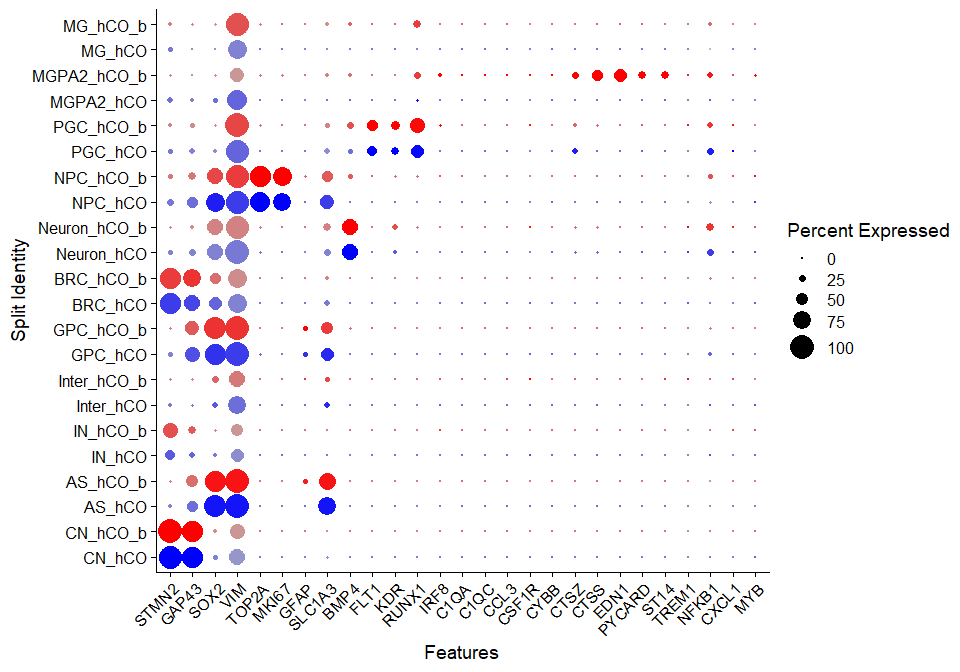

``` r
microglia.dotmarkers <- c("C1QA", "C1QC", "CCL3", "CYBB", "AIF1", "LCP1", "PTPRC", "CTSS", "CTSZ")

DotPlot(hCO.combined, features = microglia.dotmarkers, cols = c("blue", "red"), dot.scale = 8, split.by = "orig.ident") +
  RotatedAxis()
```

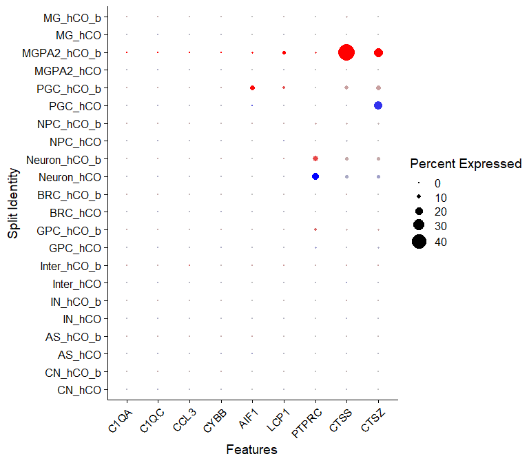

### INTERESTING FINDS:

###### EDN1 - inflammatory gene. was not clearly expressed in hCO alone.

``` r
FeaturePlot(hCO.combined, features = c("EDN1"), split.by = "orig.ident", max.cutoff = 3, label = TRUE,
            cols = c("grey", "red"))
```

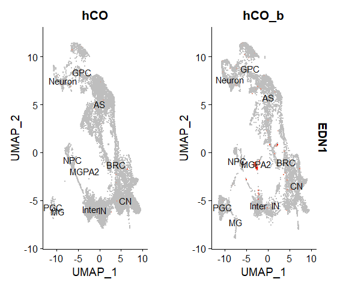

###### MG and MG activation genes expression is basically 0 in hco

``` r
FeaturePlot(hCO.combined, features = c("C1QA", "C1QC", "CCL3", "CYBB", "AIF1", "LCP1", "PTPRC", "CTSS", "CTSZ"), split.by = "orig.ident", max.cutoff = 3, cols = c("grey", "red"))
```

    ## Warning in FeaturePlot(hCO.combined, features = c("C1QA", "C1QC", "CCL3", : All
    ## cells have the same value (0) of C1QA.

    ## Warning in FeaturePlot(hCO.combined, features = c("C1QA", "C1QC", "CCL3", : All
    ## cells have the same value (0) of C1QC.

    ## Warning in FeaturePlot(hCO.combined, features = c("C1QA", "C1QC", "CCL3", : All
    ## cells have the same value (0) of CCL3.

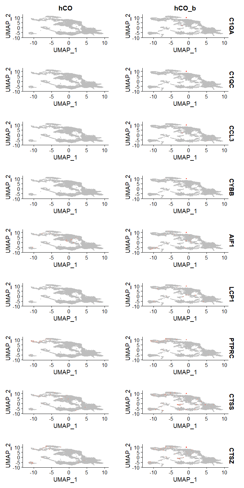

###### ferroptosis mediators slightly up regulated

``` r
FeaturePlot(hCO.combined, features = c("PHKG2", "TXNRD1", "PPARG"), split.by = "orig.ident", max.cutoff = 3, 
            cols = c("grey", "red"))
```

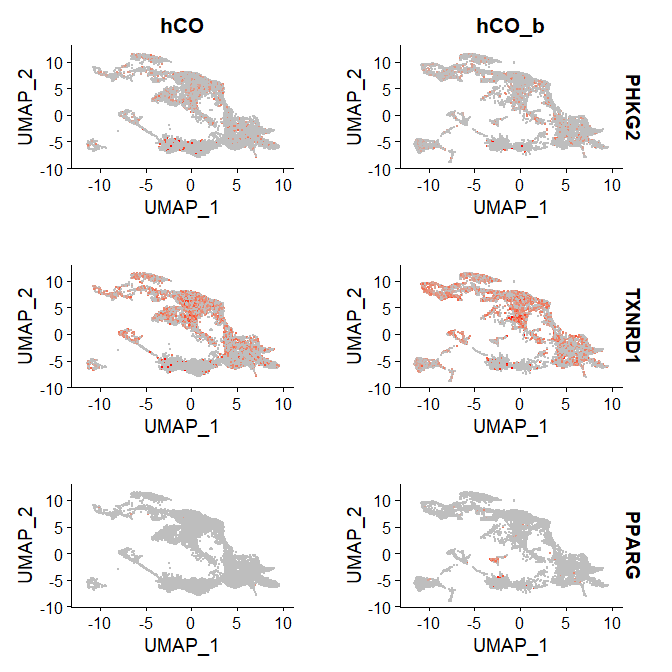

- TXNRD1 is also quite highly expressed in hco cells, maybe because
  there is none of microglia that can protect the cells. in hCO treated
  with Aβ there is at least a little of MG genes

## Gene ontology analysis

Gene Ontology (GO) term enrichment is a technique for interpreting sets
of genes making use of the Gene Ontology system of classification, in
which genes are assigned to a set of predefined bins depending on their
functional characteristics.

``` r
library(GOstats)
library(GO.db)
library(org.Hs.eg.db)
hs <- org.Hs.eg.db
```

- Get reference list

The reference list is the list of all the genes from which our
differential expression analysis list was selected.

``` r
GeneUniverse <- read.table("D:/OneDrive - Università degli Studi di Milano/PoliMirco/Secondo anno/Primo semestre/Neurogenomics/Exam/microglia-like/hCO/GSM5345017_hCO_features.tsv.gz", header = FALSE )
head(GeneUniverse$V2)
```

    ## [1] "MIR1302-10"   "FAM138A"      "OR4F5"        "RP11-34P13.7" "RP11-34P13.8"
    ## [6] "AL627309.1"

``` r
summary(GeneUniverse)
```

    ##       V1                 V2                 V3                 V4           
    ##  Length:32738       Length:32738       Length:32738       Length:32738      
    ##  Class :character   Class :character   Class :character   Class :character  
    ##  Mode  :character   Mode  :character   Mode  :character   Mode  :character

``` r
GeneUniverse.symbols <- GeneUniverse$V2 
```

- Get Entrez ID of DE gene symbols

``` r
Universe_symbol_entrez <- select(hs, keys = GeneUniverse.symbols, columns = c("ENTREZID","SYMBOL"), keytype = "SYMBOL")
```

    ## 'select()' returned many:many mapping between keys and columns

``` r
Universe.entrezIDs <- Universe_symbol_entrez$ENTREZID
```

- DE genes symbols in Cortical Neurons

``` r
CN.mark <- top10[top10$cluster_id=='CN',]
CN.symbols <- CN.mark$gene
CN_symbol_entrez <- select(hs, keys = CN.symbols, columns = c("ENTREZID","SYMBOL"), keytype = "SYMBOL")
```

    ## 'select()' returned 1:1 mapping between keys and columns

``` r
CN.entrezIDs <- CN_symbol_entrez$ENTREZID
```

Run on *Homo sapiens* annotated entrez genes, BP = biological process.
over= over-represented

``` r
upParams = new("GOHyperGParams",geneIds = CN.entrezIDs,universeGeneIds = Universe.entrezIDs,
               annotation="org.Hs.eg.db",ontology="BP",pvalueCutoff=0.01,
               conditional=FALSE, testDirection="over")
```

    ## Warning in makeValidParams(.Object): removing duplicate IDs in universeGeneIds

``` r
upBP = hyperGTest(upParams)

summary(upBP)[1:10,]
```

    ##        GOBPID       Pvalue OddsRatio     ExpCount Count Size
    ## 1  GO:1904950 4.533382e-05  59.08744 0.0738259197     3  119
    ## 2  GO:1903828 1.709190e-04  37.29742 0.1153917737     3  186
    ## 3  GO:0031112 2.038762e-04 121.78788 0.0217135058     2   35
    ## 4  GO:0048666 2.353841e-04  14.22590 0.6594701905     5 1063
    ## 5  GO:1990090 3.533527e-04  91.27841 0.0285377505     2   46
    ## 6  GO:1990089 3.848484e-04  87.29891 0.0297785222     2   48
    ## 7  GO:0031113 4.518029e-04  80.29500 0.0322600658     2   52
    ## 8  GO:0048174 6.203859e-04       Inf 0.0006203859     1    1
    ## 9  GO:0099082 6.203859e-04       Inf 0.0006203859     1    1
    ## 10 GO:0099161 6.203859e-04       Inf 0.0006203859     1    1
    ##                                                                     Term
    ## 1           negative regulation of establishment of protein localization
    ## 2                            negative regulation of protein localization
    ## 3  positive regulation of microtubule polymerization or depolymerization
    ## 4                                                     neuron development
    ## 5                      cellular response to nerve growth factor stimulus
    ## 6                                        response to nerve growth factor
    ## 7                               regulation of microtubule polymerization
    ## 8         negative regulation of short-term neuronal synaptic plasticity
    ## 9                    retrograde trans-synaptic signaling by neuropeptide
    ## 10               regulation of presynaptic dense core granule exocytosis

- DE genes symbols in microglia

``` r
MG.mark <- top10[top10$cluster_id=="MG",]
MG.symbols <- MG.mark$gene
MG_symbol_entrez <- select(hs, keys = MG.symbols, columns = c("ENTREZID","SYMBOL"), keytype = "SYMBOL")
```

    ## 'select()' returned 1:1 mapping between keys and columns

``` r
MG.entrezIDs <- MG_symbol_entrez$ENTREZID
```

``` r
upParams = new("GOHyperGParams",geneIds = MG.entrezIDs,universeGeneIds = Universe.entrezIDs,
               annotation="org.Hs.eg.db",ontology="BP",pvalueCutoff=0.01,
               conditional=FALSE, testDirection="over")
```

    ## Warning in makeValidParams(.Object): removing duplicate IDs in universeGeneIds

``` r
upBP = hyperGTest(upParams)

summary(upBP)[1:10,]
```

    ##        GOBPID       Pvalue OddsRatio   ExpCount Count Size
    ## 1  GO:0030199 1.497231e-10 291.89091 0.03722315     5   60
    ## 2  GO:0071230 5.967318e-08 167.13542 0.04218624     4   68
    ## 3  GO:0071229 9.378423e-08 148.49074 0.04714933     4   76
    ## 4  GO:0043200 3.205932e-07 107.81145 0.06389975     4  103
    ## 5  GO:0009887 4.063287e-07  34.73537 0.63341398     7 1021
    ## 6  GO:0043588 4.562413e-07  54.74048 0.18239345     5  294
    ## 7  GO:0030198 5.297729e-07  53.05705 0.18797692     5  303
    ## 8  GO:0001101 5.353320e-07  94.37168 0.07258515     4  117
    ## 9  GO:0043062 5.384908e-07  52.87625 0.18859731     5  304
    ## 10 GO:0045229 5.562680e-07  52.51827 0.18983808     5  306
    ##                                             Term
    ## 1                   collagen fibril organization
    ## 2       cellular response to amino acid stimulus
    ## 3             cellular response to acid chemical
    ## 4                         response to amino acid
    ## 5                     animal organ morphogenesis
    ## 6                               skin development
    ## 7              extracellular matrix organization
    ## 8                      response to acid chemical
    ## 9           extracellular structure organization
    ## 10 external encapsulating structure organization

- DE genes symbols in MGPA2

``` r
MGPA2.mark <- top10[top10$cluster_id=='MGPA2',]
MGPA2.symbols <- MGPA2.mark$gene
MGPA2_symbol_entrez <- select(hs, keys = MGPA2.symbols, columns = c("ENTREZID","SYMBOL"), keytype = "SYMBOL")
```

    ## 'select()' returned 1:1 mapping between keys and columns

``` r
MGPA2.entrezIDs <- MGPA2_symbol_entrez$ENTREZID

upParams = new("GOHyperGParams",geneIds = MGPA2.entrezIDs,universeGeneIds = Universe.entrezIDs,
               annotation="org.Hs.eg.db",ontology="BP",pvalueCutoff=0.01,
               conditional=FALSE, testDirection="over")
```

    ## Warning in makeValidParams(.Object): removing duplicate IDs in universeGeneIds

``` r
upBP = hyperGTest(upParams)

summary(upBP)[1:10,]
```

    ##        GOBPID       Pvalue  OddsRatio    ExpCount Count Size
    ## 1  GO:0045104 9.770845e-08  154.47711 0.048576214     4   87
    ## 2  GO:0045103 1.023357e-07  152.62857 0.049134562     4   88
    ## 3  GO:0045109 5.923553e-06  123.42308 0.037967616     3   68
    ## 4  GO:0030855 3.300348e-04   18.32166 0.378559464     4  678
    ## 5  GO:0007010 4.319594e-04   13.37418 0.771635958     5 1382
    ## 6  GO:0097435 5.262894e-04   16.11339 0.427694026     4  766
    ## 7  GO:0043396 1.116417e-03 2013.62500 0.001116695     1    2
    ## 8  GO:0043397 1.116417e-03 2013.62500 0.001116695     1    2
    ## 9  GO:0007208 1.674211e-03 1006.75000 0.001675042     1    3
    ## 10 GO:0010513 1.674211e-03 1006.75000 0.001675042     1    3
    ##                                                                Term
    ## 1                   intermediate filament cytoskeleton organization
    ## 2                               intermediate filament-based process
    ## 3                                intermediate filament organization
    ## 4                                   epithelial cell differentiation
    ## 5                                         cytoskeleton organization
    ## 6                                 supramolecular fiber organization
    ## 7                         corticotropin-releasing hormone secretion
    ## 8           regulation of corticotropin-releasing hormone secretion
    ## 9   phospholipase C-activating serotonin receptor signaling pathway
    ## 10 positive regulation of phosphatidylinositol biosynthetic process

- DE genes symbols in Astrocytes

``` r
AS.mark <- top10[top10$cluster_id=='AS',]
AS.symbols <- AS.mark$gene
AS_symbol_entrez <- select(hs, keys = AS.symbols, columns = c("ENTREZID","SYMBOL"), keytype = "SYMBOL")
```

    ## 'select()' returned 1:1 mapping between keys and columns

``` r
AS.entrezIDs <- MGPA2_symbol_entrez$ENTREZID

upParams = new("GOHyperGParams",geneIds = AS.entrezIDs,universeGeneIds = Universe.entrezIDs,
               annotation="org.Hs.eg.db",ontology="BP",pvalueCutoff=0.01,
               conditional=FALSE, testDirection="over")
```

    ## Warning in makeValidParams(.Object): removing duplicate IDs in universeGeneIds

``` r
upBP = hyperGTest(upParams)

summary(upBP)[1:10,]
```

    ##        GOBPID       Pvalue  OddsRatio    ExpCount Count Size
    ## 1  GO:0045104 9.770845e-08  154.47711 0.048576214     4   87
    ## 2  GO:0045103 1.023357e-07  152.62857 0.049134562     4   88
    ## 3  GO:0045109 5.923553e-06  123.42308 0.037967616     3   68
    ## 4  GO:0030855 3.300348e-04   18.32166 0.378559464     4  678
    ## 5  GO:0007010 4.319594e-04   13.37418 0.771635958     5 1382
    ## 6  GO:0097435 5.262894e-04   16.11339 0.427694026     4  766
    ## 7  GO:0043396 1.116417e-03 2013.62500 0.001116695     1    2
    ## 8  GO:0043397 1.116417e-03 2013.62500 0.001116695     1    2
    ## 9  GO:0007208 1.674211e-03 1006.75000 0.001675042     1    3
    ## 10 GO:0010513 1.674211e-03 1006.75000 0.001675042     1    3
    ##                                                                Term
    ## 1                   intermediate filament cytoskeleton organization
    ## 2                               intermediate filament-based process
    ## 3                                intermediate filament organization
    ## 4                                   epithelial cell differentiation
    ## 5                                         cytoskeleton organization
    ## 6                                 supramolecular fiber organization
    ## 7                         corticotropin-releasing hormone secretion
    ## 8           regulation of corticotropin-releasing hormone secretion
    ## 9   phospholipase C-activating serotonin receptor signaling pathway
    ## 10 positive regulation of phosphatidylinositol biosynthetic process

- DE genes symbols in Glia progenitor cluster

``` r
GPC.mark <- top10[top10$cluster_id=='GPC',]
GPC.symbols <- GPC.mark$gene
GPC_symbol_entrez <- select(hs, keys = GPC.symbols, columns = c("ENTREZID","SYMBOL"), keytype = "SYMBOL")
```

    ## 'select()' returned 1:1 mapping between keys and columns

``` r
GPC.entrezIDs <- GPC_symbol_entrez$ENTREZID

upParams = new("GOHyperGParams",geneIds = GPC.entrezIDs,universeGeneIds = Universe.entrezIDs,
               annotation="org.Hs.eg.db",ontology="BP",pvalueCutoff=0.01,
               conditional=FALSE, testDirection="over")
```

    ## Warning in makeValidParams(.Object): removing duplicate IDs in universeGeneIds

``` r
upBP = hyperGTest(upParams)

summary(upBP)[1:10,]
```

    ##        GOBPID       Pvalue OddsRatio    ExpCount Count Size
    ## 1  GO:1905907 2.278766e-05 402.47500 0.007444631     2   12
    ## 2  GO:0007165 2.380268e-05       Inf 3.450586265    10 5562
    ## 3  GO:1905906 3.621712e-05 309.53846 0.009305788     2   15
    ## 4  GO:0023052 5.405110e-05       Inf 3.745269558    10 6037
    ## 5  GO:0007154 5.928357e-05       Inf 3.780011167    10 6093
    ## 6  GO:0009653 2.096891e-04  12.21861 1.606799429     7 2590
    ## 7  GO:0051716 2.177624e-04       Inf 4.304857621    10 6939
    ## 8  GO:1990000 2.280532e-04 114.81429 0.022954278     2   37
    ## 9  GO:0060828 3.576580e-04  28.82506 0.148272225     3  239
    ## 10 GO:0014009 4.176660e-04  83.65104 0.031019294     2   50
    ##                                               Term
    ## 1  negative regulation of amyloid fibril formation
    ## 2                              signal transduction
    ## 3           regulation of amyloid fibril formation
    ## 4                                        signaling
    ## 5                               cell communication
    ## 6               anatomical structure morphogenesis
    ## 7                    cellular response to stimulus
    ## 8                         amyloid fibril formation
    ## 9    regulation of canonical Wnt signaling pathway
    ## 10                        glial cell proliferation

# ssGSEA

``` r
library(dittoSeq)
```

    ## Warning: il pacchetto 'dittoSeq' è stato creato con R versione 4.2.1

``` r
library(escape)
```

    ## Warning: il pacchetto 'escape' è stato creato con R versione 4.2.1

Remove metadata that can interfere with computing of Enrichment
Score(ES)

``` r
hCO.combined@meta.data$nCount_RNA <- NULL
hCO.combined@meta.data$nFeature_RNA <- NULL
hCO.combined@meta.data$percent_mito <- NULL
hCO.combined@meta.data$percent_ribo <- NULL
hCO.combined@meta.data$type <- NULL
hCO.combined@meta.data$integrated_snn_res.0.4 <- NULL
```

## Getting Gene Sets

C2 = curated gene sets; C5 = ontology gene sets

``` r
GS.hallmark <- getGeneSets(library = "C2", gene.sets =c("KEGG_ABC_TRANSPORTERS",
                                                        "KEGG_ACUTE_MYELOID_LEUKEMIA",
                                                        "KEGG_ADHERENS_JUNCTION",
                                                        "KEGG_ADIPOCYTOKINE_SIGNALING_PATHWAY",
                                                        "KEGG_ALANINE_ASPARTATE_AND_GLUTAMATE_METABOLISM",
                                                        "KEGG_ALDOSTERONE_REGULATED_SODIUM_REABSORPTION",
                                                        "KEGG_ALLOGRAFT_REJECTION",
                                                        "KEGG_ALPHA_LINOLENIC_ACID_METABOLISM",
                                                        "KEGG_ALZHEIMERS_DISEASE",
                                                        "KEGG_AMINO_SUGAR_AND_NUCLEOTIDE_SUGAR_METABOLISM",
                                                        "KEGG_AMINOACYL_TRNA_BIOSYNTHESIS",
                                                        "KEGG_AMYOTROPHIC_LATERAL_SCLEROSIS_ALS",
                                                        "KEGG_ANTIGEN_PROCESSING_AND_PRESENTATION",
                                                        "KEGG_APOPTOSIS",
                                                        "KEGG_ARACHIDONIC_ACID_METABOLISM",
                                                        "KEGG_ARGININE_AND_PROLINE_METABOLISM",
                                                    "KEGG_ARRHYTHMOGENIC_RIGHT_VENTRICULAR_CARDIOMYOPATHY_ARVC",
                                                        "KEGG_ASCORBATE_AND_ALDARATE_METABOLISM",
                                                        "KEGG_ASTHMA",
                                                        "KEGG_AUTOIMMUNE_THYROID_DISEASE",
                                                        "KEGG_AXON_GUIDANCE",
                                                        "KEGG_B_CELL_RECEPTOR_SIGNALING_PATHWAY",
                                                        "KEGG_BASAL_CELL_CARCINOMA",
                                                        "KEGG_BASAL_TRANSCRIPTION_FACTORS",
                                                        "KEGG_BASE_EXCISION_REPAIR",
                                                        "KEGG_BETA_ALANINE_METABOLISM",
                                                        "KEGG_BIOSYNTHESIS_OF_UNSATURATED_FATTY_ACIDS",
                                                        "KEGG_BLADDER_CANCER",
                                                        "KEGG_BUTANOATE_METABOLISM",
                                                        "KEGG_CALCIUM_SIGNALING_PATHWAY",
                                                        "KEGG_CARDIAC_MUSCLE_CONTRACTION",
                                                        "KEGG_CELL_ADHESION_MOLECULES_CAMS",
                                                        "KEGG_CELL_CYCLE",
                                                        "KEGG_CHEMOKINE_SIGNALING_PATHWAY",
                                                        "KEGG_CHRONIC_MYELOID_LEUKEMIA",
                                                        "KEGG_CIRCADIAN_RHYTHM_MAMMAL",
                                                        "KEGG_CITRATE_CYCLE_TCA_CYCLE",
                                                        "KEGG_COLORECTAL_CANCER",
                                                        "KEGG_COMPLEMENT_AND_COAGULATION_CASCADES",
                                                        "KEGG_CYSTEINE_AND_METHIONINE_METABOLISM",
                                                        "KEGG_CYTOKINE_CYTOKINE_RECEPTOR_INTERACTION",
                                                        "KEGG_CYTOSOLIC_DNA_SENSING_PATHWAY",
                                                        "KEGG_DILATED_CARDIOMYOPATHY",
                                                        "KEGG_DNA_REPLICATION",
                                                        "KEGG_DORSO_VENTRAL_AXIS_FORMATION",
                                                        "KEGG_DRUG_METABOLISM_CYTOCHROME_P450",
                                                        "KEGG_DRUG_METABOLISM_OTHER_ENZYMES",
                                                        "KEGG_ECM_RECEPTOR_INTERACTION",
                                                        "KEGG_ENDOCYTOSIS",
                                                        "KEGG_ENDOMETRIAL_CANCER",
                                              "KEGG_EPITHELIAL_CELL_SIGNALING_IN_HELICOBACTER_PYLORI_INFECTION",
                                                        "KEGG_ERBB_SIGNALING_PATHWAY",
                                                        "KEGG_ETHER_LIPID_METABOLISM",
                                                        "KEGG_FATTY_ACID_METABOLISM",
                                                        "KEGG_FC_EPSILON_RI_SIGNALING_PATHWAY",
                                                        "KEGG_FC_GAMMA_R_MEDIATED_PHAGOCYTOSIS",
                                                        "KEGG_FOCAL_ADHESION",
                                                        "KEGG_FOLATE_BIOSYNTHESIS",
                                                        "KEGG_FRUCTOSE_AND_MANNOSE_METABOLISM",
                                                        "KEGG_GALACTOSE_METABOLISM",
                                                        "KEGG_GAP_JUNCTION",
                                                        "KEGG_GLIOMA",
                                                        "KEGG_GLUTATHIONE_METABOLISM",
                                                        "KEGG_GLYCEROLIPID_METABOLISM",
                                                        "KEGG_GLYCEROPHOSPHOLIPID_METABOLISM",
                                                        "KEGG_GLYCINE_SERINE_AND_THREONINE_METABOLISM",
                                                        "KEGG_GLYCOLYSIS_GLUCONEOGENESIS",
                                                      "KEGG_GLYCOSAMINOGLYCAN_BIOSYNTHESIS_CHONDROITIN_SULFATE",
                                                        "KEGG_GLYCOSAMINOGLYCAN_BIOSYNTHESIS_HEPARAN_SULFATE",
                                                        "KEGG_GLYCOSAMINOGLYCAN_BIOSYNTHESIS_KERATAN_SULFATE",
                                                        "KEGG_GLYCOSAMINOGLYCAN_DEGRADATION",
                                                        "KEGG_GLYCOSPHINGOLIPID_BIOSYNTHESIS_GANGLIO_SERIES",
                                                        "KEGG_GLYCOSPHINGOLIPID_BIOSYNTHESIS_GLOBO_SERIES",
                                              "KEGG_GLYCOSPHINGOLIPID_BIOSYNTHESIS_LACTO_AND_NEOLACTO_SERIES",
                                                  "KEGG_GLYCOSYLPHOSPHATIDYLINOSITOL_GPI_ANCHOR_BIOSYNTHESIS",
                                                        "KEGG_GLYOXYLATE_AND_DICARBOXYLATE_METABOLISM",
                                                        "KEGG_GNRH_SIGNALING_PATHWAY",
                                                        "KEGG_GRAFT_VERSUS_HOST_DISEASE",
                                                        "KEGG_HEDGEHOG_SIGNALING_PATHWAY",
                                                        "KEGG_HEMATOPOIETIC_CELL_LINEAGE",
                                                        "KEGG_HISTIDINE_METABOLISM",
                                                        "KEGG_HOMOLOGOUS_RECOMBINATION",
                                                        "KEGG_HUNTINGTONS_DISEASE",
                                                        "KEGG_HYPERTROPHIC_CARDIOMYOPATHY_HCM",
                                                        "KEGG_INOSITOL_PHOSPHATE_METABOLISM",
                                                        "KEGG_INSULIN_SIGNALING_PATHWAY",
                                                        "KEGG_INTESTINAL_IMMUNE_NETWORK_FOR_IGA_PRODUCTION",
                                                        "KEGG_JAK_STAT_SIGNALING_PATHWAY",
                                                        "KEGG_LEISHMANIA_INFECTION",
                                                        "KEGG_LEUKOCYTE_TRANSENDOTHELIAL_MIGRATION",
                                                        "KEGG_LIMONENE_AND_PINENE_DEGRADATION",
                                                        "KEGG_LINOLEIC_ACID_METABOLISM",
                                                        "KEGG_LONG_TERM_DEPRESSION",
                                                        "KEGG_LONG_TERM_POTENTIATION",
                                                        "KEGG_LYSINE_DEGRADATION",
                                                        "KEGG_LYSOSOME",
                                                        "KEGG_MAPK_SIGNALING_PATHWAY",
                                                        "KEGG_MATURITY_ONSET_DIABETES_OF_THE_YOUNG",
                                                        "KEGG_MELANOGENESIS",
                                                        "KEGG_MELANOMA",
                                                        "KEGG_METABOLISM_OF_XENOBIOTICS_BY_CYTOCHROME_P450",
                                                        "KEGG_MISMATCH_REPAIR",
                                                        "KEGG_MTOR_SIGNALING_PATHWAY",
                                                        "KEGG_N_GLYCAN_BIOSYNTHESIS",
                                                        "KEGG_NATURAL_KILLER_CELL_MEDIATED_CYTOTOXICITY",
                                                        "KEGG_NEUROACTIVE_LIGAND_RECEPTOR_INTERACTION",
                                                        "KEGG_NEUROTROPHIN_SIGNALING_PATHWAY",
                                                        "KEGG_NICOTINATE_AND_NICOTINAMIDE_METABOLISM",
                                                        "KEGG_NITROGEN_METABOLISM",
                                                        "KEGG_NOD_LIKE_RECEPTOR_SIGNALING_PATHWAY",
                                                        "KEGG_NON_HOMOLOGOUS_END_JOINING",
                                                        "KEGG_NON_SMALL_CELL_LUNG_CANCER",
                                                        "KEGG_NOTCH_SIGNALING_PATHWAY",
                                                        "KEGG_NUCLEOTIDE_EXCISION_REPAIR",
                                                        "KEGG_O_GLYCAN_BIOSYNTHESIS",
                                                        "KEGG_OLFACTORY_TRANSDUCTION",
                                                        "KEGG_ONE_CARBON_POOL_BY_FOLATE",
                                                        "KEGG_OOCYTE_MEIOSIS",
                                                        "KEGG_OTHER_GLYCAN_DEGRADATION",
                                                        "KEGG_OXIDATIVE_PHOSPHORYLATION",
                                                        "KEGG_P53_SIGNALING_PATHWAY",
                                                        "KEGG_PANCREATIC_CANCER",
                                                        "KEGG_PANTOTHENATE_AND_COA_BIOSYNTHESIS",
                                                        "KEGG_PARKINSONS_DISEASE",
                                                        "KEGG_PATHOGENIC_ESCHERICHIA_COLI_INFECTION",
                                                        "KEGG_PATHWAYS_IN_CANCER",
                                                        "KEGG_PENTOSE_AND_GLUCURONATE_INTERCONVERSIONS",
                                                        "KEGG_PENTOSE_PHOSPHATE_PATHWAY",
                                                        "KEGG_PEROXISOME",
                                                        "KEGG_PHENYLALANINE_METABOLISM",
                                                        "KEGG_PHOSPHATIDYLINOSITOL_SIGNALING_SYSTEM",
                                                        "KEGG_PORPHYRIN_AND_CHLOROPHYLL_METABOLISM",
                                                        "KEGG_PPAR_SIGNALING_PATHWAY",
                                                        "KEGG_PRIMARY_BILE_ACID_BIOSYNTHESIS",
                                                        "KEGG_PRIMARY_IMMUNODEFICIENCY",
                                                        "KEGG_PRION_DISEASES",
                                                        "KEGG_PROGESTERONE_MEDIATED_OOCYTE_MATURATION",
                                                        "KEGG_PROPANOATE_METABOLISM",
                                                        "KEGG_PROSTATE_CANCER",
                                                        "KEGG_PROTEASOME",
                                                        "KEGG_PROTEIN_EXPORT",
                                                        "KEGG_PROXIMAL_TUBULE_BICARBONATE_RECLAMATION",
                                                        "KEGG_PURINE_METABOLISM",
                                                        "KEGG_PYRIMIDINE_METABOLISM",
                                                        "KEGG_PYRUVATE_METABOLISM",
                                                        "KEGG_REGULATION_OF_ACTIN_CYTOSKELETON",
                                                        "KEGG_REGULATION_OF_AUTOPHAGY",
                                                        "KEGG_RENAL_CELL_CARCINOMA",
                                                        "KEGG_RENIN_ANGIOTENSIN_SYSTEM",
                                                        "KEGG_RETINOL_METABOLISM",
                                                        "KEGG_RIBOFLAVIN_METABOLISM",
                                                        "KEGG_RIBOSOME",
                                                        "KEGG_RIG_I_LIKE_RECEPTOR_SIGNALING_PATHWAY",
                                                        "KEGG_RNA_DEGRADATION",
                                                        "KEGG_RNA_POLYMERASE",
                                                        "KEGG_SELENOAMINO_ACID_METABOLISM",
                                                        "KEGG_SMALL_CELL_LUNG_CANCER",
                                                        "KEGG_SNARE_INTERACTIONS_IN_VESICULAR_TRANSPORT",
                                                        "KEGG_SPHINGOLIPID_METABOLISM",
                                                        "KEGG_SPLICEOSOME",
                                                        "KEGG_STARCH_AND_SUCROSE_METABOLISM",
                                                        "KEGG_STEROID_BIOSYNTHESIS",
                                                        "KEGG_STEROID_HORMONE_BIOSYNTHESIS",
                                                        "KEGG_SULFUR_METABOLISM",
                                                        "KEGG_SYSTEMIC_LUPUS_ERYTHEMATOSUS",
                                                        "KEGG_T_CELL_RECEPTOR_SIGNALING_PATHWAY",
                                                        "KEGG_TASTE_TRANSDUCTION",
                                                        "KEGG_TAURINE_AND_HYPOTAURINE_METABOLISM",
                                                        "KEGG_TERPENOID_BACKBONE_BIOSYNTHESIS",
                                                        "KEGG_TGF_BETA_SIGNALING_PATHWAY",
                                                        "KEGG_THYROID_CANCER",
                                                        "KEGG_TIGHT_JUNCTION",
                                                        "KEGG_TOLL_LIKE_RECEPTOR_SIGNALING_PATHWAY",
                                                        "KEGG_TRYPTOPHAN_METABOLISM",
                                                        "KEGG_TYPE_I_DIABETES_MELLITUS",
                                                        "KEGG_TYPE_II_DIABETES_MELLITUS",
                                                        "KEGG_TYROSINE_METABOLISM",
                                                        "KEGG_UBIQUITIN_MEDIATED_PROTEOLYSIS",
                                                        "KEGG_VALINE_LEUCINE_AND_ISOLEUCINE_BIOSYNTHESIS",
                                                        "KEGG_VALINE_LEUCINE_AND_ISOLEUCINE_DEGRADATION",
                                                        "KEGG_VASCULAR_SMOOTH_MUSCLE_CONTRACTION",
                                                        "KEGG_VASOPRESSIN_REGULATED_WATER_REABSORPTION",
                                                        "KEGG_VEGF_SIGNALING_PATHWAY",
                                                        "KEGG_VIBRIO_CHOLERAE_INFECTION",
                                                        "KEGG_VIRAL_MYOCARDITIS",
                                                        "KEGG_WNT_SIGNALING_PATHWAY") )
```

## Enrichment

The next step is performing the enrichment on the RNA count data. The
function enrichIt() can handle either a matrix of raw count data or will
pull that data directly from a Seurat object. The enrichment scores will
be calculated across all individual cells

``` r
ES.hCO <- enrichIt(obj = hCO.combined, gene.sets = GS.hallmark, groups = 1000, cores = 4)
```

    ## [1] "Using sets of 1000 cells. Running 23 times."
    ## Setting parallel calculations through a SnowParam back-end
    ## with workers=4 and tasks=100.
    ## Estimating ssGSEA scores for 186 gene sets.
    ## [1] "Calculating ranks..."
    ## [1] "Calculating absolute values from ranks..."
    ## Setting parallel calculations through a SnowParam back-end
    ## with workers=4 and tasks=100.
    ## Estimating ssGSEA scores for 186 gene sets.
    ## [1] "Calculating ranks..."
    ## [1] "Calculating absolute values from ranks..."
    ## Setting parallel calculations through a SnowParam back-end
    ## with workers=4 and tasks=100.
    ## Estimating ssGSEA scores for 186 gene sets.
    ## [1] "Calculating ranks..."
    ## [1] "Calculating absolute values from ranks..."
    ## Setting parallel calculations through a SnowParam back-end
    ## with workers=4 and tasks=100.
    ## Estimating ssGSEA scores for 186 gene sets.
    ## [1] "Calculating ranks..."
    ## [1] "Calculating absolute values from ranks..."
    ## Setting parallel calculations through a SnowParam back-end
    ## with workers=4 and tasks=100.
    ## Estimating ssGSEA scores for 186 gene sets.
    ## [1] "Calculating ranks..."
    ## [1] "Calculating absolute values from ranks..."
    ## Setting parallel calculations through a SnowParam back-end
    ## with workers=4 and tasks=100.
    ## Estimating ssGSEA scores for 186 gene sets.
    ## [1] "Calculating ranks..."
    ## [1] "Calculating absolute values from ranks..."
    ## Setting parallel calculations through a SnowParam back-end
    ## with workers=4 and tasks=100.
    ## Estimating ssGSEA scores for 186 gene sets.
    ## [1] "Calculating ranks..."
    ## [1] "Calculating absolute values from ranks..."
    ## Setting parallel calculations through a SnowParam back-end
    ## with workers=4 and tasks=100.
    ## Estimating ssGSEA scores for 186 gene sets.
    ## [1] "Calculating ranks..."
    ## [1] "Calculating absolute values from ranks..."
    ## Setting parallel calculations through a SnowParam back-end
    ## with workers=4 and tasks=100.
    ## Estimating ssGSEA scores for 186 gene sets.
    ## [1] "Calculating ranks..."
    ## [1] "Calculating absolute values from ranks..."
    ## Setting parallel calculations through a SnowParam back-end
    ## with workers=4 and tasks=100.
    ## Estimating ssGSEA scores for 186 gene sets.
    ## [1] "Calculating ranks..."
    ## [1] "Calculating absolute values from ranks..."
    ## Setting parallel calculations through a SnowParam back-end
    ## with workers=4 and tasks=100.
    ## Estimating ssGSEA scores for 186 gene sets.
    ## [1] "Calculating ranks..."
    ## [1] "Calculating absolute values from ranks..."
    ## Setting parallel calculations through a SnowParam back-end
    ## with workers=4 and tasks=100.
    ## Estimating ssGSEA scores for 186 gene sets.
    ## [1] "Calculating ranks..."
    ## [1] "Calculating absolute values from ranks..."
    ## Setting parallel calculations through a SnowParam back-end
    ## with workers=4 and tasks=100.
    ## Estimating ssGSEA scores for 186 gene sets.
    ## [1] "Calculating ranks..."
    ## [1] "Calculating absolute values from ranks..."
    ## Setting parallel calculations through a SnowParam back-end
    ## with workers=4 and tasks=100.
    ## Estimating ssGSEA scores for 186 gene sets.
    ## [1] "Calculating ranks..."
    ## [1] "Calculating absolute values from ranks..."
    ## Setting parallel calculations through a SnowParam back-end
    ## with workers=4 and tasks=100.
    ## Estimating ssGSEA scores for 186 gene sets.
    ## [1] "Calculating ranks..."
    ## [1] "Calculating absolute values from ranks..."
    ## Setting parallel calculations through a SnowParam back-end
    ## with workers=4 and tasks=100.
    ## Estimating ssGSEA scores for 186 gene sets.
    ## [1] "Calculating ranks..."
    ## [1] "Calculating absolute values from ranks..."
    ## Setting parallel calculations through a SnowParam back-end
    ## with workers=4 and tasks=100.
    ## Estimating ssGSEA scores for 186 gene sets.
    ## [1] "Calculating ranks..."
    ## [1] "Calculating absolute values from ranks..."
    ## Setting parallel calculations through a SnowParam back-end
    ## with workers=4 and tasks=100.
    ## Estimating ssGSEA scores for 186 gene sets.
    ## [1] "Calculating ranks..."
    ## [1] "Calculating absolute values from ranks..."
    ## Setting parallel calculations through a SnowParam back-end
    ## with workers=4 and tasks=100.
    ## Estimating ssGSEA scores for 186 gene sets.
    ## [1] "Calculating ranks..."
    ## [1] "Calculating absolute values from ranks..."
    ## Setting parallel calculations through a SnowParam back-end
    ## with workers=4 and tasks=100.
    ## Estimating ssGSEA scores for 186 gene sets.
    ## [1] "Calculating ranks..."
    ## [1] "Calculating absolute values from ranks..."
    ## Setting parallel calculations through a SnowParam back-end
    ## with workers=4 and tasks=100.
    ## Estimating ssGSEA scores for 186 gene sets.
    ## [1] "Calculating ranks..."
    ## [1] "Calculating absolute values from ranks..."
    ## Setting parallel calculations through a SnowParam back-end
    ## with workers=4 and tasks=100.
    ## Estimating ssGSEA scores for 186 gene sets.
    ## [1] "Calculating ranks..."
    ## [1] "Calculating absolute values from ranks..."
    ## Setting parallel calculations through a SnowParam back-end
    ## with workers=4 and tasks=100.
    ## Estimating ssGSEA scores for 186 gene sets.
    ## [1] "Calculating ranks..."
    ## [1] "Calculating absolute values from ranks..."

We can then easily add these results back to our Seurat object.

``` r
hCO.combined <- Seurat::AddMetaData(hCO.combined, ES.hCO)
```

### Visualizations

The easiest way to generate almost any visualization for single cell
data is via dittoSeq, which is an extremely flexible visualization
package for both bulk and single-cell RNA-seq data that works very well
for both expression data and metadata.

To keep things consistent, we’ll define a pleasing color scheme.

``` r
colors <- colorRampPalette(c("#0348A6", "#7AC5FF", "#C6FDEC", "#FFB433", "#FF4B20"))
```

Heatmaps A simple way to approach visualizations for enrichment results
is the heatmap:

``` r
dittoHeatmap(hCO.combined, genes = NULL, metas = names(ES.hCO), 
             annot.by = "orig.ident", 
             fontsize = 7, 
             cluster_cols = TRUE,
             heatmap.colors = colors(50))              
```

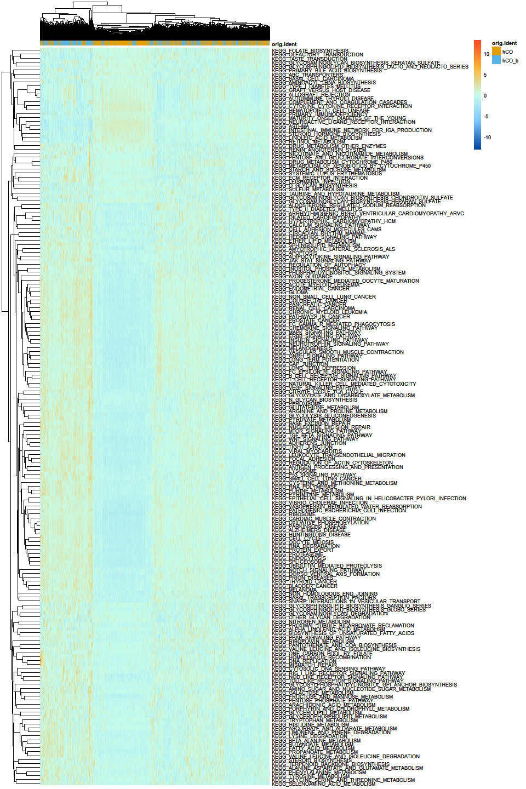

We better produce a heatmap with select gene sets by providing specific
names to the metas parameter. For example, we can isolated gene sets
involved in Alzheimer’s and Parkinson’s disease.

``` r
dittoHeatmap(hCO.combined, genes = NULL, 
             metas = c("KEGG_ALZHEIMERS_DISEASE", "KEGG_PARKINSONS_DISEASE",
                       "KEGG_HUNTINGTONS_DISEASE"), 
             annot.by = c("seurat_clusters","orig.ident"), 
             fontsize = 7,
             heatmap.colors = colors(50))
```

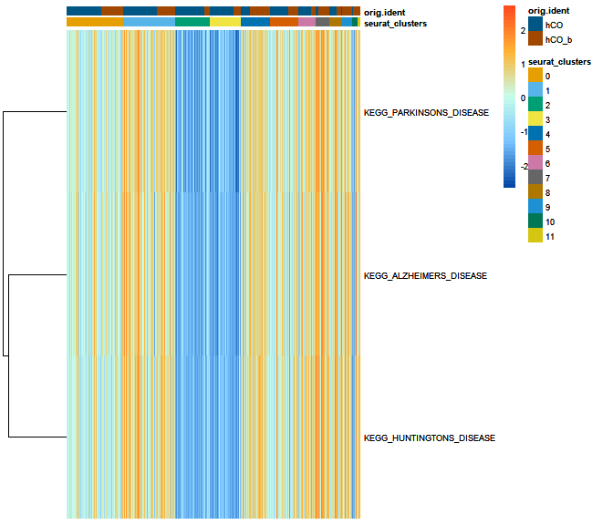

Violin Plots Another way to visualize a subset of gene set enrichment
would be to graph the distribution of enrichment using violin, jitter,
boxplot, or ridgeplots. We can also compare between categorical
variables using the group.by parameter.

``` r
multi_dittoPlot(hCO.combined, vars = c("KEGG_ALZHEIMERS_DISEASE", "KEGG_PARKINSONS_DISEASE",
                       "KEGG_HUNTINGTONS_DISEASE"), 
                group.by = c("orig.ident"), plots = c("jitter", "vlnplot", "boxplot"), 
                ylab = "Enrichment Scores", 
                theme = theme_classic() + theme(plot.title = element_text(size = 10)))
```

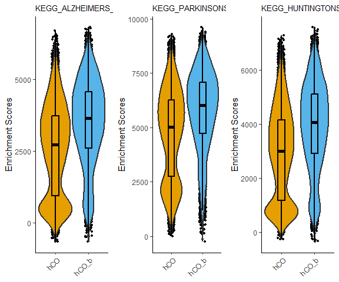

LTD; LTP

``` r
multi_dittoPlot(hCO.combined, vars = c("KEGG_LONG_TERM_DEPRESSION", "KEGG_LONG_TERM_POTENTIATION"), 
                group.by = c("orig.ident"), plots = c("jitter", "vlnplot", "boxplot"), 
                ylab = "Enrichment Scores", 
                theme = theme_classic() + theme(plot.title = element_text(size = 10)))
```

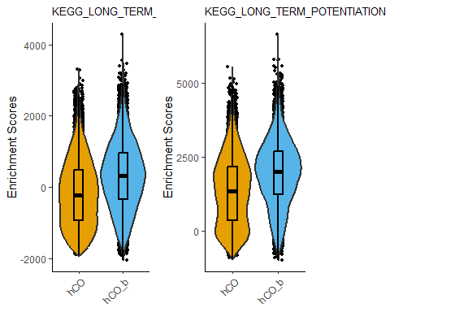<!-- -->

Same but by cluster

``` r
multi_dittoPlot(hCO.combined, vars = c("KEGG_ALZHEIMERS_DISEASE", "KEGG_PARKINSONS_DISEASE",
                                       "KEGG_HUNTINGTONS_DISEASE"), 
                group.by = c("seurat_clusters"), plots = c("jitter", "vlnplot", "boxplot"), 
                ylab = "Enrichment Scores", 
                theme = theme_classic() + theme(plot.title = element_text(size = 10)))
```

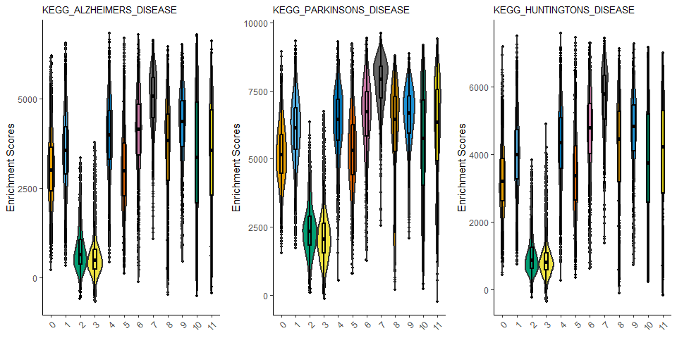

- Hex Density Enrichment Plots

We can also compare the distribution of enrichment scores of 2 distinct
gene sets across all single cells using the dittoScatterHex() function.
Here, we use our samples with results of enrichIt() and specify
Alzheimer’s and Parkinson’s to the x.var and y.var parameters to produce
a density plot.

``` r
dittoScatterHex(hCO.combined, x.var = "KEGG_ALZHEIMERS_DISEASE",
                y.var = "KEGG_PARKINSONS_DISEASE",
                do.contour = TRUE) + 
  scale_fill_gradientn(colors = colors(11))
```

    ## Scale for fill is already present.
    ## Adding another scale for fill, which will replace the existing scale.

    ## Warning: Computation failed in `stat_binhex()`
    ## Caused by error in `compute_group()`:
    ## ! The package `hexbin` is required for `stat_binhex()`

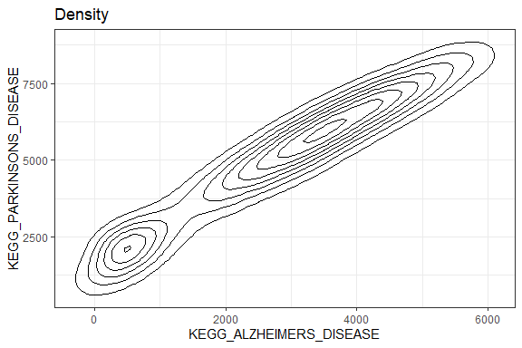<!-- -->

We can also separate the graph using the split.by parameter, allowing
for the direct comparison of the two samples.

``` r
dittoScatterHex(hCO.combined, x.var = "KEGG_ALZHEIMERS_DISEASE", 
                y.var = "KEGG_PARKINSONS_DISEASE", 
                do.contour = TRUE,
                split.by = "orig.ident")  + 
scale_fill_gradientn(colors = colors(11))
```

    ## Scale for fill is already present.
    ## Adding another scale for fill, which will replace the existing scale.

    ## Warning: Computation failed in `stat_binhex()`
    ## Computation failed in `stat_binhex()`
    ## Caused by error in `compute_group()`:
    ## ! The package `hexbin` is required for `stat_binhex()`

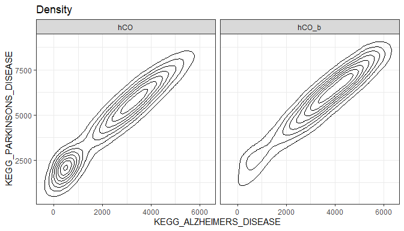

Ridge Plots Another distribution visualization is using a Ridge Plot
from the ggridges R package. This allows to cell clusters to seperate
the enrichment scores along the y-axis in addition to the faceting by
categorical variables.

Like above, we can explore the distribution of the
“KEGG_ALZHEIMERS_DISEASE” gene set between groups by calling
ridgeEnrichment() with the ES2 object. We specify group = cluster, which
will seperate groups on the y-axis.

``` r
ES2 <- data.frame(hCO.combined[[]], Idents(hCO.combined))
colnames(ES2)[ncol(ES2)] <- "cluster"
```

plot

``` r
ridgeEnrichment(ES2, gene.set = "KEGG_ALZHEIMERS_DISEASE", group = "cluster", add.rug = TRUE)
```

    ## Picking joint bandwidth of 238

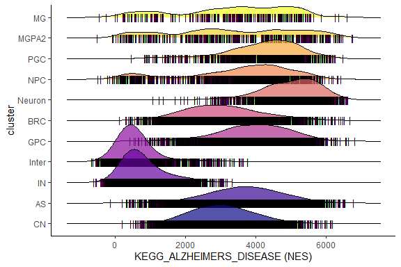<!-- -->

We can also assess apoptosis level in different clusters.

``` r
ridgeEnrichment(ES2, gene.set = "KEGG_APOPTOSIS", group = "cluster", 
                facet = "orig.ident", add.rug = TRUE)
```

    ## Picking joint bandwidth of 120

    ## Picking joint bandwidth of 134

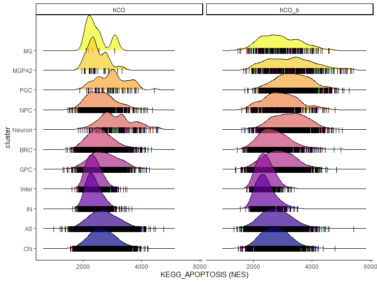

In addition to the separation of original identifiers, we can also use
ridgeEnrichment() for better granualarity of multiple variables. For
example, we can set group = “cluster” and then facet = “orig.idents”.
This gives a visualization of the enrichment by cluster and sample.

``` r
ridgeEnrichment(ES2, gene.set = "KEGG_ALZHEIMERS_DISEASE", group = "cluster", 
                facet = "orig.ident", add.rug = TRUE)
```

    ## Picking joint bandwidth of 277

    ## Picking joint bandwidth of 260

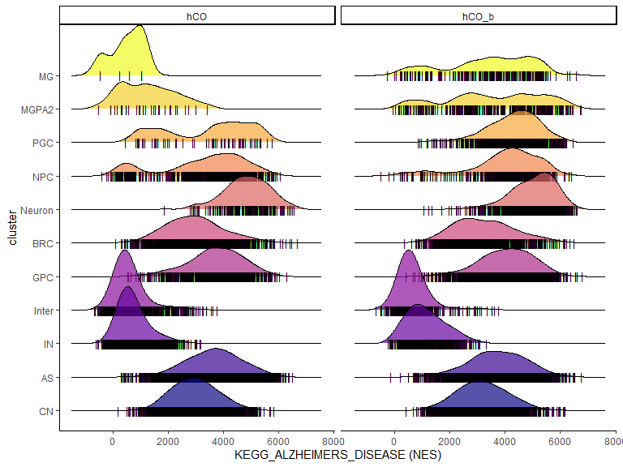

Split Violin Plots

``` r
splitEnrichment(ES2, split = "orig.ident", gene.set = "KEGG_ALZHEIMERS_DISEASE")
```

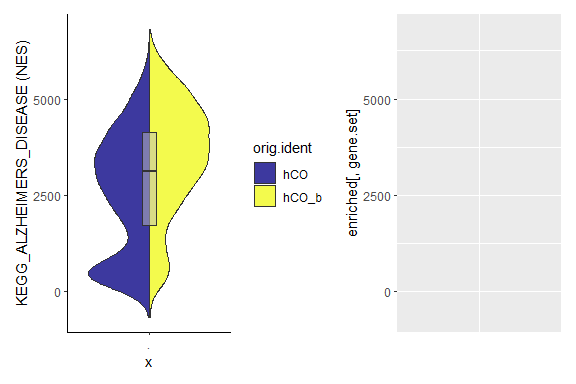<!-- -->

``` r
splitEnrichment(ES2, x.axis = "cluster", split = "orig.ident", gene.set = "KEGG_ALZHEIMERS_DISEASE")
```

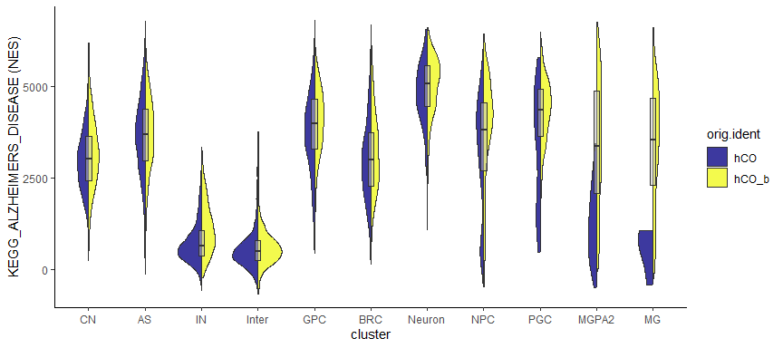

### Expanded Analysis

One frustration of Gene Set Enrichment is trying to make sense of the
values. In order to move away from just selecting pathways that may be
of interest, we can performPCA() on the enrichment scores.

``` r
PCA <- performPCA(enriched = ES2, groups = c("orig.ident", "cluster"))
pcaEnrichment(PCA, PCx = "PC1", PCy = "PC2", contours = TRUE)
```

    ## Warning: Computation failed in `stat_binhex()`
    ## Caused by error in `compute_group()`:
    ## ! The package `hexbin` is required for `stat_binhex()`

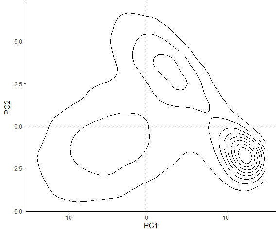

We can also look at the pcaEnrichment() output separated by categorical
factors using the facet parameter, for example using the cluster
assignment.

``` r
pcaEnrichment(PCA, PCx = "PC1", PCy = "PC2", contours = FALSE, facet = "cluster") 
```

    ## Warning: Computation failed in `stat_binhex()`
    ## Computation failed in `stat_binhex()`
    ## Computation failed in `stat_binhex()`
    ## Computation failed in `stat_binhex()`
    ## Computation failed in `stat_binhex()`
    ## Computation failed in `stat_binhex()`
    ## Computation failed in `stat_binhex()`
    ## Computation failed in `stat_binhex()`
    ## Computation failed in `stat_binhex()`
    ## Computation failed in `stat_binhex()`
    ## Computation failed in `stat_binhex()`
    ## Caused by error in `compute_group()`:
    ## ! The package `hexbin` is required for `stat_binhex()`

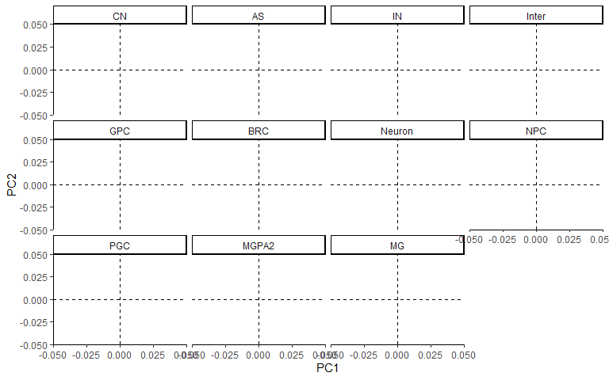

We can more closely examine the construction of the PCA by looking at
the contribution of each gene set to the respective principal component
using masterPCAPlot() with the same input as above with the
pcaEnrichment(). We can also control the number of gene sets plotted
with top.contribution.

``` r
#masterPCAPlot(ES2, PCx = "PC1", PCy = "PC2", top.contribution = 10)
```

### Signficance

We can also look for significant differences using linear modeling from
the limma package, Welch’s T test or one-way ANOVA using
getSignificance().

``` r
output <- getSignificance(ES2, group = "orig.ident", fit = "T.test")
head(output, 20)
```

    ##                                                           T.statistic
    ## KEGG_ABC_TRANSPORTERS                                        5.606844
    ## KEGG_ACUTE_MYELOID_LEUKEMIA                                -49.391140
    ## KEGG_ADHERENS_JUNCTION                                     -55.524351
    ## KEGG_ADIPOCYTOKINE_SIGNALING_PATHWAY                       -43.480276
    ## KEGG_ALANINE_ASPARTATE_AND_GLUTAMATE_METABOLISM              0.754713
    ## KEGG_ALDOSTERONE_REGULATED_SODIUM_REABSORPTION             -31.653339
    ## KEGG_ALLOGRAFT_REJECTION                                    -6.886624
    ## KEGG_ALPHA_LINOLENIC_ACID_METABOLISM                        -1.898615
    ## KEGG_ALZHEIMERS_DISEASE                                    -46.630812
    ## KEGG_AMINOACYL_TRNA_BIOSYNTHESIS                            16.084225
    ## KEGG_AMINO_SUGAR_AND_NUCLEOTIDE_SUGAR_METABOLISM           -34.963299
    ## KEGG_AMYOTROPHIC_LATERAL_SCLEROSIS_ALS                     -37.067032
    ## KEGG_ANTIGEN_PROCESSING_AND_PRESENTATION                   -57.895317
    ## KEGG_APOPTOSIS                                             -37.655738
    ## KEGG_ARACHIDONIC_ACID_METABOLISM                           -27.179969
    ## KEGG_ARGININE_AND_PROLINE_METABOLISM                       -40.649213
    ## KEGG_ARRHYTHMOGENIC_RIGHT_VENTRICULAR_CARDIOMYOPATHY_ARVC  -44.409916
    ## KEGG_ASCORBATE_AND_ALDARATE_METABOLISM                     -15.634085
    ## KEGG_ASTHMA                                                 46.044986
    ## KEGG_AUTOIMMUNE_THYROID_DISEASE                             -1.328069
    ##                                                                 p.value
    ## KEGG_ABC_TRANSPORTERS                                      2.090981e-08
    ## KEGG_ACUTE_MYELOID_LEUKEMIA                                0.000000e+00
    ## KEGG_ADHERENS_JUNCTION                                     0.000000e+00
    ## KEGG_ADIPOCYTOKINE_SIGNALING_PATHWAY                       0.000000e+00
    ## KEGG_ALANINE_ASPARTATE_AND_GLUTAMATE_METABOLISM            4.504307e-01
    ## KEGG_ALDOSTERONE_REGULATED_SODIUM_REABSORPTION            2.394084e-214
    ## KEGG_ALLOGRAFT_REJECTION                                   5.918515e-12
    ## KEGG_ALPHA_LINOLENIC_ACID_METABOLISM                       5.763135e-02
    ## KEGG_ALZHEIMERS_DISEASE                                    0.000000e+00
    ## KEGG_AMINOACYL_TRNA_BIOSYNTHESIS                           8.323837e-58
    ## KEGG_AMINO_SUGAR_AND_NUCLEOTIDE_SUGAR_METABOLISM          1.590527e-258
    ## KEGG_AMYOTROPHIC_LATERAL_SCLEROSIS_ALS                    7.953173e-291
    ## KEGG_ANTIGEN_PROCESSING_AND_PRESENTATION                   0.000000e+00
    ## KEGG_APOPTOSIS                                            1.167185e-297
    ## KEGG_ARACHIDONIC_ACID_METABOLISM                          2.816007e-159
    ## KEGG_ARGININE_AND_PROLINE_METABOLISM                       0.000000e+00
    ## KEGG_ARRHYTHMOGENIC_RIGHT_VENTRICULAR_CARDIOMYOPATHY_ARVC  0.000000e+00
    ## KEGG_ASCORBATE_AND_ALDARATE_METABOLISM                     1.051298e-54
    ## KEGG_ASTHMA                                                0.000000e+00
    ## KEGG_AUTOIMMUNE_THYROID_DISEASE                            1.841733e-01
    ##                                                                     FDR
    ## KEGG_ABC_TRANSPORTERS                                      3.830036e-07
    ## KEGG_ACUTE_MYELOID_LEUKEMIA                                0.000000e+00
    ## KEGG_ADHERENS_JUNCTION                                     0.000000e+00
    ## KEGG_ADIPOCYTOKINE_SIGNALING_PATHWAY                       0.000000e+00
    ## KEGG_ALANINE_ASPARTATE_AND_GLUTAMATE_METABOLISM            1.000000e+00
    ## KEGG_ALDOSTERONE_REGULATED_SODIUM_REABSORPTION            2.106794e-212
    ## KEGG_ALLOGRAFT_REJECTION                                   1.302073e-10
    ## KEGG_ALPHA_LINOLENIC_ACID_METABOLISM                       4.034194e-01
    ## KEGG_ALZHEIMERS_DISEASE                                    0.000000e+00
    ## KEGG_AMINOACYL_TRNA_BIOSYNTHESIS                           3.579250e-56
    ## KEGG_AMINO_SUGAR_AND_NUCLEOTIDE_SUGAR_METABOLISM          1.638243e-256
    ## KEGG_AMYOTROPHIC_LATERAL_SCLEROSIS_ALS                    8.748490e-289
    ## KEGG_ANTIGEN_PROCESSING_AND_PRESENTATION                   0.000000e+00
    ## KEGG_APOPTOSIS                                            1.295576e-295
    ## KEGG_ARACHIDONIC_ACID_METABOLISM                          2.083845e-157
    ## KEGG_ARGININE_AND_PROLINE_METABOLISM                       0.000000e+00
    ## KEGG_ARRHYTHMOGENIC_RIGHT_VENTRICULAR_CARDIOMYOPATHY_ARVC  0.000000e+00
    ## KEGG_ASCORBATE_AND_ALDARATE_METABOLISM                     4.415450e-53
    ## KEGG_ASTHMA                                                0.000000e+00
    ## KEGG_AUTOIMMUNE_THYROID_DISEASE                            9.208667e-01
    ##                                                            median.hCO
    ## KEGG_ABC_TRANSPORTERS                                       -63.75922
    ## KEGG_ACUTE_MYELOID_LEUKEMIA                                 905.73533
    ## KEGG_ADHERENS_JUNCTION                                     1584.98690
    ## KEGG_ADIPOCYTOKINE_SIGNALING_PATHWAY                       1509.81611
    ## KEGG_ALANINE_ASPARTATE_AND_GLUTAMATE_METABOLISM            1857.81094
    ## KEGG_ALDOSTERONE_REGULATED_SODIUM_REABSORPTION             1132.00572
    ## KEGG_ALLOGRAFT_REJECTION                                    783.72115
    ## KEGG_ALPHA_LINOLENIC_ACID_METABOLISM                      -2784.03160
    ## KEGG_ALZHEIMERS_DISEASE                                    2717.58230
    ## KEGG_AMINOACYL_TRNA_BIOSYNTHESIS                           3069.26527
    ## KEGG_AMINO_SUGAR_AND_NUCLEOTIDE_SUGAR_METABOLISM           2238.84938
    ## KEGG_AMYOTROPHIC_LATERAL_SCLEROSIS_ALS                      509.44234
    ## KEGG_ANTIGEN_PROCESSING_AND_PRESENTATION                   1782.70665
    ## KEGG_APOPTOSIS                                             2520.85875
    ## KEGG_ARACHIDONIC_ACID_METABOLISM                          -2672.43916
    ## KEGG_ARGININE_AND_PROLINE_METABOLISM                       1243.57886
    ## KEGG_ARRHYTHMOGENIC_RIGHT_VENTRICULAR_CARDIOMYOPATHY_ARVC  1074.90398
    ## KEGG_ASCORBATE_AND_ALDARATE_METABOLISM                     -137.00417
    ## KEGG_ASTHMA                                                 185.21473
    ## KEGG_AUTOIMMUNE_THYROID_DISEASE                             536.64327
    ##                                                           median.hCO_b
    ## KEGG_ABC_TRANSPORTERS                                       -153.95859
    ## KEGG_ACUTE_MYELOID_LEUKEMIA                                 1591.65844
    ## KEGG_ADHERENS_JUNCTION                                      2798.06751
    ## KEGG_ADIPOCYTOKINE_SIGNALING_PATHWAY                        1875.54972
    ## KEGG_ALANINE_ASPARTATE_AND_GLUTAMATE_METABOLISM             1870.09814
    ## KEGG_ALDOSTERONE_REGULATED_SODIUM_REABSORPTION              1579.44714
    ## KEGG_ALLOGRAFT_REJECTION                                     803.99013
    ## KEGG_ALPHA_LINOLENIC_ACID_METABOLISM                       -2819.35426
    ## KEGG_ALZHEIMERS_DISEASE                                     3644.27746
    ## KEGG_AMINOACYL_TRNA_BIOSYNTHESIS                            2829.50045
    ## KEGG_AMINO_SUGAR_AND_NUCLEOTIDE_SUGAR_METABOLISM            2644.96358
    ## KEGG_AMYOTROPHIC_LATERAL_SCLEROSIS_ALS                      1025.61765
    ## KEGG_ANTIGEN_PROCESSING_AND_PRESENTATION                    2706.78974
    ## KEGG_APOPTOSIS                                              2799.47655
    ## KEGG_ARACHIDONIC_ACID_METABOLISM                           -2428.30355
    ## KEGG_ARGININE_AND_PROLINE_METABOLISM                        1863.58557
    ## KEGG_ARRHYTHMOGENIC_RIGHT_VENTRICULAR_CARDIOMYOPATHY_ARVC   1453.63258
    ## KEGG_ASCORBATE_AND_ALDARATE_METABOLISM                        69.99085
    ## KEGG_ASTHMA                                                 -215.59739
    ## KEGG_AUTOIMMUNE_THYROID_DISEASE                              524.50143
