Microglia-induced Human cortical organoids with and without Aβ
treatment: single-cell RNA seq analysis.
================
Mirco Macchi & Ugne Kisieliute
2023-03-21

- tissue: microglia-induced human cortical organoids (mhCOs) derived
  from human embryonic stem cells (hESCs) and treated Aβ.
- Platforms Illumina HiSeq 4000
- species: *Homo sapiens*
- Source: GEO
  [GSE175722](https://www.ncbi.nlm.nih.gov/geo/query/acc.cgi?acc=GSE175722)

contact: <mirco.macchi@live.it>

###### The goal of the project is to assess the role of microglia in inflammation within the CNS, such as during inflammation induced by amyloid-β with (Aβ).

Load the libraries and the files needed.

``` r
{
  library(DESeq2)
  library(ggplot2)
  library(Seurat)
  library(dplyr)
  library(patchwork)
  library(Matrix)
  library(tibble)
  
}
```

``` r
setwd("D:/OneDrive - Università degli Studi di Milano/PoliMirco/Secondo anno/Primo semestre/Neurogenomics/Exam/microglia-like/")


mhCO <-  ReadMtx(mtx = "mhCO/GSM5345019_mhco_matrix.mtx.gz", 
                 features = "mhCO/GSM5345019_mhco_features.tsv.gz",
                 cells = "mhCO/GSM5345019_mhco_barcodes.tsv.gz")


mhCO_b <-  ReadMtx(mtx = "mhCO/mhCO+AB/GSM5345020_mhcoAB_matrix.mtx.gz", 
                   features = "mhCO/mhCO+AB/GSM5345020_mhcoAB_features.tsv.gz",
                   cells = "mhCO/mhCO+AB/GSM5345020_mhcoAB_barcodes.tsv.gz")

mhCO <- CreateSeuratObject(counts = mhCO, project = "mhCO",
                          min.cells = 3, min.features = 200)
#> Warning: Feature names cannot have underscores ('_'), replacing with dashes
#> ('-')
mhCO
#> An object of class Seurat 
#> 24046 features across 13542 samples within 1 assay 
#> Active assay: RNA (24046 features, 0 variable features)

mhCO_b <- CreateSeuratObject(counts = mhCO_b, project = "mhCO_b",
                            min.cells = 3, min.features = 200)
#> Warning: Feature names cannot have underscores ('_'), replacing with dashes
#> ('-')
mhCO_b
#> An object of class Seurat 
#> 24436 features across 13337 samples within 1 assay 
#> Active assay: RNA (24436 features, 0 variable features)
```

Adding metadata

``` r
mhCO$type = "mhCO_ctrl"
mhCO_b$type = "mhCO+b.amyloid"
```

Now merge the two datasets.

``` r
mhCOall <- merge(mhCO, y = mhCO_b, add.cell.ids = c("mhCO", "mhCO_b"), project = "Exam")
head(mhCOall)
#>                         orig.ident nCount_RNA nFeature_RNA      type
#> mhCO_AAACCCAAGAATCGTA-1       mhCO       5375         2482 mhCO_ctrl
#> mhCO_AAACCCAAGAGGGCGA-1       mhCO       2402         1591 mhCO_ctrl
#> mhCO_AAACCCAAGCATCAGG-1       mhCO       5516         2711 mhCO_ctrl
#> mhCO_AAACCCAAGCTAAGTA-1       mhCO       9286         3719 mhCO_ctrl
#> mhCO_AAACCCAAGGGATGTC-1       mhCO       5106         2480 mhCO_ctrl
#> mhCO_AAACCCAAGGTTACAA-1       mhCO       2191         1262 mhCO_ctrl
#> mhCO_AAACCCAAGTTGTACC-1       mhCO       2746          870 mhCO_ctrl
#> mhCO_AAACCCAGTAGGGTAC-1       mhCO       9596         2965 mhCO_ctrl
#> mhCO_AAACCCAGTCCTGAAT-1       mhCO       8056         3520 mhCO_ctrl
#> mhCO_AAACCCAGTCGGCTAC-1       mhCO       6546         2605 mhCO_ctrl
tail(mhCOall)
#>                           orig.ident nCount_RNA nFeature_RNA           type
#> mhCO_b_TTTGTTGCATCATGAC-1     mhCO_b       3263         1960 mhCO+b.amyloid
#> mhCO_b_TTTGTTGGTAGTATAG-1     mhCO_b       4905         2395 mhCO+b.amyloid
#> mhCO_b_TTTGTTGGTCGTGGTC-1     mhCO_b       8169         3287 mhCO+b.amyloid
#> mhCO_b_TTTGTTGGTGGACTGA-1     mhCO_b       1215          636 mhCO+b.amyloid
#> mhCO_b_TTTGTTGGTGGGACAT-1     mhCO_b       3225         2012 mhCO+b.amyloid
#> mhCO_b_TTTGTTGGTTAGCTAC-1     mhCO_b       4301         2412 mhCO+b.amyloid
#> mhCO_b_TTTGTTGGTTCGGTAT-1     mhCO_b       4698         2374 mhCO+b.amyloid
#> mhCO_b_TTTGTTGTCCATATGG-1     mhCO_b       3118         1160 mhCO+b.amyloid
#> mhCO_b_TTTGTTGTCGTCTCAC-1     mhCO_b      13930         3929 mhCO+b.amyloid
#> mhCO_b_TTTGTTGTCTCATAGG-1     mhCO_b       5003         2542 mhCO+b.amyloid
```

remove all objects that will not be used.

``` r
rm(mhCO,mhCO_b)
gc()
#>             used   (Mb) gc trigger   (Mb)  max used   (Mb)
#> Ncells   7849095  419.2   12414347  663.0  11584593  618.7
#> Vcells 202633823 1546.0  567152098 4327.1 425419657 3245.7
```

``` r
as.data.frame(mhCOall@assays$RNA@counts[1:10, 1:2])
#>               mhCO_AAACCCAAGAATCGTA-1 mhCO_AAACCCAAGAGGGCGA-1
#> RP11-34P13.7                        0                       0
#> RP11-34P13.8                        0                       0
#> AL627309.1                          0                       0
#> RP11-34P13.9                        0                       0
#> AP006222.2                          0                       0
#> RP4-669L17.10                       0                       0
#> RP5-857K21.3                        0                       0
#> RP5-857K21.4                        0                       0
#> RP11-206L10.3                       0                       0
#> RP11-206L10.4                       0                       0
```

Adding a tag containing information about MT and ribosomal genes.

``` r

mhCOall <- PercentageFeatureSet(mhCOall, "^MT-", col.name = "percent_mito")
mhCOall <- PercentageFeatureSet(mhCOall, "^RP[SL]", col.name = "percent_ribo")
head(mhCOall)
#>                         orig.ident nCount_RNA nFeature_RNA      type
#> mhCO_AAACCCAAGAATCGTA-1       mhCO       5375         2482 mhCO_ctrl
#> mhCO_AAACCCAAGAGGGCGA-1       mhCO       2402         1591 mhCO_ctrl
#> mhCO_AAACCCAAGCATCAGG-1       mhCO       5516         2711 mhCO_ctrl
#> mhCO_AAACCCAAGCTAAGTA-1       mhCO       9286         3719 mhCO_ctrl
#> mhCO_AAACCCAAGGGATGTC-1       mhCO       5106         2480 mhCO_ctrl
#> mhCO_AAACCCAAGGTTACAA-1       mhCO       2191         1262 mhCO_ctrl
#> mhCO_AAACCCAAGTTGTACC-1       mhCO       2746          870 mhCO_ctrl
#> mhCO_AAACCCAGTAGGGTAC-1       mhCO       9596         2965 mhCO_ctrl
#> mhCO_AAACCCAGTCCTGAAT-1       mhCO       8056         3520 mhCO_ctrl
#> mhCO_AAACCCAGTCGGCTAC-1       mhCO       6546         2605 mhCO_ctrl
#>                         percent_mito percent_ribo
#> mhCO_AAACCCAAGAATCGTA-1     4.186047     6.493023
#> mhCO_AAACCCAAGAGGGCGA-1     4.870941     3.205662
#> mhCO_AAACCCAAGCATCAGG-1     4.387237     3.498912
#> mhCO_AAACCCAAGCTAAGTA-1     4.975232     9.778161
#> mhCO_AAACCCAAGGGATGTC-1     5.757932     7.422640
#> mhCO_AAACCCAAGGTTACAA-1    12.596988     3.286171
#> mhCO_AAACCCAAGTTGTACC-1    43.554261     2.039330
#> mhCO_AAACCCAGTAGGGTAC-1     3.907878    17.194664
#> mhCO_AAACCCAGTCCTGAAT-1     4.692155     8.378848
#> mhCO_AAACCCAGTCGGCTAC-1     9.578368     4.781546
```

``` r
ribo_genes <- rownames(mhCOall)[grep("^RP[SL]", rownames(mhCOall))]
head(ribo_genes, 10)
#>  [1] "RPL22"   "RPL11"   "RPS6KA1" "RPS8"    "RPL5"    "RPS27"   "RPS10P7"
#>  [8] "RPS6KC1" "RPS7"    "RPS27A"
```

# Quality Control

## QC - I

``` r
feats <- c("nFeature_RNA", "nCount_RNA", "percent_mito", "percent_ribo")
VlnPlot(mhCOall, group.by = "orig.ident", features = feats, pt.size = 0.1, ncol = 3) +
  NoLegend()
```

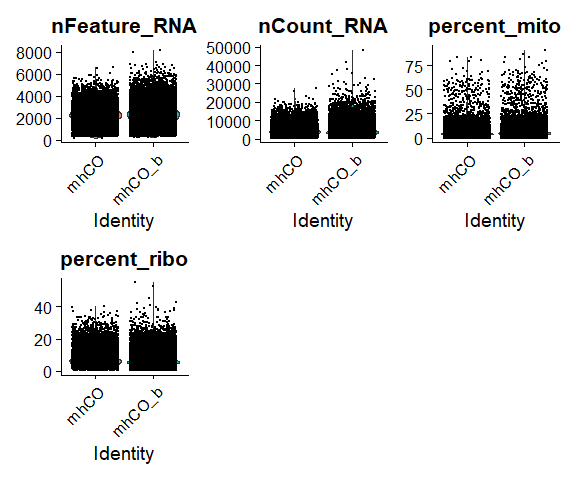<!-- -->

mhCO_b sample has higher trascriptional activity

The number of features (nrow) and cells (ncol).

``` r
dim(mhCOall)
#> [1] 25153 26879
```

numer of cells/sample

``` r
table(mhCOall$orig.ident)
#> 
#>   mhCO mhCO_b 
#>  13542  13337
```

Additionally, we can also see which genes contribute the most to such
reads. We can for instance plot the percentage of counts per gene.

``` r
par(mar = c(4, 8, 2, 1))
C <- mhCOall@assays$RNA@counts
C <- Matrix::t(Matrix::t(C)/Matrix::colSums(C)) * 100
most_expressed <- order(apply(C, 1, median), decreasing = T)[20:1]
#> Warning in asMethod(object): sparse->dense coercion: allocating vector of size
#> 5.0 GiB
boxplot(as.matrix(t(C[most_expressed, ])), cex = 0.1, las = 1, xlab = "% total count per cell",
        col = (scales::hue_pal())(20)[20:1], horizontal = TRUE)
```

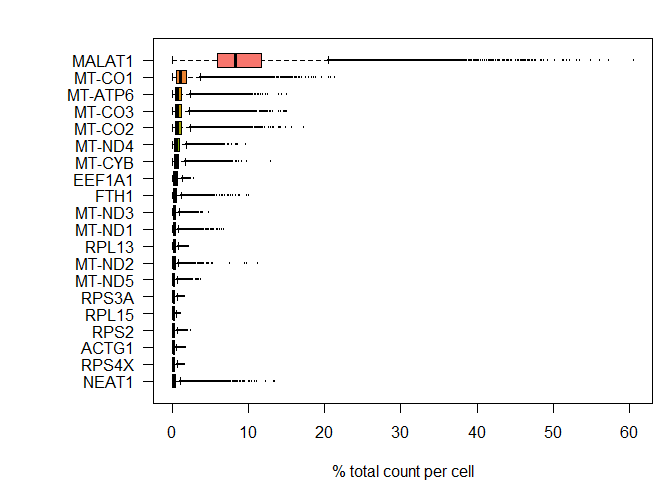

As you can see, MALAT1 constitutes up to 50-60% of the UMIs from a
single cell and the other top genes are mitochondrial and ribosomal
genes. It is quite common that nuclear lincRNAs have correlation with
quality and mitochondrial reads, so high detection of MALAT1 may be a
technical issue.

Looking at the plots, we can make reasonable decisions on where to draw
the cutoff. In this case, the bulk of the cells are below 30%
mitochondrial reads and that will be used as a cutoff. We will also
remove cells with less than 2.5% ribosomal reads.

``` r
mhCOall <- subset(mhCOall, subset = nFeature_RNA > 200 & nFeature_RNA < 7500 &
                      percent_mito < 30 & nCount_RNA < 35000 & percent_ribo > 0.025)
```

``` r
dim(mhCOall)
#> [1] 25153 26393
```

``` r
table(mhCOall$orig.ident)
#> 
#>   mhCO mhCO_b 
#>  13338  13055
```

## Quality Control - II

``` r
feats <- c("nFeature_RNA", "nCount_RNA", "percent_mito", "percent_ribo")
VlnPlot(mhCOall, group.by = "orig.ident", features = feats, pt.size = 0.1, ncol = 3) +
  NoLegend()
```

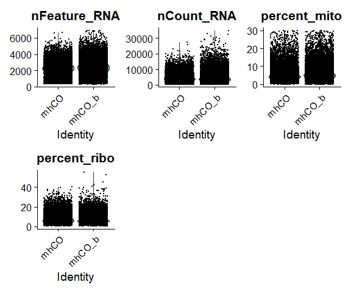<!-- -->

``` r
dim(mhCOall)
#> [1] 25153 26393
```

Filter MALAT1

``` r
mhCOall <- mhCOall[!grepl("MALAT1", rownames(mhCOall)), ]
```

Filter Mitocondrial mhCOall \<- mhCOall\[!grepl(“^MT-”,
rownames(mhCOall)), \]

Filter Ribosomal gene mhCOall \<- mhCOall\[ ! grepl(‘^RP\[SL\]’,
rownames(mhCOall)), \]

``` r
dim(mhCOall)
#> [1] 25152 26393
```

# - Data splitting:

split the dataset in two different seurat objects which can be recalled
thanks to their original identifier

``` r
mhCO.split <- SplitObject(mhCOall, split.by = "orig.ident")
```

normalize and identify variable features for each dataset independently

``` r
mhCO.split <- lapply(X = mhCO.split, FUN = function(x) {
  x <- NormalizeData(x)
  x <- FindVariableFeatures(x, selection.method = "vst", nfeatures = 2500)
})
```

select features that are repeatedly variable across datasets for
integration

``` r
features <- SelectIntegrationFeatures(object.list = mhCO.split)
```

# - Calculate cell-cycle scores

``` r
mhCOall <- CellCycleScoring(object = mhCOall, g2m.features = cc.genes$g2m.genes,
                              s.features = cc.genes$s.genes)
#> Warning: The following features are not present in the object: UHRF1, MLF1IP,
#> CASP8AP2, not searching for symbol synonyms
```

``` r
VlnPlot(mhCOall, features = c("S.Score", "G2M.Score"), group.by = "orig.ident",
        ncol = 4, pt.size = 0.1)
```

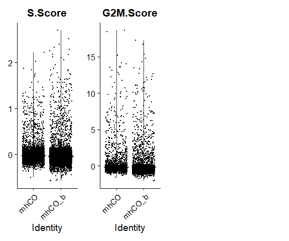<!-- -->

In this case it looks like we only have a few cycling cells in the
datasets

# - Perform integration

We then identify anchors using the FindIntegrationAnchors() function,
which takes a list of Seurat objects as input, and use these anchors to
integrate the datasets together with IntegrateData().

``` r
mhCO.anchors <- FindIntegrationAnchors(object.list = mhCO.split, anchor.features = features)
#> Scaling features for provided objects
#> Finding all pairwise anchors
#> Running CCA
#> Merging objects
#> Finding neighborhoods
#> Finding anchors
#>  Found 22915 anchors
#> Filtering anchors
#>  Retained 12002 anchors
```

this command creates an ‘integrated’ data assay

``` r
mhCO.combined <- IntegrateData(anchorset = mhCO.anchors)
#> Merging dataset 2 into 1
#> Extracting anchors for merged samples
#> Finding integration vectors
#> Finding integration vector weights
#> Integrating data
rm(mhCO.anchors, mhCOall, C, mhCO.split)
```

## - Perform an integrated analysis

Now we can run a single integrated analysis on all cells. specify that
we will perform downstream analysis on the integrated data:

``` r
DefaultAssay(mhCO.combined) <- "integrated"
```

## Run the standard workflow for visualization and clustering

``` r

mhCO.combined <- ScaleData(mhCO.combined, verbose = FALSE)
mhCO.combined <- RunPCA(mhCO.combined, npcs = 30, verbose = FALSE)
mhCO.combined[["pca"]] #' MOST VARIABLE FREATURES
#> A dimensional reduction object with key PC_ 
#>  Number of dimensions: 30 
#>  Projected dimensional reduction calculated:  FALSE 
#>  Jackstraw run: FALSE 
#>  Computed using assay: integrated
print(mhCO.combined[["pca"]], dims = 1:5, nfeatures = 5)
#> PC_ 1 
#> Positive:  DCX, STMN2, SYT1, NRXN1, GRIA2 
#> Negative:  S100A11, BST2, IFITM3, DCN, TIMP1 
#> PC_ 2 
#> Positive:  SPARC, VIM, COL5A2, DCN, LUM 
#> Negative:  TSPAN8, EPCAM, EDN1, SERPINA1, FABP1 
#> PC_ 3 
#> Positive:  CLU, TOP2A, NUF2, IGFBP2, SOX2 
#> Negative:  COL3A1, COL1A1, DCN, COL1A2, COL15A1 
#> PC_ 4 
#> Positive:  MKI67, TOP2A, UBE2C, CASC5, NUF2 
#> Negative:  CA2, HTR2C, TRPM3, FOLR1, TTR 
#> PC_ 5 
#> Positive:  TRPM3, HTR2C, FOLR1, TTR, CXCL14 
#> Negative:  PTN, GPM6B, PTPRZ1, EDNRB, SLC1A3
```

``` r
VizDimLoadings(mhCO.combined, dims = 1:2, reduction = "pca")
```

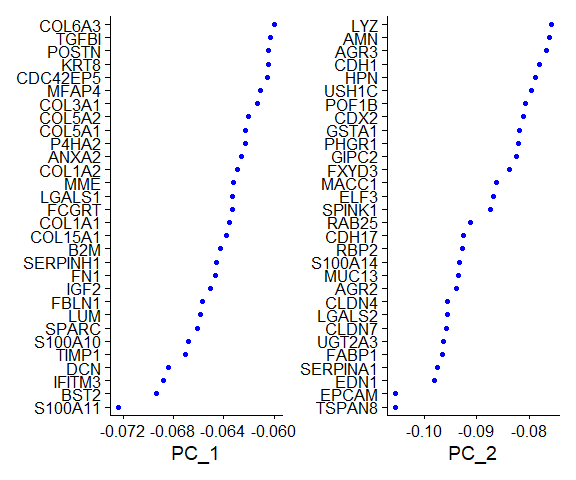

``` r
DimPlot(mhCO.combined, reduction = "pca")
```

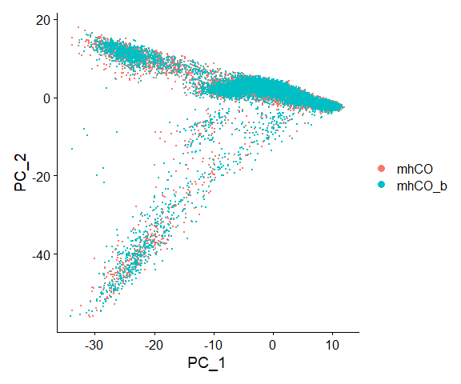

``` r
DimPlot(mhCO.combined, reduction = "pca", dims = c(3,4))
```

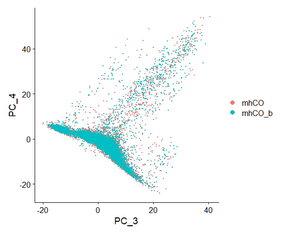

Plotting heatmaps for each PC:

``` r
DimHeatmap(mhCO.combined, dims = 1, cells = 500, balanced = TRUE)
```

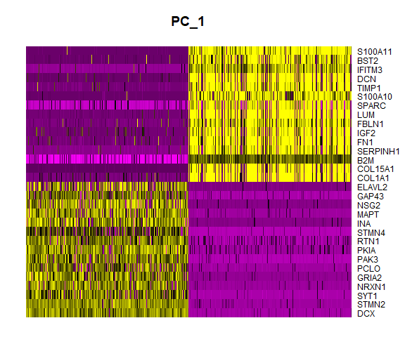

``` r
DimHeatmap(mhCO.combined, dims = 1:9, cells = 500, balanced = TRUE)
```

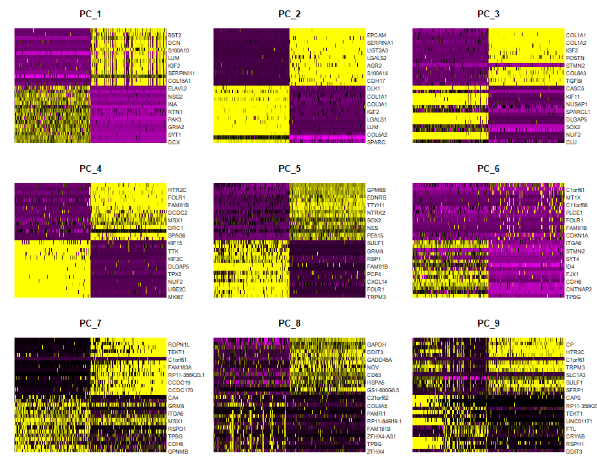

Elbow plot in an informative tool to get optimal trade-off to identify
the majority of variation, avoiding overfitting.

``` r
ElbowPlot(mhCO.combined)
```

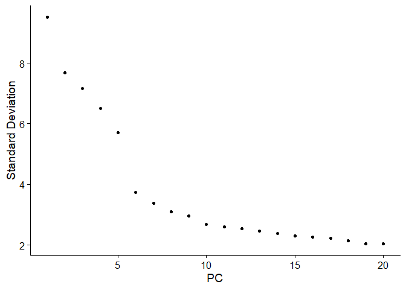<!-- -->

``` r
mhCO.combined <- FindNeighbors(mhCO.combined, reduction = "pca", dims = 1:8)
#> Computing nearest neighbor graph
#> Computing SNN
mhCO.combined <- FindClusters(mhCO.combined, resolution = 0.4)
#> Modularity Optimizer version 1.3.0 by Ludo Waltman and Nees Jan van Eck
#> 
#> Number of nodes: 26393
#> Number of edges: 822978
#> 
#> Running Louvain algorithm...
#> Maximum modularity in 10 random starts: 0.9211
#> Number of communities: 13
#> Elapsed time: 6 seconds
```

Get the number of cells contained in each cluster.

``` r
summary(mhCO.combined@meta.data$seurat_clusters)
#>    0    1    2    3    4    5    6    7    8    9   10   11   12 
#> 5184 2770 2668 2664 2430 2330 2256 2121 1821  951  827  272   99
```

Finally run UMAP.

``` r
mhCO.combined <- RunUMAP(mhCO.combined, reduction = "pca", dims = 1:30)
#> Warning: The default method for RunUMAP has changed from calling Python UMAP via reticulate to the R-native UWOT using the cosine metric
#> To use Python UMAP via reticulate, set umap.method to 'umap-learn' and metric to 'correlation'
#> This message will be shown once per session
#> 10:51:24 UMAP embedding parameters a = 0.9922 b = 1.112
#> 10:51:24 Read 26393 rows and found 30 numeric columns
#> 10:51:24 Using Annoy for neighbor search, n_neighbors = 30
#> 10:51:24 Building Annoy index with metric = cosine, n_trees = 50
#> 0%   10   20   30   40   50   60   70   80   90   100%
#> [----|----|----|----|----|----|----|----|----|----|
#> **************************************************|
#> 10:51:28 Writing NN index file to temp file C:\Users\Mirco\AppData\Local\Temp\RtmpGGhd0k\file316421a22fa8
#> 10:51:28 Searching Annoy index using 1 thread, search_k = 3000
#> 10:51:39 Annoy recall = 100%
#> 10:51:40 Commencing smooth kNN distance calibration using 1 thread with target n_neighbors = 30
#> 10:51:42 Initializing from normalized Laplacian + noise (using irlba)
#> 10:51:45 Commencing optimization for 200 epochs, with 1176588 positive edges
#> 10:52:15 Optimization finished

p1 <- DimPlot(mhCO.combined, reduction = "umap", group.by = "orig.ident")
p2 <- DimPlot(mhCO.combined, reduction = "umap", label = TRUE, repel = TRUE)
p1
```

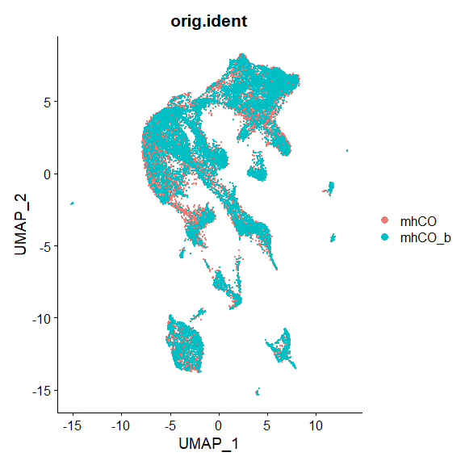

``` r
p2
```

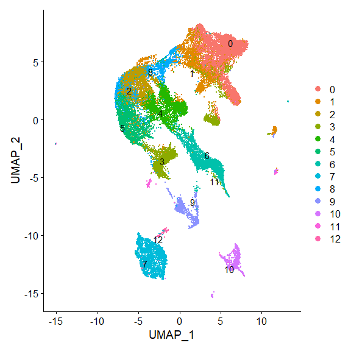

To visualize the two conditions side-by-side, we can use the split.by
argument to show each condition colored by cluster.

``` r
DimPlot(mhCO.combined, reduction = "umap", split.by = "orig.ident")
```

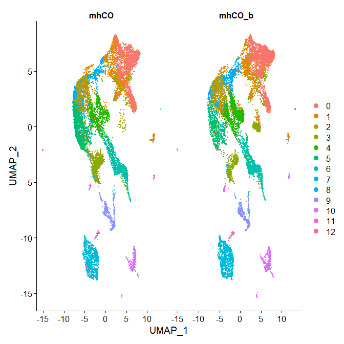

For performing differential expression after integration, we switch back
to the original data

``` r
DefaultAssay(mhCO.combined) <- "RNA"
```

We can explore these marker genes for each cluster and use them to
annotate our clusters as specific cell types.

Cortical Neurons(CN), Interneurons(IN) and Neurons

``` r
FeaturePlot(mhCO.combined, features = c("STMN2", "GAP43"), split.by = "orig.ident", max.cutoff = 3,
           cols = c("grey", "red"))
```

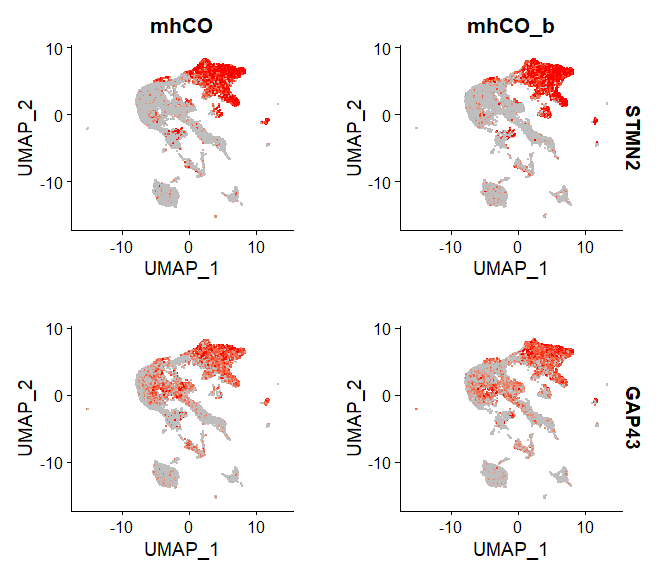

Neuron progenitor cells(NPC)

``` r
FeaturePlot(mhCO.combined, features = c("SOX2", "TOP2A", "MKI67", "SLC1A3"), split.by = "orig.ident", max.cutoff = 3,cols = c("grey", "red"))
```

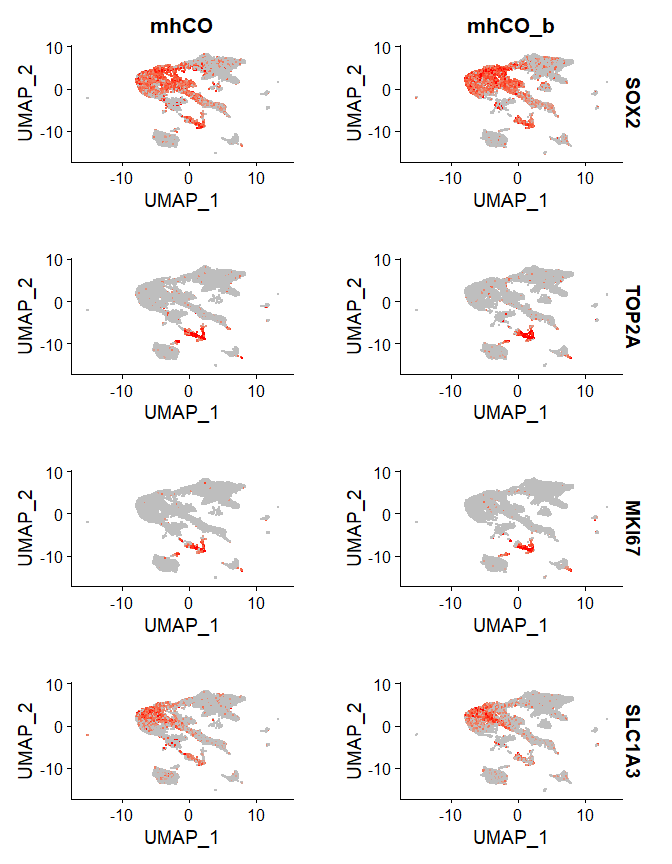

Astrocytes(AS)

``` r
FeaturePlot(mhCO.combined, features = c("GFAP", "SLC1A3"), split.by = "orig.ident", max.cutoff = 3,
             cols = c("grey", "red"))
```

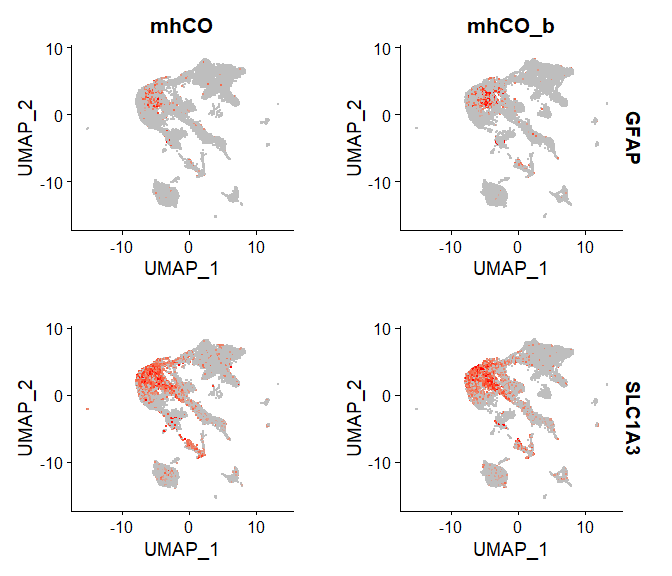

Glia progenitor cells(GPC)/ BMP responsible cell(BRC)

``` r
FeaturePlot(mhCO.combined, features = c("SOX2","BMP4"), split.by = "orig.ident", max.cutoff = 3,
             cols = c("grey", "red"))
```

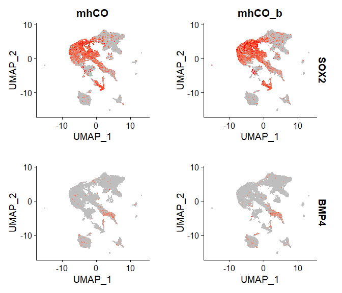

Proteoglycan-expressing cells (PGC)

``` r
FeaturePlot(mhCO.combined, features = c("FLT1", "KDR", "RUNX1", "NFKB1", "CXCL1"), split.by = "orig.ident", max.cutoff = 3,
             cols = c("grey", "red"))
```

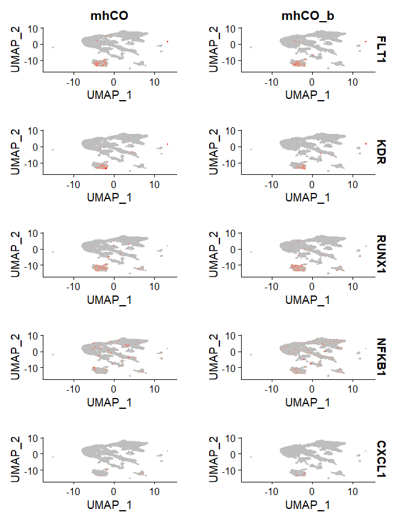

Microglia (MG)

``` r
FeaturePlot(mhCO.combined, features = c("IRF8", "C1QA", "C1QC", "CCL3", "CSF1R", "CYBB", "CTSZ", "CTSS", "TREM1", "CXCL1"), split.by = "orig.ident", max.cutoff = 3,
             cols = c("grey", "red"))
```


Microglia progenitors cluster A2(MGPA2)

``` r
FeaturePlot(mhCO.combined, features = c("RUNX1", "IRF8", "CTSZ", "CTSS", "EDN1", "PYCARD", "ST14", "NFKB1", "CXCL1", "MYB"), split.by = "orig.ident", max.cutoff = 3,
             cols = c("grey", "red"))
```

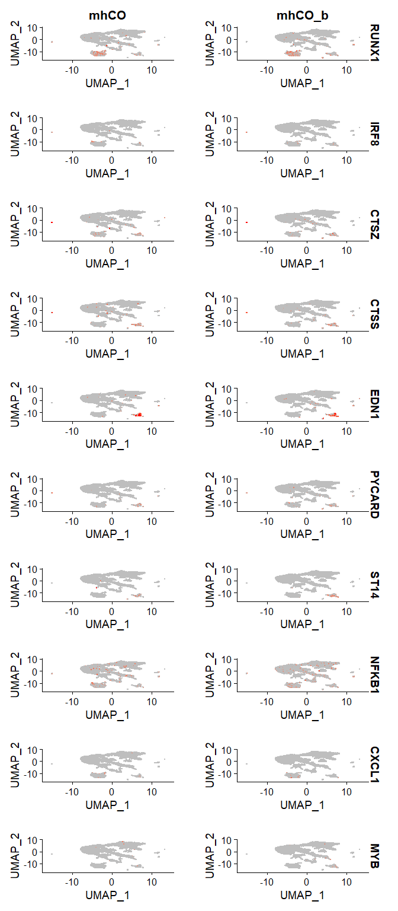

Microglia progenitors cluster A1(MGPA1)

``` r

FeaturePlot(mhCO.combined, features = c("RUNX1", "ST14", "TREM1", "NFKB1"), split.by = "orig.ident", max.cutoff = 3,
             cols = c("grey", "red"))
```

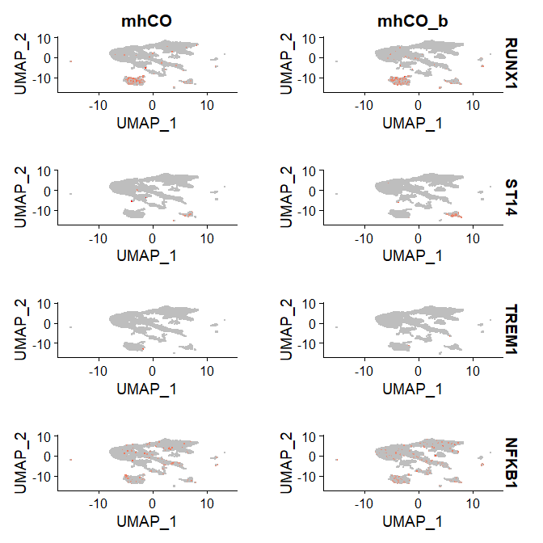

# Labelling clusters

``` r

mhCO.combined <- RenameIdents(mhCO.combined,"0"="CN", "1"="AS", "2"="Neuron", "3"="AS", "4"="AS", "5"="BRC/CBC", "6" = "PGC","7" = "Inter", "8" = "NPC", "9" = "MGPA2", "10"="AS", "11" = "MG", "12"="PGC")
DimPlot(mhCO.combined, label = TRUE, split.by="orig.ident")
```

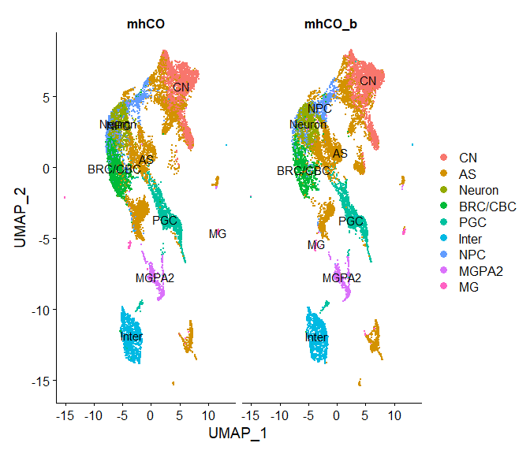<!-- -->

# Gene markers extraction

Since we have samples representing different conditions in our dataset,
our best option is to find conserved markers. This function internally
separates out cells by sample group/condition, and then performs
differential gene expression testing for a single specified cluster
against all other clusters.

------------------------------------------------------------------------

<div class="figure" style="text-align: center">


<p class="caption">
FindConserverdMarkers function
</p>

</div>

------------------------------------------------------------------------

The function accepts a single cluster at a time, so if we want to have
the function run on all clusters, then we can use the map family of
functions to iterate across clusters.

Create function to get conserved markers for any given cluster:

``` r

get_conserved <- function(cluster){
  FindConservedMarkers(mhCO.combined,
                       ident.1 = cluster,
                       grouping.var = "orig.ident",
                       only.pos = TRUE) %>%
    rownames_to_column(var = "gene") %>%
    cbind(cluster_id = cluster, .)
}
```

Since we want the output of the map family of functions to be a
dataframe with each cluster output bound together by rows, we will use
the map_dfr() function. Iterate function across desired clusters

``` r
conserved_markers <- purrr::map_dfr(c("CN","AS","Neuron",
                                     "BRC/CBC","PGC","Inter","NPC","MGPA2",
                                     "MG"), get_conserved)
#> Testing group mhCO_b: (CN) vs (NPC, BRC/CBC, Inter, PGC, AS, Neuron, MGPA2, MG)
#> Testing group mhCO: (CN) vs (Neuron, MGPA2, AS, Inter, NPC, BRC/CBC, PGC, MG)
#> Testing group mhCO_b: (AS) vs (NPC, BRC/CBC, Inter, PGC, CN, Neuron, MGPA2, MG)
#> Testing group mhCO: (AS) vs (Neuron, CN, MGPA2, Inter, NPC, BRC/CBC, PGC, MG)
#> Testing group mhCO_b: (Neuron) vs (NPC, BRC/CBC, Inter, PGC, AS, CN, MGPA2, MG)
#> Testing group mhCO: (Neuron) vs (CN, MGPA2, AS, Inter, NPC, BRC/CBC, PGC, MG)
#> Testing group mhCO_b: (BRC/CBC) vs (NPC, Inter, PGC, AS, CN, Neuron, MGPA2, MG)
#> Testing group mhCO: (BRC/CBC) vs (Neuron, CN, MGPA2, AS, Inter, NPC, PGC, MG)
#> Testing group mhCO_b: (PGC) vs (NPC, BRC/CBC, Inter, AS, CN, Neuron, MGPA2, MG)
#> Testing group mhCO: (PGC) vs (Neuron, CN, MGPA2, AS, Inter, NPC, BRC/CBC, MG)
#> Testing group mhCO_b: (Inter) vs (NPC, BRC/CBC, PGC, AS, CN, Neuron, MGPA2, MG)
#> Testing group mhCO: (Inter) vs (Neuron, CN, MGPA2, AS, NPC, BRC/CBC, PGC, MG)
#> Testing group mhCO_b: (NPC) vs (BRC/CBC, Inter, PGC, AS, CN, Neuron, MGPA2, MG)
#> Testing group mhCO: (NPC) vs (Neuron, CN, MGPA2, AS, Inter, BRC/CBC, PGC, MG)
#> Testing group mhCO_b: (MGPA2) vs (NPC, BRC/CBC, Inter, PGC, AS, CN, Neuron, MG)
#> Testing group mhCO: (MGPA2) vs (Neuron, CN, AS, Inter, NPC, BRC/CBC, PGC, MG)
#> Testing group mhCO_b: (MG) vs (NPC, BRC/CBC, Inter, PGC, AS, CN, Neuron, MGPA2)
#> Testing group mhCO: (MG) vs (Neuron, CN, MGPA2, AS, Inter, NPC, BRC/CBC, PGC)
```

Extract top 10 markers per cluster

``` r
top10 <- conserved_markers %>% 
  mutate(avg_fc = (mhCO_avg_log2FC + mhCO_b_avg_log2FC) /2) %>% 
  group_by(cluster_id) %>% 
  top_n(n = 10, 
        wt = avg_fc)
```

Visualize top 10 markers per cluster

``` r
top10
#> # A tibble: 90 × 15
#> # Groups:   cluster_id [9]
#>    cluster_id gene  mhCO_b_p…¹ mhCO_…² mhCO_…³ mhCO_…⁴ mhCO_…⁵ mhCO_p_…⁶ mhCO_…⁷
#>    <chr>      <chr>      <dbl>   <dbl>   <dbl>   <dbl>   <dbl>     <dbl>   <dbl>
#>  1 CN         NRXN1          0    1.94   0.914   0.227       0 0            1.72
#>  2 CN         SCG2           0    2.13   0.59    0.188       0 7.42e-215    1.67
#>  3 CN         NSG2           0    2.07   0.832   0.139       0 0            2.06
#>  4 CN         DCX            0    2.40   0.979   0.327       0 0            2.55
#>  5 CN         PKIA           0    2.11   0.891   0.314       0 0            2.02
#>  6 CN         STMN2          0    2.77   0.991   0.267       0 0            2.83
#>  7 CN         INA            0    1.95   0.859   0.174       0 0            2.03
#>  8 CN         RTN1           0    2.09   0.923   0.397       0 0            2.05
#>  9 CN         MAPT           0    2.07   0.855   0.242       0 0            1.79
#> 10 CN         SYT4           0    2.22   0.721   0.151       0 0            2.02
#> # … with 80 more rows, 6 more variables: mhCO_pct.1 <dbl>, mhCO_pct.2 <dbl>,
#> #   mhCO_p_val_adj <dbl>, max_pval <dbl>, minimump_p_val <dbl>, avg_fc <dbl>,
#> #   and abbreviated variable names ¹​mhCO_b_p_val, ²​mhCO_b_avg_log2FC,
#> #   ³​mhCO_b_pct.1, ⁴​mhCO_b_pct.2, ⁵​mhCO_b_p_val_adj, ⁶​mhCO_p_val,
#> #   ⁷​mhCO_avg_log2FC
```

Dotplot is a useful function when we are willing to do a check:

``` r

markers.to.plot.mhCO <- c("STMN2","GAP43","SOX2","VIM","TOP2A","MKI67","GFAP","SLC1A3",
                          "BMP4","FOJ1","FLT1","KDR","RUNX1","IRF8","C1QA","C1QC","CCL3"
                          ,"CSF1R","CYBB","CTSZ","CTSS","EDN1","PYCARD","ST14","TREM1",
                          "NFKB1","CXCL1","MYB")

DotPlot(mhCO.combined, features = markers.to.plot.mhCO, cols = c("blue", "red"), dot.scale = 8, split.by = "orig.ident") +
  RotatedAxis()
#> Warning in FetchData.Seurat(object = object, vars = features, cells = cells):
#> The following requested variables were not found: FOJ1
```

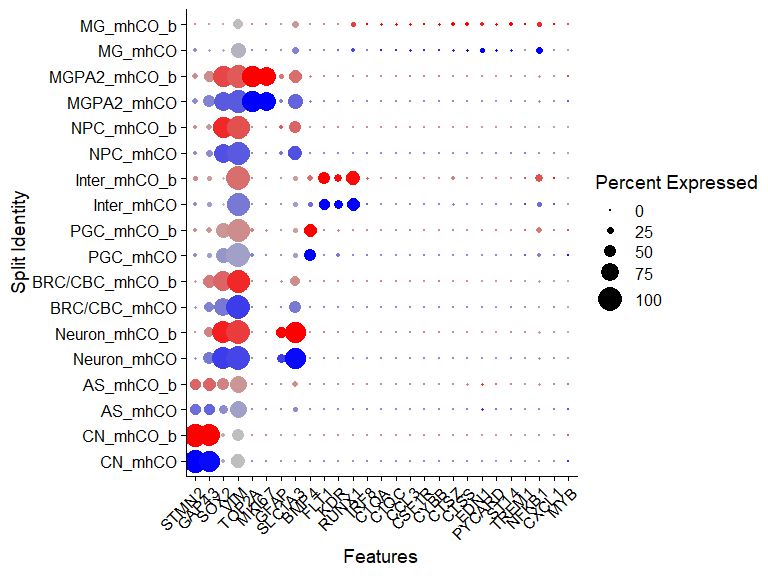

### INTERESTING FINDS

First of all, many genes are expressed similarly in mhCO and mhCO_b
cells, meaning that microglia cells could protect neurons and other
cells from inflammation induced by treatment. of course there is still a
difference, but not as big as in hCO vs treated hCO.

EDN1 - inflammatory gene. wasn’t up regulated in treated mhCO sample,
could mean that micoglia protected cells from treatment-induced
neuroinflammation.

``` r
FeaturePlot(mhCO.combined, features = c("EDN1"), split.by = "orig.ident", max.cutoff = 3,
            cols = c("grey", "red"))
```

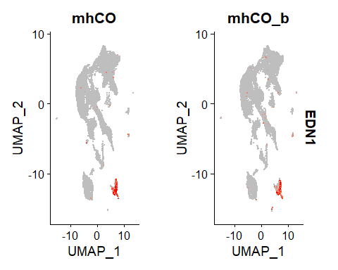

MG activation genes up regulated in cluster 11

``` r
mg.activation.markers <- c("AIF1", "C1QC", "CSF1R", "LCP1", "PTPRC", "CTSS")
DotPlot(mhCO.combined, features = mg.activation.markers, cols = c("blue", "red"), dot.scale = 8, split.by = "orig.ident") +
  RotatedAxis()
```

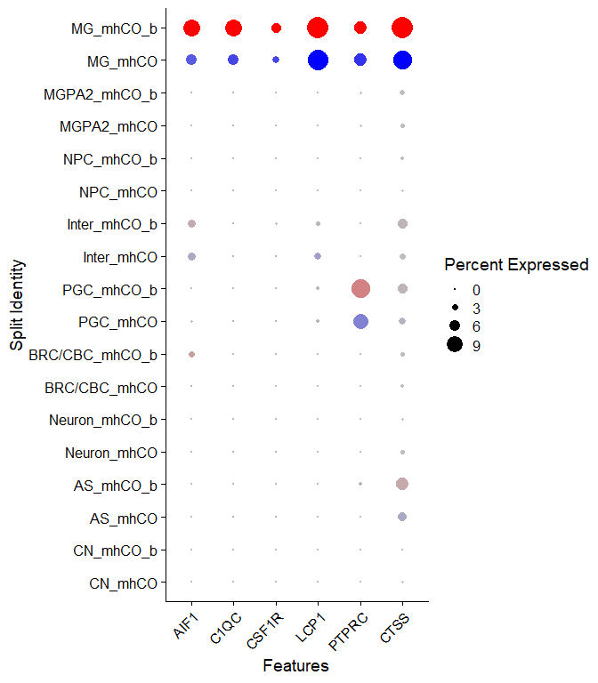

Thos genese are UP regulated in treatment sample, probably due to the
fact that these genes are involved in lysosome activity, phagocytosis,
leukocyte aggregation. AB treatment led to the induced phagocytic
activity of MG in the organoids.

It should be noted that, the biggest change in expression occurs in MG
cluster. also the most genes are involved in MG cluster

``` r
phagocytic.markers <- c("NCF4","ANXA2","CYBA","MYH9","CLEC7A","CD44","ITGB2", "FCER1G","ABCA1","CD36", "CD68")

DotPlot(mhCO.combined, features = phagocytic.markers, cols = c("blue", "red"), dot.scale = 8, split.by = "orig.ident") +
  RotatedAxis()
```

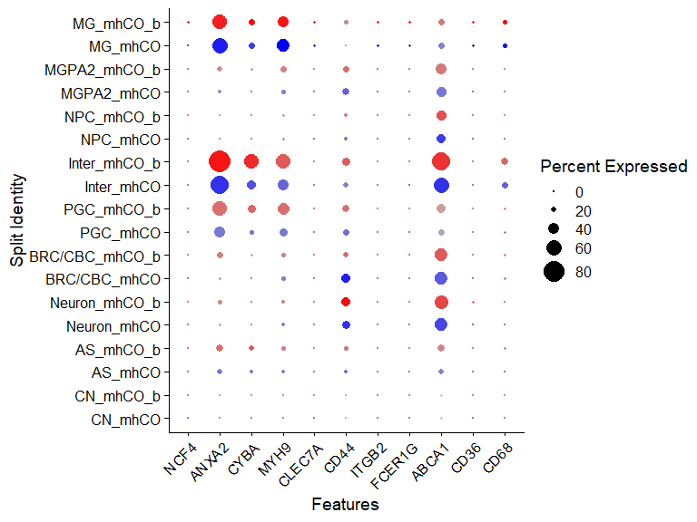

ferropotosis mediators markers are very similarly expressed, meaning
that cell apoptosis wasn’t quite occurring

``` r
FeaturePlot(mhCO.combined, features = c("PHKG2", "TXNRD1", "PPARG"), split.by = "orig.ident", max.cutoff = 3,
            cols = c("grey", "red"))
```

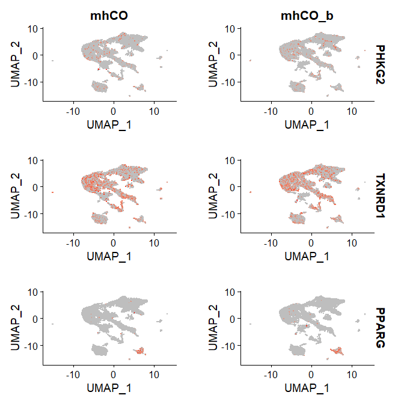

``` r
rm(mhCO.anchors, mhCO.filt, mhCOall, ifnb.list)
#> Warning in rm(mhCO.anchors, mhCO.filt, mhCOall, ifnb.list): oggetto
#> 'mhCO.anchors' non trovato
#> Warning in rm(mhCO.anchors, mhCO.filt, mhCOall, ifnb.list): oggetto 'mhCO.filt'
#> non trovato
#> Warning in rm(mhCO.anchors, mhCO.filt, mhCOall, ifnb.list): oggetto 'mhCOall'
#> non trovato
#> Warning in rm(mhCO.anchors, mhCO.filt, mhCOall, ifnb.list): oggetto 'ifnb.list'
#> non trovato
```

# Gene ontology analysis

Gene Ontology (GO) term enrichment is a technique for interpreting sets
of genes making use of the Gene Ontology system of classification, in
which genes are assigned to a set of predefined bins depending on their
functional characteristics.

``` r
library(GOstats)
#> Warning: il pacchetto 'GOstats' è stato creato con R versione 4.2.1
#> Caricamento del pacchetto richiesto: Category
#> Warning: il pacchetto 'Category' è stato creato con R versione 4.2.1
#> Caricamento del pacchetto richiesto: AnnotationDbi
#> Warning: il pacchetto 'AnnotationDbi' è stato creato con R versione 4.2.1
#> 
#> Caricamento pacchetto: 'AnnotationDbi'
#> Il seguente oggetto è mascherato da 'package:dplyr':
#> 
#>     select
#> Caricamento del pacchetto richiesto: graph
#> Warning: il pacchetto 'graph' è stato creato con R versione 4.2.1
#> 
#> 
#> Caricamento pacchetto: 'GOstats'
#> Il seguente oggetto è mascherato da 'package:AnnotationDbi':
#> 
#>     makeGOGraph
library(GO.db)
library(org.Hs.eg.db)
#> 
hs <- org.Hs.eg.db
```

## Get reference list

The reference list is the list of all the genes from which our
differential expression analysis list was selected.

``` r
GeneUniverse <- read.table("D:/OneDrive - Università degli Studi di Milano/PoliMirco/Secondo anno/Primo semestre/Neurogenomics/Exam/microglia-like/mhCO/GSM5345019_mhCO_features.tsv", header = FALSE )
head(GeneUniverse$V2)
#> [1] "MIR1302-10"   "FAM138A"      "OR4F5"        "RP11-34P13.7" "RP11-34P13.8"
#> [6] "AL627309.1"
summary(GeneUniverse)
#>       V1                 V2                 V3                 V4           
#>  Length:32738       Length:32738       Length:32738       Length:32738      
#>  Class :character   Class :character   Class :character   Class :character  
#>  Mode  :character   Mode  :character   Mode  :character   Mode  :character
GeneUniverse.symbols <- GeneUniverse$V2 
```

Get Entrez ID of Universe and DE gene symbols in Cortical Neurons

``` r

Universe_symbol_entrez <- select(hs, keys = GeneUniverse.symbols, columns = c("ENTREZID","SYMBOL"), keytype = "SYMBOL")
#> 'select()' returned many:many mapping between keys and columns
Universe.entrezIDs <- Universe_symbol_entrez$ENTREZID

CN.mark <- top10[top10$cluster_id=='CN',]
CN.symbols <- CN.mark$gene
CN_symbol_entrez <- select(hs, keys = CN.symbols, columns = c("ENTREZID","SYMBOL"), keytype = "SYMBOL")
#> 'select()' returned 1:1 mapping between keys and columns
CN.entrezIDs <- CN_symbol_entrez$ENTREZID
```

Run on Homo sapiens annotated entrez genes, BP = biological process.
over= over-represented

``` r

upParams = new("GOHyperGParams",geneIds = CN.entrezIDs,universeGeneIds = Universe.entrezIDs,
               annotation="org.Hs.eg.db",ontology="BP",pvalueCutoff=0.01,
               conditional=FALSE, testDirection="over")
#> Warning in makeValidParams(.Object): removing duplicate IDs in universeGeneIds

upBP = hyperGTest(upParams)

summary(upBP)[1:10,]
#>        GOBPID       Pvalue OddsRatio     ExpCount Count Size
#> 1  GO:1904950 4.533382e-05  59.08744 0.0738259197     3  119
#> 2  GO:1903828 1.709190e-04  37.29742 0.1153917737     3  186
#> 3  GO:0031112 2.038762e-04 121.78788 0.0217135058     2   35
#> 4  GO:0048666 2.353841e-04  14.22590 0.6594701905     5 1063
#> 5  GO:1990090 3.533527e-04  91.27841 0.0285377505     2   46
#> 6  GO:1990089 3.848484e-04  87.29891 0.0297785222     2   48
#> 7  GO:0031113 4.518029e-04  80.29500 0.0322600658     2   52
#> 8  GO:0007611 4.786785e-04  26.02299 0.1637818723     3  264
#> 9  GO:0048174 6.203859e-04       Inf 0.0006203859     1    1
#> 10 GO:0099082 6.203859e-04       Inf 0.0006203859     1    1
#>                                                                     Term
#> 1           negative regulation of establishment of protein localization
#> 2                            negative regulation of protein localization
#> 3  positive regulation of microtubule polymerization or depolymerization
#> 4                                                     neuron development
#> 5                      cellular response to nerve growth factor stimulus
#> 6                                        response to nerve growth factor
#> 7                               regulation of microtubule polymerization
#> 8                                                     learning or memory
#> 9         negative regulation of short-term neuronal synaptic plasticity
#> 10                   retrograde trans-synaptic signaling by neuropeptide
```

DE genes symbols in microglia

``` r
MG.mark <- top10[top10$cluster_id=="MG",]
MG.symbols <- MG.mark$gene
MG_symbol_entrez <- select(hs, keys = MG.symbols, columns = c("ENTREZID","SYMBOL"), keytype = "SYMBOL")
#> 'select()' returned 1:1 mapping between keys and columns
MG.entrezIDs <- MG_symbol_entrez$ENTREZID

upParams = new("GOHyperGParams",geneIds = MG.entrezIDs,universeGeneIds = Universe.entrezIDs,
               annotation="org.Hs.eg.db",ontology="BP",pvalueCutoff=0.01,
               conditional=FALSE, testDirection="over")
#> Warning in makeValidParams(.Object): removing duplicate IDs in universeGeneIds

upBP = hyperGTest(upParams)

summary(upBP)[1:10,]
#>        GOBPID       Pvalue OddsRatio   ExpCount Count Size
#> 1  GO:0045104 5.450695e-08 193.10843 0.04317886     4   87
#> 2  GO:0045103 5.709114e-08 190.79762 0.04367517     4   88
#> 3  GO:0045109 3.961008e-06 148.11692 0.03374899     3   68
#> 4  GO:0030855 6.537146e-06  38.23180 0.33649730     5  678
#> 5  GO:0030216 5.477324e-05  59.81625 0.08089832     3  163
#> 6  GO:0060429 8.733174e-05  21.68261 0.57323655     5 1155
#> 7  GO:0018149 1.272030e-04 162.40404 0.01737080     2   35
#> 8  GO:0009913 1.446006e-04  42.74798 0.11216577     3  226
#> 9  GO:0007010 2.065983e-04  17.83345 0.68589863     5 1382
#> 10 GO:0097435 3.038013e-04  20.14304 0.38017247     4  766
#>                                               Term
#> 1  intermediate filament cytoskeleton organization
#> 2              intermediate filament-based process
#> 3               intermediate filament organization
#> 4                  epithelial cell differentiation
#> 5                     keratinocyte differentiation
#> 6                           epithelium development
#> 7                            peptide cross-linking
#> 8                   epidermal cell differentiation
#> 9                        cytoskeleton organization
#> 10               supramolecular fiber organization
```

DE genes symbols in Inter

``` r
Inter.mark <- top10[top10$cluster_id=='Inter',]
Inter.symbols <- Inter.mark$gene
Inter_symbol_entrez <- select(hs, keys = Inter.symbols, columns = c("ENTREZID","SYMBOL"), keytype = "SYMBOL")
#> 'select()' returned 1:1 mapping between keys and columns
Inter.entrezIDs <- Inter_symbol_entrez$ENTREZID

upParams = new("GOHyperGParams",geneIds = Inter.entrezIDs,universeGeneIds = Universe.entrezIDs,
               annotation="org.Hs.eg.db",ontology="BP",pvalueCutoff=0.01,
               conditional=FALSE, testDirection="over")
#> Warning in makeValidParams(.Object): removing duplicate IDs in universeGeneIds

upBP = hyperGTest(upParams)
summary(upBP)[1:10,]
#>        GOBPID       Pvalue OddsRatio    ExpCount Count Size
#> 1  GO:0030199 3.581638e-08 191.10714 0.037223153     4   60
#> 2  GO:0030198 5.297729e-07  53.05705 0.187976922     5  303
#> 3  GO:0043062 5.384908e-07  52.87625 0.188597308     5  304
#> 4  GO:0045229 5.562680e-07  52.51827 0.189838079     5  306
#> 5  GO:0007166 5.977332e-07  47.23778 1.604938272     9 2587
#> 6  GO:0018149 1.113727e-06 215.31696 0.021713506     3   35
#> 7  GO:0071604 1.678486e-06 186.16216 0.024815435     3   40
#> 8  GO:0071230 8.436644e-06 105.78462 0.042186240     3   68
#> 9  GO:0071229 1.180360e-05  94.14481 0.047149327     3   76
#> 10 GO:0043589 1.899601e-05 447.22222 0.006824245     2   11
#>                                             Term
#> 1                   collagen fibril organization
#> 2              extracellular matrix organization
#> 3           extracellular structure organization
#> 4  external encapsulating structure organization
#> 5        cell surface receptor signaling pathway
#> 6                          peptide cross-linking
#> 7     transforming growth factor beta production
#> 8       cellular response to amino acid stimulus
#> 9             cellular response to acid chemical
#> 10                            skin morphogenesis
```

DE genes symbols in MGPA2

``` r
MGPA2.mark <- top10[top10$cluster_id=="MGPA2",]
MGPA2.symbols <- MGPA2.mark$gene
MGPA2_symbol_entrez <- select(hs, keys = MGPA2.symbols, columns = c("ENTREZID","SYMBOL"), keytype = "SYMBOL")
#> 'select()' returned 1:1 mapping between keys and columns
MGPA2.entrezIDs <- MGPA2_symbol_entrez$ENTREZID

upParams = new("GOHyperGParams",geneIds = MGPA2.entrezIDs,universeGeneIds = Universe.entrezIDs,
               annotation="org.Hs.eg.db",ontology="BP",pvalueCutoff=0.01,
               conditional=FALSE, testDirection="over")
#> Warning in makeValidParams(.Object): removing duplicate IDs in universeGeneIds

upBP = hyperGTest(upParams)

summary(upBP)[1:10,]
#>        GOBPID       Pvalue OddsRatio  ExpCount Count Size
#> 1  GO:0000280 2.736767e-12 287.59633 0.2479062     8  444
#> 2  GO:0048285 5.751661e-12 261.06054 0.2719151     8  487
#> 3  GO:0051301 3.080608e-09  92.23005 0.3327750     7  596
#> 4  GO:0140014 3.711818e-09 104.68874 0.1719710     6  308
#> 5  GO:0022402 4.984725e-09 106.35670 0.6337242     8 1135
#> 6  GO:0007059 7.200044e-09  93.32544 0.1920715     6  344
#> 7  GO:0000819 5.331843e-08  92.85047 0.1222781     5  219
#> 8  GO:0051276 9.487751e-08  59.48855 0.2959241     6  530
#> 9  GO:0007049 1.014479e-07  70.06178 0.9262982     8 1659
#> 10 GO:0051726 1.514244e-07  50.82081 0.5834729     7 1045
#>                            Term
#> 1              nuclear division
#> 2             organelle fission
#> 3                 cell division
#> 4      mitotic nuclear division
#> 5            cell cycle process
#> 6        chromosome segregation
#> 7  sister chromatid segregation
#> 8       chromosome organization
#> 9                    cell cycle
#> 10     regulation of cell cycle
```

# ssGSEA

``` r
library(dittoSeq)
#> Warning: il pacchetto 'dittoSeq' è stato creato con R versione 4.2.1
library(escape)
#> Warning: il pacchetto 'escape' è stato creato con R versione 4.2.1
```

Remove metadata that can interfere with computing of Enrichment
Score(ES)

``` r
mhCO.combined@meta.data$nCount_RNA <- NULL
mhCO.combined@meta.data$nFeature_RNA <- NULL
mhCO.combined@meta.data$percent_mito <- NULL
mhCO.combined@meta.data$percent_ribo <- NULL
mhCO.combined@meta.data$type <- NULL
mhCO.combined@meta.data$integrated_snn_res.0.4 <- NULL
```

## Getting Gene Sets

C2 = curated gene sets; C5 = ontology gene sets

``` r
GS.hallmark <- getGeneSets(library = "C2", gene.sets =c("KEGG_ABC_TRANSPORTERS",
                                                        "KEGG_ACUTE_MYELOID_LEUKEMIA",
                                                        "KEGG_ADHERENS_JUNCTION",
                                                        "KEGG_ADIPOCYTOKINE_SIGNALING_PATHWAY",
                                                        "KEGG_ALANINE_ASPARTATE_AND_GLUTAMATE_METABOLISM",
                                                        "KEGG_ALDOSTERONE_REGULATED_SODIUM_REABSORPTION",
                                                        "KEGG_ALLOGRAFT_REJECTION",
                                                        "KEGG_ALPHA_LINOLENIC_ACID_METABOLISM",
                                                        "KEGG_ALZHEIMERS_DISEASE",
                                                        "KEGG_AMINO_SUGAR_AND_NUCLEOTIDE_SUGAR_METABOLISM",
                                                        "KEGG_AMINOACYL_TRNA_BIOSYNTHESIS",
                                                        "KEGG_AMYOTROPHIC_LATERAL_SCLEROSIS_ALS",
                                                        "KEGG_ANTIGEN_PROCESSING_AND_PRESENTATION",
                                                        "KEGG_APOPTOSIS",
                                                        "KEGG_ARACHIDONIC_ACID_METABOLISM",
                                                        "KEGG_ARGININE_AND_PROLINE_METABOLISM",
                                                    "KEGG_ARRHYTHMOGENIC_RIGHT_VENTRICULAR_CARDIOMYOPATHY_ARVC",
                                                        "KEGG_ASCORBATE_AND_ALDARATE_METABOLISM",
                                                        "KEGG_ASTHMA",
                                                        "KEGG_AUTOIMMUNE_THYROID_DISEASE",
                                                        "KEGG_AXON_GUIDANCE",
                                                        "KEGG_B_CELL_RECEPTOR_SIGNALING_PATHWAY",
                                                        "KEGG_BASAL_CELL_CARCINOMA",
                                                        "KEGG_BASAL_TRANSCRIPTION_FACTORS",
                                                        "KEGG_BASE_EXCISION_REPAIR",
                                                        "KEGG_BETA_ALANINE_METABOLISM",
                                                        "KEGG_BIOSYNTHESIS_OF_UNSATURATED_FATTY_ACIDS",
                                                        "KEGG_BLADDER_CANCER",
                                                        "KEGG_BUTANOATE_METABOLISM",
                                                        "KEGG_CALCIUM_SIGNALING_PATHWAY",
                                                        "KEGG_CARDIAC_MUSCLE_CONTRACTION",
                                                        "KEGG_CELL_ADHESION_MOLECULES_CAMS",
                                                        "KEGG_CELL_CYCLE",
                                                        "KEGG_CHEMOKINE_SIGNALING_PATHWAY",
                                                        "KEGG_CHRONIC_MYELOID_LEUKEMIA",
                                                        "KEGG_CIRCADIAN_RHYTHM_MAMMAL",
                                                        "KEGG_CITRATE_CYCLE_TCA_CYCLE",
                                                        "KEGG_COLORECTAL_CANCER",
                                                        "KEGG_COMPLEMENT_AND_COAGULATION_CASCADES",
                                                        "KEGG_CYSTEINE_AND_METHIONINE_METABOLISM",
                                                        "KEGG_CYTOKINE_CYTOKINE_RECEPTOR_INTERACTION",
                                                        "KEGG_CYTOSOLIC_DNA_SENSING_PATHWAY",
                                                        "KEGG_DILATED_CARDIOMYOPATHY",
                                                        "KEGG_DNA_REPLICATION",
                                                        "KEGG_DORSO_VENTRAL_AXIS_FORMATION",
                                                        "KEGG_DRUG_METABOLISM_CYTOCHROME_P450",
                                                        "KEGG_DRUG_METABOLISM_OTHER_ENZYMES",
                                                        "KEGG_ECM_RECEPTOR_INTERACTION",
                                                        "KEGG_ENDOCYTOSIS",
                                                        "KEGG_ENDOMETRIAL_CANCER",
                                              "KEGG_EPITHELIAL_CELL_SIGNALING_IN_HELICOBACTER_PYLORI_INFECTION",
                                                        "KEGG_ERBB_SIGNALING_PATHWAY",
                                                        "KEGG_ETHER_LIPID_METABOLISM",
                                                        "KEGG_FATTY_ACID_METABOLISM",
                                                        "KEGG_FC_EPSILON_RI_SIGNALING_PATHWAY",
                                                        "KEGG_FC_GAMMA_R_MEDIATED_PHAGOCYTOSIS",
                                                        "KEGG_FOCAL_ADHESION",
                                                        "KEGG_FOLATE_BIOSYNTHESIS",
                                                        "KEGG_FRUCTOSE_AND_MANNOSE_METABOLISM",
                                                        "KEGG_GALACTOSE_METABOLISM",
                                                        "KEGG_GAP_JUNCTION",
                                                        "KEGG_GLIOMA",
                                                        "KEGG_GLUTATHIONE_METABOLISM",
                                                        "KEGG_GLYCEROLIPID_METABOLISM",
                                                        "KEGG_GLYCEROPHOSPHOLIPID_METABOLISM",
                                                        "KEGG_GLYCINE_SERINE_AND_THREONINE_METABOLISM",
                                                        "KEGG_GLYCOLYSIS_GLUCONEOGENESIS",
                                                      "KEGG_GLYCOSAMINOGLYCAN_BIOSYNTHESIS_CHONDROITIN_SULFATE",
                                                        "KEGG_GLYCOSAMINOGLYCAN_BIOSYNTHESIS_HEPARAN_SULFATE",
                                                        "KEGG_GLYCOSAMINOGLYCAN_BIOSYNTHESIS_KERATAN_SULFATE",
                                                        "KEGG_GLYCOSAMINOGLYCAN_DEGRADATION",
                                                        "KEGG_GLYCOSPHINGOLIPID_BIOSYNTHESIS_GANGLIO_SERIES",
                                                        "KEGG_GLYCOSPHINGOLIPID_BIOSYNTHESIS_GLOBO_SERIES",
                                              "KEGG_GLYCOSPHINGOLIPID_BIOSYNTHESIS_LACTO_AND_NEOLACTO_SERIES",
                                                  "KEGG_GLYCOSYLPHOSPHATIDYLINOSITOL_GPI_ANCHOR_BIOSYNTHESIS",
                                                        "KEGG_GLYOXYLATE_AND_DICARBOXYLATE_METABOLISM",
                                                        "KEGG_GNRH_SIGNALING_PATHWAY",
                                                        "KEGG_GRAFT_VERSUS_HOST_DISEASE",
                                                        "KEGG_HEDGEHOG_SIGNALING_PATHWAY",
                                                        "KEGG_HEMATOPOIETIC_CELL_LINEAGE",
                                                        "KEGG_HISTIDINE_METABOLISM",
                                                        "KEGG_HOMOLOGOUS_RECOMBINATION",
                                                        "KEGG_HUNTINGTONS_DISEASE",
                                                        "KEGG_HYPERTROPHIC_CARDIOMYOPATHY_HCM",
                                                        "KEGG_INOSITOL_PHOSPHATE_METABOLISM",
                                                        "KEGG_INSULIN_SIGNALING_PATHWAY",
                                                        "KEGG_INTESTINAL_IMMUNE_NETWORK_FOR_IGA_PRODUCTION",
                                                        "KEGG_JAK_STAT_SIGNALING_PATHWAY",
                                                        "KEGG_LEISHMANIA_INFECTION",
                                                        "KEGG_LEUKOCYTE_TRANSENDOTHELIAL_MIGRATION",
                                                        "KEGG_LIMONENE_AND_PINENE_DEGRADATION",
                                                        "KEGG_LINOLEIC_ACID_METABOLISM",
                                                        "KEGG_LONG_TERM_DEPRESSION",
                                                        "KEGG_LONG_TERM_POTENTIATION",
                                                        "KEGG_LYSINE_DEGRADATION",
                                                        "KEGG_LYSOSOME",
                                                        "KEGG_MAPK_SIGNALING_PATHWAY",
                                                        "KEGG_MATURITY_ONSET_DIABETES_OF_THE_YOUNG",
                                                        "KEGG_MELANOGENESIS",
                                                        "KEGG_MELANOMA",
                                                        "KEGG_METABOLISM_OF_XENOBIOTICS_BY_CYTOCHROME_P450",
                                                        "KEGG_MISMATCH_REPAIR",
                                                        "KEGG_MTOR_SIGNALING_PATHWAY",
                                                        "KEGG_N_GLYCAN_BIOSYNTHESIS",
                                                        "KEGG_NATURAL_KILLER_CELL_MEDIATED_CYTOTOXICITY",
                                                        "KEGG_NEUROACTIVE_LIGAND_RECEPTOR_INTERACTION",
                                                        "KEGG_NEUROTROPHIN_SIGNALING_PATHWAY",
                                                        "KEGG_NICOTINATE_AND_NICOTINAMIDE_METABOLISM",
                                                        "KEGG_NITROGEN_METABOLISM",
                                                        "KEGG_NOD_LIKE_RECEPTOR_SIGNALING_PATHWAY",
                                                        "KEGG_NON_HOMOLOGOUS_END_JOINING",
                                                        "KEGG_NON_SMALL_CELL_LUNG_CANCER",
                                                        "KEGG_NOTCH_SIGNALING_PATHWAY",
                                                        "KEGG_NUCLEOTIDE_EXCISION_REPAIR",
                                                        "KEGG_O_GLYCAN_BIOSYNTHESIS",
                                                        "KEGG_OLFACTORY_TRANSDUCTION",
                                                        "KEGG_ONE_CARBON_POOL_BY_FOLATE",
                                                        "KEGG_OOCYTE_MEIOSIS",
                                                        "KEGG_OTHER_GLYCAN_DEGRADATION",
                                                        "KEGG_OXIDATIVE_PHOSPHORYLATION",
                                                        "KEGG_P53_SIGNALING_PATHWAY",
                                                        "KEGG_PANCREATIC_CANCER",
                                                        "KEGG_PANTOTHENATE_AND_COA_BIOSYNTHESIS",
                                                        "KEGG_PARKINSONS_DISEASE",
                                                        "KEGG_PATHOGENIC_ESCHERICHIA_COLI_INFECTION",
                                                        "KEGG_PATHWAYS_IN_CANCER",
                                                        "KEGG_PENTOSE_AND_GLUCURONATE_INTERCONVERSIONS",
                                                        "KEGG_PENTOSE_PHOSPHATE_PATHWAY",
                                                        "KEGG_PEROXISOME",
                                                        "KEGG_PHENYLALANINE_METABOLISM",
                                                        "KEGG_PHOSPHATIDYLINOSITOL_SIGNALING_SYSTEM",
                                                        "KEGG_PORPHYRIN_AND_CHLOROPHYLL_METABOLISM",
                                                        "KEGG_PPAR_SIGNALING_PATHWAY",
                                                        "KEGG_PRIMARY_BILE_ACID_BIOSYNTHESIS",
                                                        "KEGG_PRIMARY_IMMUNODEFICIENCY",
                                                        "KEGG_PRION_DISEASES",
                                                        "KEGG_PROGESTERONE_MEDIATED_OOCYTE_MATURATION",
                                                        "KEGG_PROPANOATE_METABOLISM",
                                                        "KEGG_PROSTATE_CANCER",
                                                        "KEGG_PROTEASOME",
                                                        "KEGG_PROTEIN_EXPORT",
                                                        "KEGG_PROXIMAL_TUBULE_BICARBONATE_RECLAMATION",
                                                        "KEGG_PURINE_METABOLISM",
                                                        "KEGG_PYRIMIDINE_METABOLISM",
                                                        "KEGG_PYRUVATE_METABOLISM",
                                                        "KEGG_REGULATION_OF_ACTIN_CYTOSKELETON",
                                                        "KEGG_REGULATION_OF_AUTOPHAGY",
                                                        "KEGG_RENAL_CELL_CARCINOMA",
                                                        "KEGG_RENIN_ANGIOTENSIN_SYSTEM",
                                                        "KEGG_RETINOL_METABOLISM",
                                                        "KEGG_RIBOFLAVIN_METABOLISM",
                                                        "KEGG_RIBOSOME",
                                                        "KEGG_RIG_I_LIKE_RECEPTOR_SIGNALING_PATHWAY",
                                                        "KEGG_RNA_DEGRADATION",
                                                        "KEGG_RNA_POLYMERASE",
                                                        "KEGG_SELENOAMINO_ACID_METABOLISM",
                                                        "KEGG_SMALL_CELL_LUNG_CANCER",
                                                        "KEGG_SNARE_INTERACTIONS_IN_VESICULAR_TRANSPORT",
                                                        "KEGG_SPHINGOLIPID_METABOLISM",
                                                        "KEGG_SPLICEOSOME",
                                                        "KEGG_STARCH_AND_SUCROSE_METABOLISM",
                                                        "KEGG_STEROID_BIOSYNTHESIS",
                                                        "KEGG_STEROID_HORMONE_BIOSYNTHESIS",
                                                        "KEGG_SULFUR_METABOLISM",
                                                        "KEGG_SYSTEMIC_LUPUS_ERYTHEMATOSUS",
                                                        "KEGG_T_CELL_RECEPTOR_SIGNALING_PATHWAY",
                                                        "KEGG_TASTE_TRANSDUCTION",
                                                        "KEGG_TAURINE_AND_HYPOTAURINE_METABOLISM",
                                                        "KEGG_TERPENOID_BACKBONE_BIOSYNTHESIS",
                                                        "KEGG_TGF_BETA_SIGNALING_PATHWAY",
                                                        "KEGG_THYROID_CANCER",
                                                        "KEGG_TIGHT_JUNCTION",
                                                        "KEGG_TOLL_LIKE_RECEPTOR_SIGNALING_PATHWAY",
                                                        "KEGG_TRYPTOPHAN_METABOLISM",
                                                        "KEGG_TYPE_I_DIABETES_MELLITUS",
                                                        "KEGG_TYPE_II_DIABETES_MELLITUS",
                                                        "KEGG_TYROSINE_METABOLISM",
                                                        "KEGG_UBIQUITIN_MEDIATED_PROTEOLYSIS",
                                                        "KEGG_VALINE_LEUCINE_AND_ISOLEUCINE_BIOSYNTHESIS",
                                                        "KEGG_VALINE_LEUCINE_AND_ISOLEUCINE_DEGRADATION",
                                                        "KEGG_VASCULAR_SMOOTH_MUSCLE_CONTRACTION",
                                                        "KEGG_VASOPRESSIN_REGULATED_WATER_REABSORPTION",
                                                        "KEGG_VEGF_SIGNALING_PATHWAY",
                                                        "KEGG_VIBRIO_CHOLERAE_INFECTION",
                                                        "KEGG_VIRAL_MYOCARDITIS",
                                                        "KEGG_WNT_SIGNALING_PATHWAY") )
```

## Enrichment

The next step is performing the enrichment on the RNA count data. The
function enrichIt() can handle either a matrix of raw count data or will
pull that data directly from a Seurat object. The enrichment scores will
be calculated across all individual cells

``` r

ES.mhCO <- enrichIt(obj = mhCO.combined, gene.sets = GS.hallmark, groups = 1000, cores = 4)
#> [1] "Using sets of 1000 cells. Running 27 times."
#> Setting parallel calculations through a SnowParam back-end
#> with workers=4 and tasks=100.
#> Estimating ssGSEA scores for 186 gene sets.
#> [1] "Calculating ranks..."
#> [1] "Calculating absolute values from ranks..."
#> Setting parallel calculations through a SnowParam back-end
#> with workers=4 and tasks=100.
#> Estimating ssGSEA scores for 186 gene sets.
#> [1] "Calculating ranks..."
#> [1] "Calculating absolute values from ranks..."
#> Setting parallel calculations through a SnowParam back-end
#> with workers=4 and tasks=100.
#> Estimating ssGSEA scores for 186 gene sets.
#> [1] "Calculating ranks..."
#> [1] "Calculating absolute values from ranks..."
#> Setting parallel calculations through a SnowParam back-end
#> with workers=4 and tasks=100.
#> Estimating ssGSEA scores for 186 gene sets.
#> [1] "Calculating ranks..."
#> [1] "Calculating absolute values from ranks..."
#> Setting parallel calculations through a SnowParam back-end
#> with workers=4 and tasks=100.
#> Estimating ssGSEA scores for 186 gene sets.
#> [1] "Calculating ranks..."
#> [1] "Calculating absolute values from ranks..."
#> Setting parallel calculations through a SnowParam back-end
#> with workers=4 and tasks=100.
#> Estimating ssGSEA scores for 186 gene sets.
#> [1] "Calculating ranks..."
#> [1] "Calculating absolute values from ranks..."
#> Setting parallel calculations through a SnowParam back-end
#> with workers=4 and tasks=100.
#> Estimating ssGSEA scores for 186 gene sets.
#> [1] "Calculating ranks..."
#> [1] "Calculating absolute values from ranks..."
#> Setting parallel calculations through a SnowParam back-end
#> with workers=4 and tasks=100.
#> Estimating ssGSEA scores for 186 gene sets.
#> [1] "Calculating ranks..."
#> [1] "Calculating absolute values from ranks..."
#> Setting parallel calculations through a SnowParam back-end
#> with workers=4 and tasks=100.
#> Estimating ssGSEA scores for 186 gene sets.
#> [1] "Calculating ranks..."
#> [1] "Calculating absolute values from ranks..."
#> Setting parallel calculations through a SnowParam back-end
#> with workers=4 and tasks=100.
#> Estimating ssGSEA scores for 186 gene sets.
#> [1] "Calculating ranks..."
#> [1] "Calculating absolute values from ranks..."
#> Setting parallel calculations through a SnowParam back-end
#> with workers=4 and tasks=100.
#> Estimating ssGSEA scores for 186 gene sets.
#> [1] "Calculating ranks..."
#> [1] "Calculating absolute values from ranks..."
#> Setting parallel calculations through a SnowParam back-end
#> with workers=4 and tasks=100.
#> Estimating ssGSEA scores for 186 gene sets.
#> [1] "Calculating ranks..."
#> [1] "Calculating absolute values from ranks..."
#> Setting parallel calculations through a SnowParam back-end
#> with workers=4 and tasks=100.
#> Estimating ssGSEA scores for 186 gene sets.
#> [1] "Calculating ranks..."
#> [1] "Calculating absolute values from ranks..."
#> Setting parallel calculations through a SnowParam back-end
#> with workers=4 and tasks=100.
#> Estimating ssGSEA scores for 186 gene sets.
#> [1] "Calculating ranks..."
#> [1] "Calculating absolute values from ranks..."
#> Setting parallel calculations through a SnowParam back-end
#> with workers=4 and tasks=100.
#> Estimating ssGSEA scores for 186 gene sets.
#> [1] "Calculating ranks..."
#> [1] "Calculating absolute values from ranks..."
#> Setting parallel calculations through a SnowParam back-end
#> with workers=4 and tasks=100.
#> Estimating ssGSEA scores for 186 gene sets.
#> [1] "Calculating ranks..."
#> [1] "Calculating absolute values from ranks..."
#> Setting parallel calculations through a SnowParam back-end
#> with workers=4 and tasks=100.
#> Estimating ssGSEA scores for 186 gene sets.
#> [1] "Calculating ranks..."
#> [1] "Calculating absolute values from ranks..."
#> Setting parallel calculations through a SnowParam back-end
#> with workers=4 and tasks=100.
#> Estimating ssGSEA scores for 186 gene sets.
#> [1] "Calculating ranks..."
#> [1] "Calculating absolute values from ranks..."
#> Setting parallel calculations through a SnowParam back-end
#> with workers=4 and tasks=100.
#> Estimating ssGSEA scores for 186 gene sets.
#> [1] "Calculating ranks..."
#> [1] "Calculating absolute values from ranks..."
#> Setting parallel calculations through a SnowParam back-end
#> with workers=4 and tasks=100.
#> Estimating ssGSEA scores for 186 gene sets.
#> [1] "Calculating ranks..."
#> [1] "Calculating absolute values from ranks..."
#> Setting parallel calculations through a SnowParam back-end
#> with workers=4 and tasks=100.
#> Estimating ssGSEA scores for 186 gene sets.
#> [1] "Calculating ranks..."
#> [1] "Calculating absolute values from ranks..."
#> Setting parallel calculations through a SnowParam back-end
#> with workers=4 and tasks=100.
#> Estimating ssGSEA scores for 186 gene sets.
#> [1] "Calculating ranks..."
#> [1] "Calculating absolute values from ranks..."
#> Setting parallel calculations through a SnowParam back-end
#> with workers=4 and tasks=100.
#> Estimating ssGSEA scores for 186 gene sets.
#> [1] "Calculating ranks..."
#> [1] "Calculating absolute values from ranks..."
#> Setting parallel calculations through a SnowParam back-end
#> with workers=4 and tasks=100.
#> Estimating ssGSEA scores for 186 gene sets.
#> [1] "Calculating ranks..."
#> [1] "Calculating absolute values from ranks..."
#> Setting parallel calculations through a SnowParam back-end
#> with workers=4 and tasks=100.
#> Estimating ssGSEA scores for 186 gene sets.
#> [1] "Calculating ranks..."
#> [1] "Calculating absolute values from ranks..."
#> Setting parallel calculations through a SnowParam back-end
#> with workers=4 and tasks=100.
#> Estimating ssGSEA scores for 186 gene sets.
#> [1] "Calculating ranks..."
#> [1] "Calculating absolute values from ranks..."
#> Setting parallel calculations through a SnowParam back-end
#> with workers=4 and tasks=100.
#> Estimating ssGSEA scores for 186 gene sets.
#> [1] "Calculating ranks..."
#> [1] "Calculating absolute values from ranks..."
```

We can then easily add these results back to our Seurat object.

``` r
mhCO.combined <- Seurat::AddMetaData(mhCO.combined, ES.mhCO)
```

### Visualizations

The easiest way to generate almost any visualization for single cell
data is via dittoSeq, which is an extremely flexible visualization
package for both bulk and single-cell RNA-seq data that works very well
for both expression data and metadata.

To keep things consistent, we’ll define a pleasing color scheme.

``` r
colors <- colorRampPalette(c("#0348A6", "#7AC5FF", "#C6FDEC", "#FFB433", "#FF4B20"))
```

Heatmaps

A simple way to approach visualizations for enrichment results is the
heatmap:

``` r
dittoHeatmap(mhCO.combined, genes = NULL, metas = names(ES.mhCO), 
             annot.by = "orig.ident", 
             fontsize = 7, 
             cluster_cols = TRUE,
             heatmap.colors = colors(50))              
```

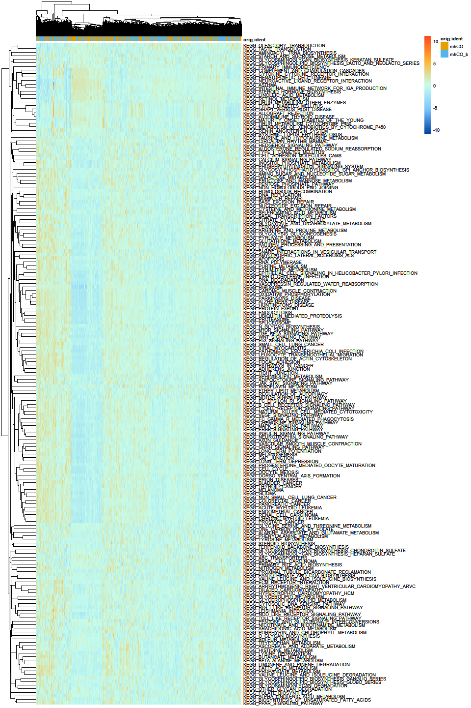

We better produce a heatmap with select gene sets by providing specific
names to the metas parameter. For example, we can isolated gene sets
involved in Alzheimer’s and Parkinson’s disease.

``` r

dittoHeatmap(mhCO.combined, genes = NULL, 
             metas = c("KEGG_ALZHEIMERS_DISEASE", "KEGG_PARKINSONS_DISEASE",
                       "KEGG_HUNTINGTONS_DISEASE"), 
             annot.by = c("seurat_clusters","orig.ident"), 
             fontsize = 7,
             heatmap.colors = colors(50))
```

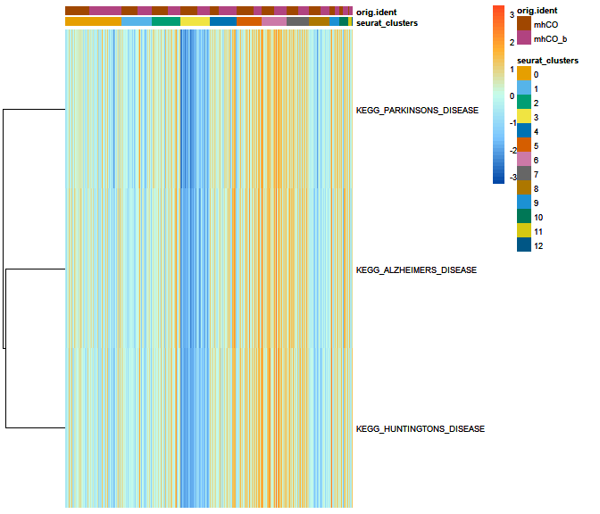

Violin Plots

Another way to visualize a subset of gene set enrichment would be to
graph the distribution of enrichment using violin, jitter, boxplot, or
ridgeplots. We can also compare between categorical variables using the
group.by parameter.

``` r
multi_dittoPlot(mhCO.combined, vars = c("KEGG_ALZHEIMERS_DISEASE", "KEGG_PARKINSONS_DISEASE",
                       "KEGG_HUNTINGTONS_DISEASE"), 
                group.by = c("orig.ident"), plots = c("jitter", "vlnplot", "boxplot"), 
                ylab = "Enrichment Scores", 
                theme = theme_classic() + theme(plot.title = element_text(size = 10)))
```

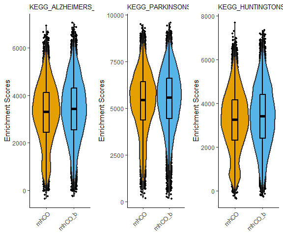

LTD; LTP

``` r
multi_dittoPlot(mhCO.combined, vars = c("KEGG_LONG_TERM_DEPRESSION", "KEGG_LONG_TERM_POTENTIATION"), 
                group.by = c("orig.ident"), plots = c("jitter", "vlnplot", "boxplot"), 
                ylab = "Enrichment Scores", 
                theme = theme_classic() + theme(plot.title = element_text(size = 10)))
```

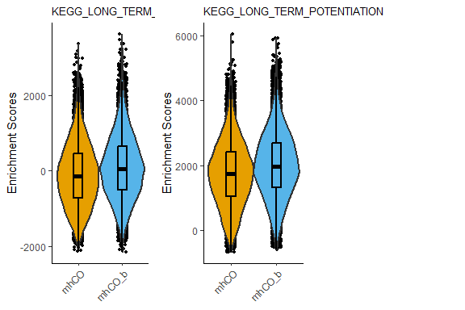<!-- -->

Another interesting point concerns the same analysis performed on
different cell clusters.

``` r
multi_dittoPlot(mhCO.combined, vars = c("KEGG_ALZHEIMERS_DISEASE", "KEGG_PARKINSONS_DISEASE",
                                       "KEGG_HUNTINGTONS_DISEASE"), 
                group.by = c("seurat_clusters"), plots = c("jitter", "vlnplot", "boxplot"), 
                ylab = "Enrichment Scores", 
                theme = theme_classic() + theme(plot.title = element_text(size = 10)))
```

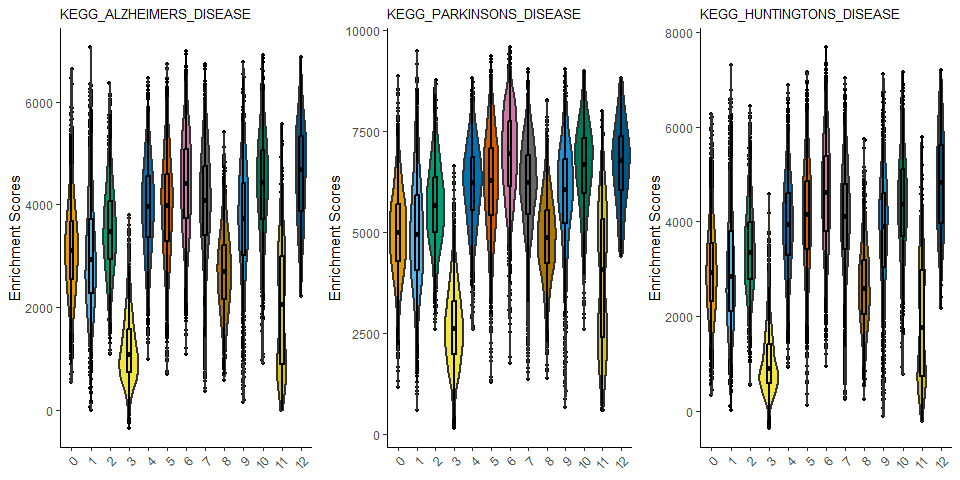

- Hex Density Enrichment Plots

We can also compare the distribution of enrichment scores of 2 distinct
gene sets across all single cells using the dittoScatterHex() function.
Here, we use our samples with results of enrichIt() and specify
Alzheimer’s and Parkinson’s to the x.var and y.var parameters to produce
a density plot.

``` r
dittoScatterHex(mhCO.combined, x.var = "KEGG_ALZHEIMERS_DISEASE",
                y.var = "KEGG_PARKINSONS_DISEASE",
                do.contour = TRUE) + 
  scale_fill_gradientn(colors = colors(11))
#> Scale for fill is already present.
#> Adding another scale for fill, which will replace the existing scale.
#> Warning: Computation failed in `stat_binhex()`
#> Caused by error in `compute_group()`:
#> ! The package `hexbin` is required for `stat_binhex()`
```

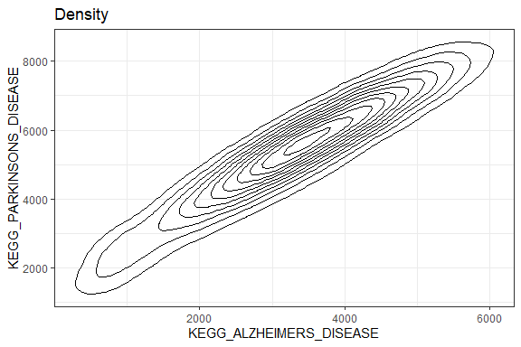<!-- -->

We can also separate the graph using the split.by parameter, allowing
for the direct comparison of the two samples.

``` r
dittoScatterHex(mhCO.combined, x.var = "KEGG_ALZHEIMERS_DISEASE", 
                y.var = "KEGG_PARKINSONS_DISEASE", 
                do.contour = TRUE,
                split.by = "orig.ident")  + 
scale_fill_gradientn(colors = colors(11))
#> Scale for fill is already present.
#> Adding another scale for fill, which will replace the existing scale.
#> Warning: Computation failed in `stat_binhex()`
#> Computation failed in `stat_binhex()`
#> Caused by error in `compute_group()`:
#> ! The package `hexbin` is required for `stat_binhex()`
```

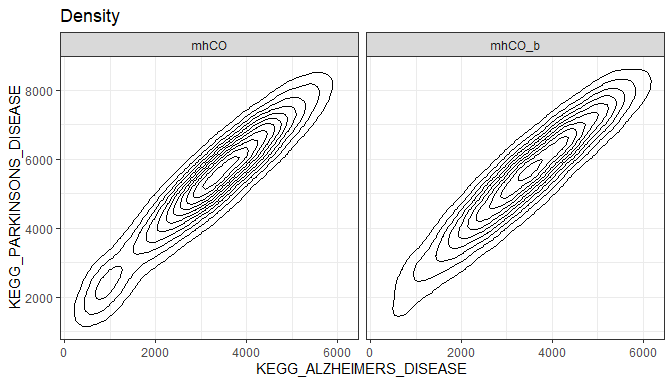

Ridge Plots Another distribution visualization is using a Ridge Plot
from the ggridges R package. This allows to cell clusters to separate
the enrichment scores along the y-axis in addition to the faceting by
categorical variables.

Like above, we can explore the distribution of the
“KEGG_ALZHEIMERS_DISEASE” gene set between groups by calling
ridgeEnrichment() with the ES2 object. We specify group = cluster, which
will seperate groups on the y-axis.

``` r
ES2 <- data.frame(mhCO.combined[[]], Idents(mhCO.combined))
colnames(ES2)[ncol(ES2)] <- "cluster"
```

plot

``` r
ridgeEnrichment(ES2, gene.set = "KEGG_ALZHEIMERS_DISEASE", group = "cluster", add.rug = TRUE)
#> Picking joint bandwidth of 204
```

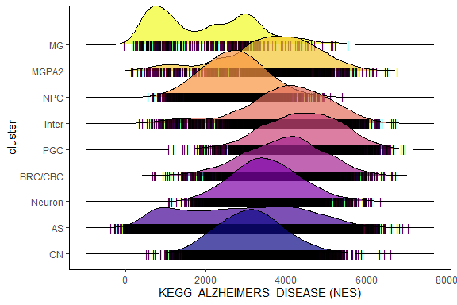<!-- -->

In addition to the separation of original identifiers, we can also use
ridgeEnrichment() for better granualarity of multiple variables. For
example, we can set group = “cluster” and then facet = “orig.idents”.
This gives a visualization of the enrichment by cluster and sample.

``` r
ridgeEnrichment(ES2, gene.set = "KEGG_ALZHEIMERS_DISEASE", group = "cluster", 
                facet = "orig.ident", add.rug = TRUE)
#> Picking joint bandwidth of 230
#> Picking joint bandwidth of 236
```

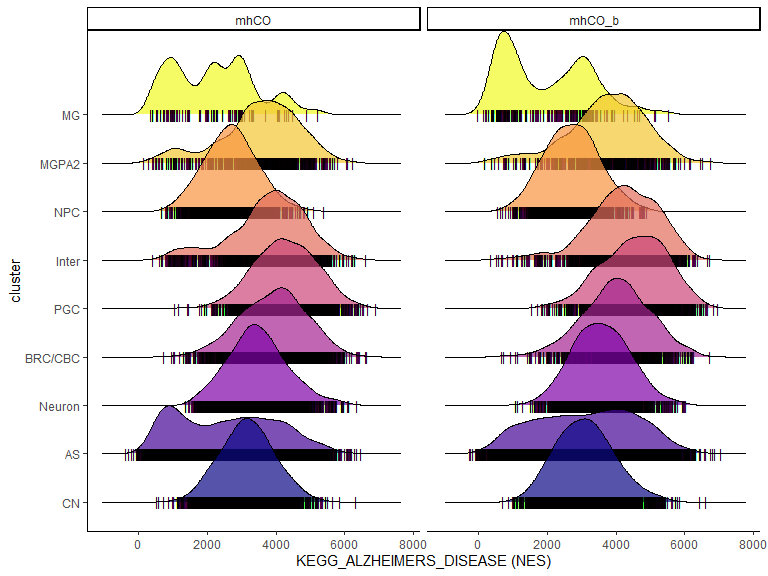

We can also assess apoptosis level in different clusters.

``` r
ridgeEnrichment(ES2, gene.set = "KEGG_APOPTOSIS", group = "cluster", 
                facet = "orig.ident", add.rug = TRUE)
#> Picking joint bandwidth of 112
#> Picking joint bandwidth of 125
```

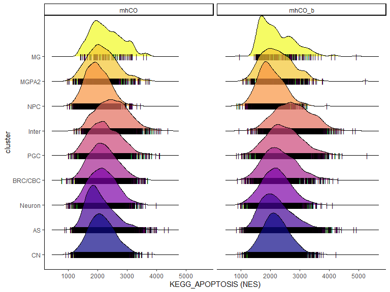

Split Violin Plots

``` r
splitEnrichment(ES2, split = "orig.ident", gene.set = "KEGG_ALZHEIMERS_DISEASE")
```

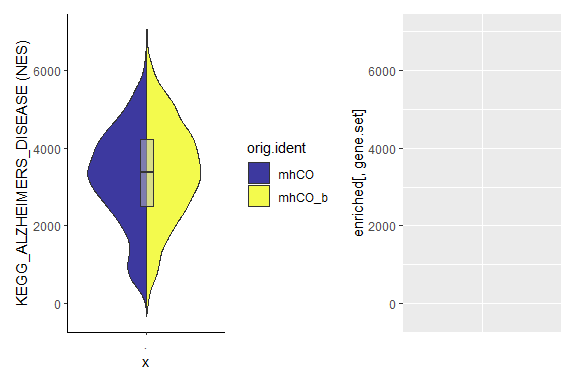<!-- -->

``` r

splitEnrichment(ES2, x.axis = "cluster", split = "orig.ident", gene.set = "KEGG_ALZHEIMERS_DISEASE")
```

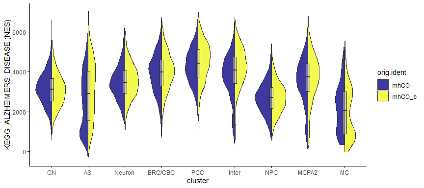

\###Expanded Analysis

One frustration of Gene Set Enrichment is trying to make sense of the
values. In order to move away from just selecting pathways that may be
of interest, escape offers the ability to performPCA() on the enrichment
scores.

``` r
PCA <- performPCA(enriched = ES2, groups = c("orig.ident", "cluster"))
pcaEnrichment(PCA, PCx = "PC1", PCy = "PC2", contours = TRUE)
#> Warning: Computation failed in `stat_binhex()`
#> Caused by error in `compute_group()`:
#> ! The package `hexbin` is required for `stat_binhex()`
```

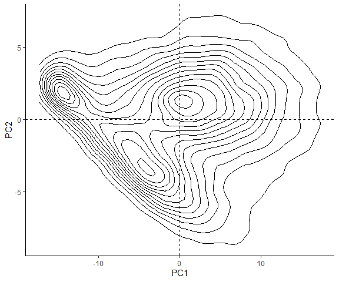
We can also look at the pcaEnrichment() output separated by categorical
factors using the facet parameter, for example using the cluster
assignment.

``` r
pcaEnrichment(PCA, PCx = "PC1", PCy = "PC2", contours = FALSE, facet = "cluster") 
#> Warning: Computation failed in `stat_binhex()`
#> Computation failed in `stat_binhex()`
#> Computation failed in `stat_binhex()`
#> Computation failed in `stat_binhex()`
#> Computation failed in `stat_binhex()`
#> Computation failed in `stat_binhex()`
#> Computation failed in `stat_binhex()`
#> Computation failed in `stat_binhex()`
#> Computation failed in `stat_binhex()`
#> Caused by error in `compute_group()`:
#> ! The package `hexbin` is required for `stat_binhex()`
```

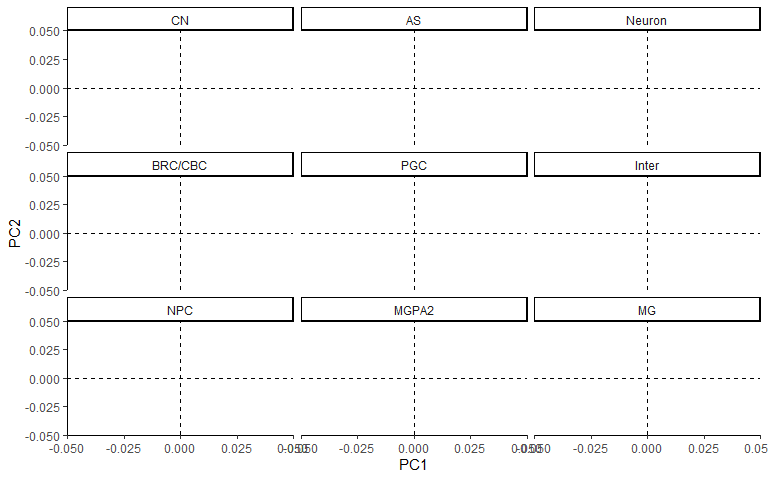

We can more closely examine the construction of the PCA by looking at
the contribution of each gene set to the respective principal component
using masterPCAPlot() with the same input as above with the
pcaEnrichment(). We can also control the number of gene sets plotted
with top.contribution. (currently under development)

``` r


#masterPCAPlot(ES2, PCx = "PC1", PCy = "PC2", top.contribution = 10)
```

### Signficance

We can also look for significant differences using linear modeling from
the limma package, Welch’s T test or one-way ANOVA using
getSignificance().

``` r

output <- getSignificance(ES2, group = "orig.ident", fit = "T.test")
head(output, 20)
#>                                                           T.statistic
#> KEGG_ABC_TRANSPORTERS                                        2.989977
#> KEGG_ACUTE_MYELOID_LEUKEMIA                                -26.635517
#> KEGG_ADHERENS_JUNCTION                                     -17.969579
#> KEGG_ADIPOCYTOKINE_SIGNALING_PATHWAY                        -6.997028
#> KEGG_ALANINE_ASPARTATE_AND_GLUTAMATE_METABOLISM              1.292662
#> KEGG_ALDOSTERONE_REGULATED_SODIUM_REABSORPTION              -3.937835
#> KEGG_ALLOGRAFT_REJECTION                                    20.311140
#> KEGG_ALPHA_LINOLENIC_ACID_METABOLISM                         3.862380
#> KEGG_ALZHEIMERS_DISEASE                                    -11.831961
#> KEGG_AMINOACYL_TRNA_BIOSYNTHESIS                             3.894188
#> KEGG_AMINO_SUGAR_AND_NUCLEOTIDE_SUGAR_METABOLISM            -5.810469
#> KEGG_AMYOTROPHIC_LATERAL_SCLEROSIS_ALS                     -15.834521
#> KEGG_ANTIGEN_PROCESSING_AND_PRESENTATION                    -1.522876
#> KEGG_APOPTOSIS                                             -16.768957
#> KEGG_ARACHIDONIC_ACID_METABOLISM                             3.354740
#> KEGG_ARGININE_AND_PROLINE_METABOLISM                        -7.822486
#> KEGG_ARRHYTHMOGENIC_RIGHT_VENTRICULAR_CARDIOMYOPATHY_ARVC  -23.960227
#> KEGG_ASCORBATE_AND_ALDARATE_METABOLISM                       5.892331
#> KEGG_ASTHMA                                                 18.418074
#> KEGG_AUTOIMMUNE_THYROID_DISEASE                             20.708404
#>                                                                 p.value
#> KEGG_ABC_TRANSPORTERS                                      2.792571e-03
#> KEGG_ACUTE_MYELOID_LEUKEMIA                               3.117248e-154
#> KEGG_ADHERENS_JUNCTION                                     9.083935e-72
#> KEGG_ADIPOCYTOKINE_SIGNALING_PATHWAY                       2.677879e-12
#> KEGG_ALANINE_ASPARTATE_AND_GLUTAMATE_METABOLISM            1.961395e-01
#> KEGG_ALDOSTERONE_REGULATED_SODIUM_REABSORPTION             8.243127e-05
#> KEGG_ALLOGRAFT_REJECTION                                   5.148854e-91
#> KEGG_ALPHA_LINOLENIC_ACID_METABOLISM                       1.125571e-04
#> KEGG_ALZHEIMERS_DISEASE                                    3.219434e-32
#> KEGG_AMINOACYL_TRNA_BIOSYNTHESIS                           9.877215e-05
#> KEGG_AMINO_SUGAR_AND_NUCLEOTIDE_SUGAR_METABOLISM           6.302792e-09
#> KEGG_AMYOTROPHIC_LATERAL_SCLEROSIS_ALS                     3.272191e-56
#> KEGG_ANTIGEN_PROCESSING_AND_PRESENTATION                   1.278019e-01
#> KEGG_APOPTOSIS                                             8.857557e-63
#> KEGG_ARACHIDONIC_ACID_METABOLISM                           7.955224e-04
#> KEGG_ARGININE_AND_PROLINE_METABOLISM                       5.373993e-15
#> KEGG_ARRHYTHMOGENIC_RIGHT_VENTRICULAR_CARDIOMYOPATHY_ARVC 1.627713e-125
#> KEGG_ASCORBATE_AND_ALDARATE_METABOLISM                     3.854118e-09
#> KEGG_ASTHMA                                                2.841588e-75
#> KEGG_AUTOIMMUNE_THYROID_DISEASE                            1.661447e-94
#>                                                                     FDR
#> KEGG_ABC_TRANSPORTERS                                      6.422912e-02
#> KEGG_ACUTE_MYELOID_LEUKEMIA                               5.766909e-152
#> KEGG_ADHERENS_JUNCTION                                     1.271751e-69
#> KEGG_ADIPOCYTOKINE_SIGNALING_PATHWAY                       1.499612e-10
#> KEGG_ALANINE_ASPARTATE_AND_GLUTAMATE_METABOLISM            1.000000e+00
#> KEGG_ALDOSTERONE_REGULATED_SODIUM_REABSORPTION             2.720232e-03
#> KEGG_ALLOGRAFT_REJECTION                                   8.083700e-89
#> KEGG_ALPHA_LINOLENIC_ACID_METABOLISM                       3.264157e-03
#> KEGG_ALZHEIMERS_DISEASE                                    2.994073e-30
#> KEGG_AMINOACYL_TRNA_BIOSYNTHESIS                           2.963164e-03
#> KEGG_AMINO_SUGAR_AND_NUCLEOTIDE_SUGAR_METABOLISM           2.773229e-07
#> KEGG_AMYOTROPHIC_LATERAL_SCLEROSIS_ALS                     4.155683e-54
#> KEGG_ANTIGEN_PROCESSING_AND_PRESENTATION                   1.000000e+00
#> KEGG_APOPTOSIS                                             1.160340e-60
#> KEGG_ARACHIDONIC_ACID_METABOLISM                           2.068358e-02
#> KEGG_ARGININE_AND_PROLINE_METABOLISM                       3.385615e-13
#> KEGG_ARRHYTHMOGENIC_RIGHT_VENTRICULAR_CARDIOMYOPATHY_ARVC 2.881052e-123
#> KEGG_ASCORBATE_AND_ALDARATE_METABOLISM                     1.772894e-07
#> KEGG_ASTHMA                                                4.063470e-73
#> KEGG_AUTOIMMUNE_THYROID_DISEASE                            2.674930e-92
#>                                                           median.mhCO
#> KEGG_ABC_TRANSPORTERS                                        52.35716
#> KEGG_ACUTE_MYELOID_LEUKEMIA                                 617.01837
#> KEGG_ADHERENS_JUNCTION                                     1925.19063
#> KEGG_ADIPOCYTOKINE_SIGNALING_PATHWAY                       1452.21146
#> KEGG_ALANINE_ASPARTATE_AND_GLUTAMATE_METABOLISM            2440.99422
#> KEGG_ALDOSTERONE_REGULATED_SODIUM_REABSORPTION              632.32751
#> KEGG_ALLOGRAFT_REJECTION                                   2498.93204
#> KEGG_ALPHA_LINOLENIC_ACID_METABOLISM                      -2338.95664
#> KEGG_ALZHEIMERS_DISEASE                                    3312.69764
#> KEGG_AMINOACYL_TRNA_BIOSYNTHESIS                           2727.11308
#> KEGG_AMINO_SUGAR_AND_NUCLEOTIDE_SUGAR_METABOLISM           3094.64354
#> KEGG_AMYOTROPHIC_LATERAL_SCLEROSIS_ALS                      601.65768
#> KEGG_ANTIGEN_PROCESSING_AND_PRESENTATION                   3142.03870
#> KEGG_APOPTOSIS                                             2105.74347
#> KEGG_ARACHIDONIC_ACID_METABOLISM                          -2009.82143
#> KEGG_ARGININE_AND_PROLINE_METABOLISM                       1586.43429
#> KEGG_ARRHYTHMOGENIC_RIGHT_VENTRICULAR_CARDIOMYOPATHY_ARVC  1497.20051
#> KEGG_ASCORBATE_AND_ALDARATE_METABOLISM                     3612.70207
#> KEGG_ASTHMA                                                2395.38372
#> KEGG_AUTOIMMUNE_THYROID_DISEASE                            2125.29382
#>                                                           median.mhCO_b
#> KEGG_ABC_TRANSPORTERS                                          28.16189
#> KEGG_ACUTE_MYELOID_LEUKEMIA                                   907.29574
#> KEGG_ADHERENS_JUNCTION                                       2165.60469
#> KEGG_ADIPOCYTOKINE_SIGNALING_PATHWAY                         1495.06651
#> KEGG_ALANINE_ASPARTATE_AND_GLUTAMATE_METABOLISM              2454.60724
#> KEGG_ALDOSTERONE_REGULATED_SODIUM_REABSORPTION                688.12660
#> KEGG_ALLOGRAFT_REJECTION                                     2332.88450
#> KEGG_ALPHA_LINOLENIC_ACID_METABOLISM                        -2398.07386
#> KEGG_ALZHEIMERS_DISEASE                                      3434.75986
#> KEGG_AMINOACYL_TRNA_BIOSYNTHESIS                             2671.01786
#> KEGG_AMINO_SUGAR_AND_NUCLEOTIDE_SUGAR_METABOLISM             3117.30556
#> KEGG_AMYOTROPHIC_LATERAL_SCLEROSIS_ALS                        769.09553
#> KEGG_ANTIGEN_PROCESSING_AND_PRESENTATION                     3138.28080
#> KEGG_APOPTOSIS                                               2201.92627
#> KEGG_ARACHIDONIC_ACID_METABOLISM                            -2047.90610
#> KEGG_ARGININE_AND_PROLINE_METABOLISM                         1651.29620
#> KEGG_ARRHYTHMOGENIC_RIGHT_VENTRICULAR_CARDIOMYOPATHY_ARVC    1661.12817
#> KEGG_ASCORBATE_AND_ALDARATE_METABOLISM                       3522.02102
#> KEGG_ASTHMA                                                  2294.99234
#> KEGG_AUTOIMMUNE_THYROID_DISEASE                              1964.97084
```
