Comparing CRISPRi-mediated suppression of Alzheimer’s disease realated
genes in mhCOs treated with Aβ.
================
Mirco Macchi & Ugne Kisieliute
2023-03-21

- tissue: microglia-induced human cortical organoids (mhCOs) derived
  from human embryonic stem cells (hESCs) and treated with CRISPRi to
  suppress AD-associated genes highly expressed in microglia in response
  to Aβ.
- Platforms Illumina HiSeq 4000
- species: Homo sapiens
- Source: GEO
  [GSE175722](https://www.ncbi.nlm.nih.gov/geo/query/acc.cgi?acc=GSE175722)

contact: <mirco.macchi@live.it>

###### The goal of the project is to assess the function of Alzheimer’s disease(AD)-associated genes highly expressed in microglia in response to Aβ using pooled CRISPRi.

Load the libraries and the files needed.

``` r
{
  library(DESeq2)
  library(ggplot2)
  library(Seurat)
  library(dplyr)
  library(patchwork)
  library(Matrix)
  library(tibble)
}
```

``` r
setwd("D:/OneDrive - Università degli Studi di Milano/PoliMirco/Secondo anno/Primo semestre/Neurogenomics/Exam/microglia-like/")


mhCOcrop <-  ReadMtx(mtx = "CROP-Seq/mhco+ab_crop/GSM5345024_BC04_matrix.mtx.gz", 
                 features = "CROP-Seq/mhco+ab_crop/GSM5345024_BC04_features.tsv.gz",
                 cells = "CROP-Seq/mhco+ab_crop/GSM5345024_BC04_barcodes.tsv.gz")


mhCO_b <-  ReadMtx(mtx = "mhCO/mhCO+AB/GSM5345020_mhCOAB_matrix.mtx.gz", 
                   features = "mhCO/mhCO+AB/GSM5345020_mhCOAB_features.tsv.gz",
                   cells = "mhCO/mhCO+AB/GSM5345020_mhCOAB_barcodes.tsv.gz")

mhCOcrop <- CreateSeuratObject(counts = mhCOcrop, project = "mhCOcrop",
                           min.cells = 3, min.features = 200)
#> Warning: Feature names cannot have underscores ('_'), replacing with dashes
#> ('-')
mhCOcrop
#> An object of class Seurat 
#> 21120 features across 7713 samples within 1 assay 
#> Active assay: RNA (21120 features, 0 variable features)

mhCO_b <- CreateSeuratObject(counts = mhCO_b, project = "mhCO_b",
                             min.cells = 3, min.features = 200)
#> Warning: Feature names cannot have underscores ('_'), replacing with dashes
#> ('-')
mhCO_b
#> An object of class Seurat 
#> 24436 features across 13337 samples within 1 assay 
#> Active assay: RNA (24436 features, 0 variable features)
```

Adding metadata

``` r
mhCOcrop$type = "CROP-seq+b.amyloid"
mhCO_b$type = "mhCO+b.amyloid"

mhCOCRall <- merge(mhCOcrop, y = mhCO_b, add.cell.ids = c("mhCO+b_Crop", "mhCO_b"), project = "Exam")
head(mhCOCRall)
#>                                orig.ident nCount_RNA nFeature_RNA
#> mhCO+b_Crop_AAACCCAAGGTTCAGG-1   mhCOcrop      10161         3262
#> mhCO+b_Crop_AAACCCAAGTCACTGT-1   mhCOcrop       6596         2549
#> mhCO+b_Crop_AAACCCACAGCACCCA-1   mhCOcrop       8848         2765
#> mhCO+b_Crop_AAACCCACAGGCGTTC-1   mhCOcrop       4313         2016
#> mhCO+b_Crop_AAACCCACATCGAAGG-1   mhCOcrop       5041         2505
#> mhCO+b_Crop_AAACCCACATTAGGCT-1   mhCOcrop       9821         3079
#> mhCO+b_Crop_AAACCCAGTCGTGATT-1   mhCOcrop       2127         1201
#> mhCO+b_Crop_AAACCCAGTGACACAG-1   mhCOcrop      14345         4367
#> mhCO+b_Crop_AAACCCAGTTAGAAGT-1   mhCOcrop       7667         3117
#> mhCO+b_Crop_AAACCCATCACACCGG-1   mhCOcrop      15891         4248
#>                                              type
#> mhCO+b_Crop_AAACCCAAGGTTCAGG-1 CROP-seq+b.amyloid
#> mhCO+b_Crop_AAACCCAAGTCACTGT-1 CROP-seq+b.amyloid
#> mhCO+b_Crop_AAACCCACAGCACCCA-1 CROP-seq+b.amyloid
#> mhCO+b_Crop_AAACCCACAGGCGTTC-1 CROP-seq+b.amyloid
#> mhCO+b_Crop_AAACCCACATCGAAGG-1 CROP-seq+b.amyloid
#> mhCO+b_Crop_AAACCCACATTAGGCT-1 CROP-seq+b.amyloid
#> mhCO+b_Crop_AAACCCAGTCGTGATT-1 CROP-seq+b.amyloid
#> mhCO+b_Crop_AAACCCAGTGACACAG-1 CROP-seq+b.amyloid
#> mhCO+b_Crop_AAACCCAGTTAGAAGT-1 CROP-seq+b.amyloid
#> mhCO+b_Crop_AAACCCATCACACCGG-1 CROP-seq+b.amyloid
```

``` r
tail(mhCOCRall)
#>                           orig.ident nCount_RNA nFeature_RNA           type
#> mhCO_b_TTTGTTGCATCATGAC-1     mhCO_b       3263         1960 mhCO+b.amyloid
#> mhCO_b_TTTGTTGGTAGTATAG-1     mhCO_b       4905         2395 mhCO+b.amyloid
#> mhCO_b_TTTGTTGGTCGTGGTC-1     mhCO_b       8169         3287 mhCO+b.amyloid
#> mhCO_b_TTTGTTGGTGGACTGA-1     mhCO_b       1215          636 mhCO+b.amyloid
#> mhCO_b_TTTGTTGGTGGGACAT-1     mhCO_b       3225         2012 mhCO+b.amyloid
#> mhCO_b_TTTGTTGGTTAGCTAC-1     mhCO_b       4301         2412 mhCO+b.amyloid
#> mhCO_b_TTTGTTGGTTCGGTAT-1     mhCO_b       4698         2374 mhCO+b.amyloid
#> mhCO_b_TTTGTTGTCCATATGG-1     mhCO_b       3118         1160 mhCO+b.amyloid
#> mhCO_b_TTTGTTGTCGTCTCAC-1     mhCO_b      13930         3929 mhCO+b.amyloid
#> mhCO_b_TTTGTTGTCTCATAGG-1     mhCO_b       5003         2542 mhCO+b.amyloid
```

remove all objects that will not be used.

``` r
as.data.frame(mhCOCRall@assays$RNA@counts[1:10, 1:2])
#>               mhCO+b_Crop_AAACCCAAGGTTCAGG-1 mhCO+b_Crop_AAACCCAAGTCACTGT-1
#> RP11-34P13.7                               0                              0
#> AL627309.1                                 0                              0
#> AP006222.2                                 0                              0
#> RP4-669L17.10                              0                              0
#> RP5-857K21.4                               0                              0
#> RP11-206L10.3                              0                              0
#> RP11-206L10.5                              0                              0
#> RP11-206L10.2                              0                              0
#> RP11-206L10.9                              0                              0
#> FAM87B                                     0                              0
```

Adding a tag containing information about MT and ribosomal genes

``` r

mhCOCRall <- PercentageFeatureSet(mhCOCRall, "^MT-", col.name = "percent_mito")
mhCOCRall <- PercentageFeatureSet(mhCOCRall, "^RP[SL]", col.name = "percent_ribo")
head(mhCOCRall)
#>                                orig.ident nCount_RNA nFeature_RNA
#> mhCO+b_Crop_AAACCCAAGGTTCAGG-1   mhCOcrop      10161         3262
#> mhCO+b_Crop_AAACCCAAGTCACTGT-1   mhCOcrop       6596         2549
#> mhCO+b_Crop_AAACCCACAGCACCCA-1   mhCOcrop       8848         2765
#> mhCO+b_Crop_AAACCCACAGGCGTTC-1   mhCOcrop       4313         2016
#> mhCO+b_Crop_AAACCCACATCGAAGG-1   mhCOcrop       5041         2505
#> mhCO+b_Crop_AAACCCACATTAGGCT-1   mhCOcrop       9821         3079
#> mhCO+b_Crop_AAACCCAGTCGTGATT-1   mhCOcrop       2127         1201
#> mhCO+b_Crop_AAACCCAGTGACACAG-1   mhCOcrop      14345         4367
#> mhCO+b_Crop_AAACCCAGTTAGAAGT-1   mhCOcrop       7667         3117
#> mhCO+b_Crop_AAACCCATCACACCGG-1   mhCOcrop      15891         4248
#>                                              type percent_mito percent_ribo
#> mhCO+b_Crop_AAACCCAAGGTTCAGG-1 CROP-seq+b.amyloid     2.775317    19.397697
#> mhCO+b_Crop_AAACCCAAGTCACTGT-1 CROP-seq+b.amyloid     3.759854    16.297756
#> mhCO+b_Crop_AAACCCACAGCACCCA-1 CROP-seq+b.amyloid     5.187613    16.082731
#> mhCO+b_Crop_AAACCCACAGGCGTTC-1 CROP-seq+b.amyloid     3.570601     9.645259
#> mhCO+b_Crop_AAACCCACATCGAAGG-1 CROP-seq+b.amyloid     3.134299     7.260464
#> mhCO+b_Crop_AAACCCACATTAGGCT-1 CROP-seq+b.amyloid     7.158131    15.568679
#> mhCO+b_Crop_AAACCCAGTCGTGATT-1 CROP-seq+b.amyloid     1.410437    12.035731
#> mhCO+b_Crop_AAACCCAGTGACACAG-1 CROP-seq+b.amyloid     5.060997    14.304636
#> mhCO+b_Crop_AAACCCAGTTAGAAGT-1 CROP-seq+b.amyloid     4.943263    12.521195
#> mhCO+b_Crop_AAACCCATCACACCGG-1 CROP-seq+b.amyloid     6.255113    21.200680
```

``` r
ribo_genes <- rownames(mhCOCRall)[grep("^RP[SL]", rownames(mhCOCRall))]
head(ribo_genes, 10)
#>  [1] "RPL22"   "RPL11"   "RPS6KA1" "RPS8"    "RPL5"    "RPS27"   "RPS10P7"
#>  [8] "RPS6KC1" "RPS7"    "RPS27A"
```

# Quality Control

## QC - I

``` r
feats <- c("nFeature_RNA", "nCount_RNA", "percent_mito", "percent_ribo")
VlnPlot(mhCOCRall, group.by = "orig.ident", features = feats, pt.size = 0, ncol = 3) +
  NoLegend()
```

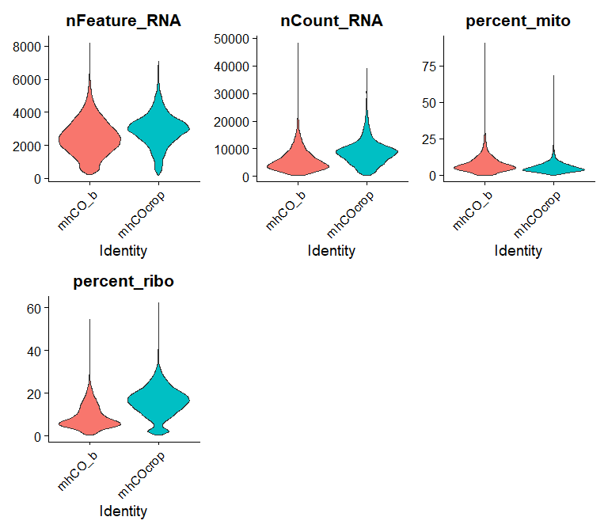<!-- -->

The number of features (nrow) and cells (ncol).

``` r
dim(mhCOCRall)
#> [1] 24882 21050
```

numer of cells/sample

``` r
table(mhCOCRall$orig.ident)
#> 
#>   mhCO_b mhCOcrop 
#>    13337     7713
```

Additionally, we can also see which genes contribute the most to such
reads. We can for instance plot the percentage of counts per gene.

``` r
par(mar = c(4, 8, 2, 1))
C <- mhCOCRall@assays$RNA@counts
C <- Matrix::t(Matrix::t(C)/Matrix::colSums(C)) * 100
most_expressed <- order(apply(C, 1, median), decreasing = T)[20:1]
#> Warning in asMethod(object): sparse->dense coercion: allocating vector of size
#> 3.9 GiB
boxplot(as.matrix(t(C[most_expressed, ])), cex = 0.1, las = 1, xlab = "% total count per cell",
        col = (scales::hue_pal())(20)[20:1], horizontal = TRUE)
```

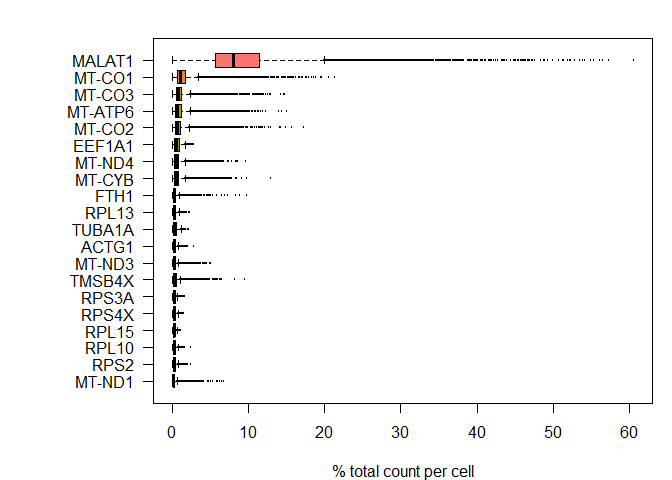<!-- -->

As you can see, MALAT1 constitutes up to 50% of the UMIs from a single
cell and the other top genes are mitochondrial and ribosomal genes. It
is quite common that nuclear lincRNAs have correlation with quality and
mitochondrial reads, so high detection of MALAT1 may be a technical
issue.

Looking at the plots, we can make reasonable decisions on where to draw
the cutoff. In this case, the bulk of the cells are below 30%
mitochondrial reads and that will be used as a cutoff. We will also
remove cells with less than 2.5% ribosomal reads.

``` r
mhCOCRall <- subset(mhCOCRall, subset = nFeature_RNA > 200 & nFeature_RNA < 7500 &
                      percent_mito < 30 & nCount_RNA < 35000 & percent_ribo > 0.025)
```

``` r
dim(mhCOCRall)
#> [1] 24882 20721
```

``` r
table(mhCOCRall$orig.ident)
#> 
#>   mhCO_b mhCOcrop 
#>    13055     7666
```

We can already tell, that we have less cells in engineered sample,
almost 6000 less cells.

## QC - II

``` r
feats <- c("nFeature_RNA", "nCount_RNA", "percent_mito", "percent_ribo")
VlnPlot(mhCOCRall, group.by = "orig.ident", features = feats, pt.size = 0.1, ncol = 3) +
  NoLegend()
```

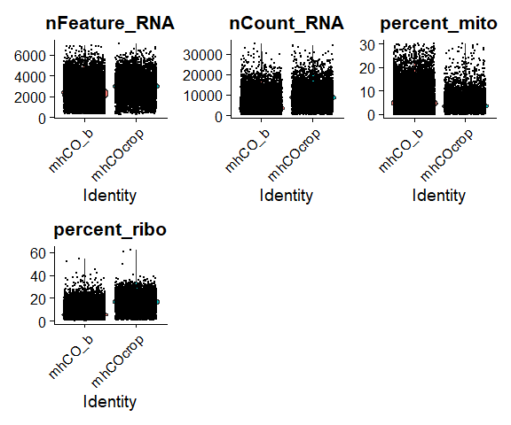

``` r
dim(mhCOCRall)
#> [1] 24882 20721
```

Filter MALAT1

``` r
mhCOCRall <- mhCOCRall[!grepl("MALAT1", rownames(mhCOCRall)), ]
```

Filter Mitocondrial mhCOCRall \<- mhCOCRall\[!grepl(“^MT-”,
rownames(mhCOCRall)), \]

Filter Ribosomal gene mhCOCRall \<- mhCOCRall\[ ! grepl(‘^RP\[SL\]’,
rownames(mhCOCRall)), \]

``` r
dim(mhCOCRall)
#> [1] 24881 20721
```

# - Data splitting:

split the dataset in two different seurat objects which can be recalled
thanks to their original identifier

``` r
mhCO.split <- SplitObject(mhCOCRall, split.by = "orig.ident")
```

normalize and identify variable features for each dataset independently

``` r
mhCO.split <- lapply(X = mhCO.split, FUN = function(x) {
  x <- NormalizeData(x)
  x <- FindVariableFeatures(x, selection.method = "vst", nfeatures = 2500)
})
```

select features that are repeatedly variable across datasets for
integration

``` r
features <- SelectIntegrationFeatures(object.list = mhCO.split)
```

# - Calculate cell-cycle scores

``` r
mhCOCRall <- CellCycleScoring(object = mhCOCRall, g2m.features = cc.genes$g2m.genes,
                              s.features = cc.genes$s.genes)
#> Warning: The following features are not present in the object: UHRF1, MLF1IP,
#> CASP8AP2, not searching for symbol synonyms
```

``` r
VlnPlot(mhCOCRall, features = c("S.Score", "G2M.Score"), group.by = "orig.ident",
        ncol = 4, pt.size = 0.1)
```

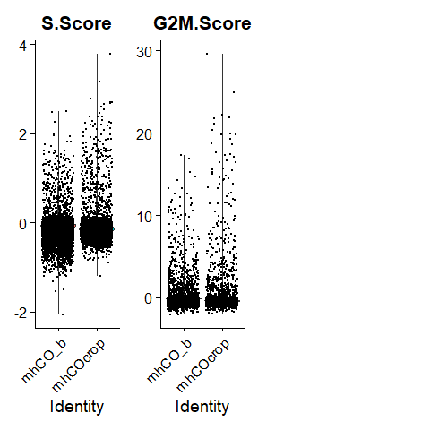

In this case it looks like we only have a few cycling cells in the
datasets

# - Perform integration

We then identify anchors using the FindIntegrationAnchors() function,
which takes a list of Seurat objects as input, and use these anchors to
integrate the datasets together with IntegrateData().

``` r
mhCO.anchors <- FindIntegrationAnchors(object.list = mhCO.split, anchor.features = features)
#> Scaling features for provided objects
#> Finding all pairwise anchors
#> Running CCA
#> Merging objects
#> Finding neighborhoods
#> Finding anchors
#>  Found 20141 anchors
#> Filtering anchors
#>  Retained 2363 anchors
```

this command creates an ‘integrated’ data assay

``` r
mhCO.combined <- IntegrateData(anchorset = mhCO.anchors)
#> Merging dataset 1 into 2
#> Extracting anchors for merged samples
#> Finding integration vectors
#> Finding integration vector weights
#> Integrating data
rm(mhCO.anchors, mhCOCRall, C, mhCO.split)
```

## - Perform an integrated analysis

Now we can run a single integrated analysis on all cells. specify that
we will perform downstream analysis on the integrated data:

``` r
DefaultAssay(mhCO.combined) <- "integrated"
```

## Run the standard workflow for visualization and clustering

``` r

mhCO.combined <- ScaleData(mhCO.combined, verbose = FALSE)
mhCO.combined <- RunPCA(mhCO.combined, npcs = 30, verbose = FALSE)
mhCO.combined[["pca"]] #' MOST VARIABLE FREATURES
#> A dimensional reduction object with key PC_ 
#>  Number of dimensions: 30 
#>  Projected dimensional reduction calculated:  FALSE 
#>  Jackstraw run: FALSE 
#>  Computed using assay: integrated
print(mhCO.combined[["pca"]], dims = 1:5, nfeatures = 5)
#> PC_ 1 
#> Positive:  STMN2, DCX, INA, GRIA2, RTN1 
#> Negative:  SPARC, B2M, IFITM3, ZFP36L1, ANXA5 
#> PC_ 2 
#> Positive:  TOP2A, MKI67, NUF2, CASC5, NUSAP1 
#> Negative:  S100A11, DCN, COL1A1, COL3A1, IGF2 
#> PC_ 3 
#> Positive:  NTRK2, PTN, SPARCL1, CLU, GPM6B 
#> Negative:  TSPAN8, CLDN7, EPCAM, RAB25, SERPINA1 
#> PC_ 4 
#> Positive:  COL3A1, DCN, COL1A1, COL15A1, LUM 
#> Negative:  TSPAN8, CLDN7, SERPINA1, FABP1, EPCAM 
#> PC_ 5 
#> Positive:  TRPM3, HTR2C, FOLR1, TTR, CA2 
#> Negative:  PTPRZ1, EDNRB, PTN, GPM6B, C1orf61
```

``` r
VizDimLoadings(mhCO.combined, dims = 1:2, reduction = "pca")
```

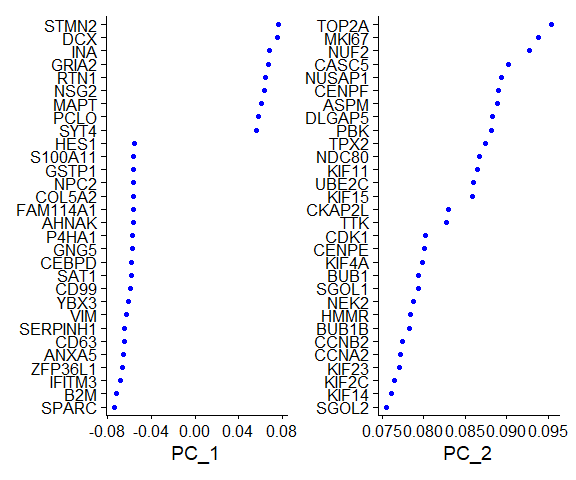

``` r
DimPlot(mhCO.combined, reduction = "pca")
```

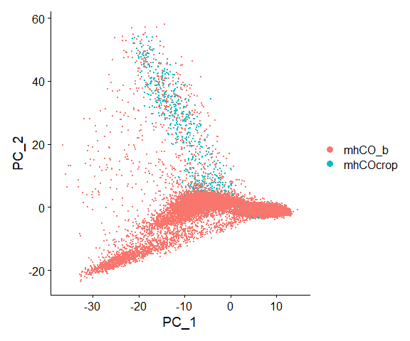

``` r
DimPlot(mhCO.combined, reduction = "pca", dims = c(3,4))
```

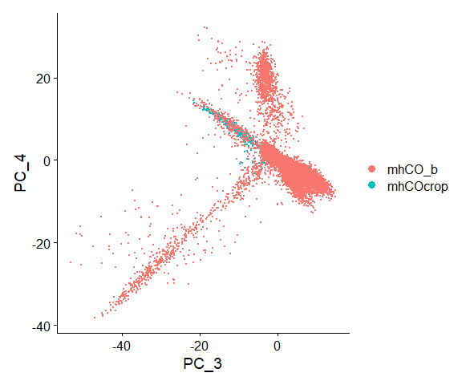

Plotting heatmaps for each PC:

``` r
DimHeatmap(mhCO.combined, dims = 1, cells = 500, balanced = TRUE)
```

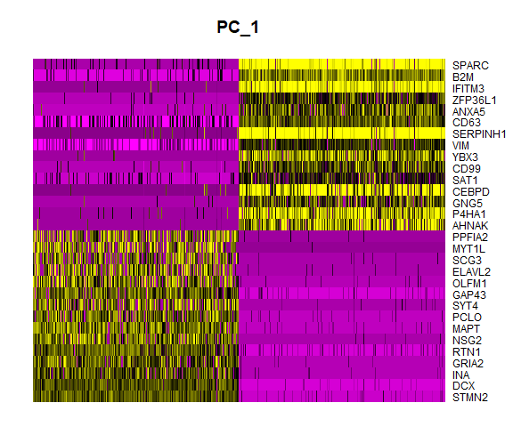

``` r
DimHeatmap(mhCO.combined, dims = 1:9, cells = 500, balanced = TRUE)
```

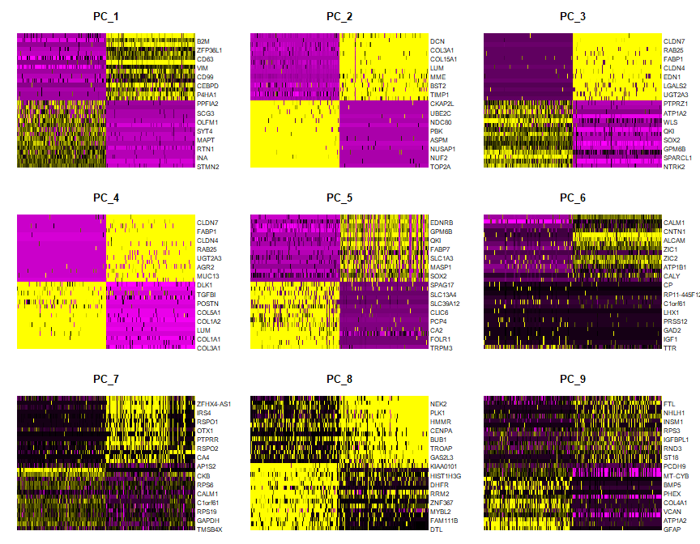

Elbow plot in an informative tool to get optimal trade-off to identify
the majority of variation, avoiding overfitting.

``` r
ElbowPlot(mhCO.combined)
```

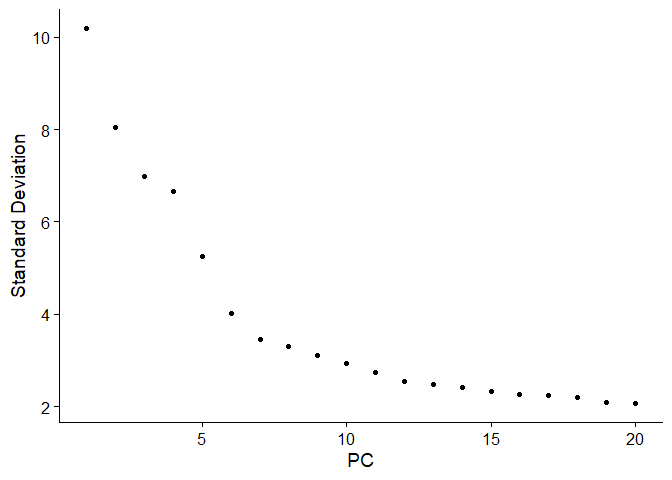<!-- -->

``` r
mhCO.combined <- FindNeighbors(mhCO.combined, reduction = "pca", dims = 1:10)
#> Computing nearest neighbor graph
#> Computing SNN
mhCO.combined <- FindClusters(mhCO.combined, resolution = 0.4)
#> Modularity Optimizer version 1.3.0 by Ludo Waltman and Nees Jan van Eck
#> 
#> Number of nodes: 20721
#> Number of edges: 682936
#> 
#> Running Louvain algorithm...
#> Maximum modularity in 10 random starts: 0.9201
#> Number of communities: 15
#> Elapsed time: 3 seconds
```

Get the number of cells contained in each cluster.

``` r
summary(mhCO.combined@meta.data$seurat_clusters)
#>    0    1    2    3    4    5    6    7    8    9   10   11   12   13   14 
#> 3559 3135 2893 2347 1452 1365 1269 1252 1134  748  507  352  341  297   70
```

Finally run UMAP.

``` r
mhCO.combined <- RunUMAP(mhCO.combined, reduction = "pca", dims = 1:30)
#> Warning: The default method for RunUMAP has changed from calling Python UMAP via reticulate to the R-native UWOT using the cosine metric
#> To use Python UMAP via reticulate, set umap.method to 'umap-learn' and metric to 'correlation'
#> This message will be shown once per session
#> 10:44:46 UMAP embedding parameters a = 0.9922 b = 1.112
#> 10:44:46 Read 20721 rows and found 30 numeric columns
#> 10:44:46 Using Annoy for neighbor search, n_neighbors = 30
#> 10:44:46 Building Annoy index with metric = cosine, n_trees = 50
#> 0%   10   20   30   40   50   60   70   80   90   100%
#> [----|----|----|----|----|----|----|----|----|----|
#> **************************************************|
#> 10:44:49 Writing NN index file to temp file C:\Users\Mirco\AppData\Local\Temp\RtmpSUhLC4\file37c4580e6ceb
#> 10:44:49 Searching Annoy index using 1 thread, search_k = 3000
#> 10:44:55 Annoy recall = 100%
#> 10:44:55 Commencing smooth kNN distance calibration using 1 thread with target n_neighbors = 30
#> 10:44:57 Initializing from normalized Laplacian + noise (using irlba)
#> 10:44:59 Commencing optimization for 200 epochs, with 908402 positive edges
#> 10:45:19 Optimization finished

p1 <- DimPlot(mhCO.combined, reduction = "umap", group.by = "orig.ident")
p1
```

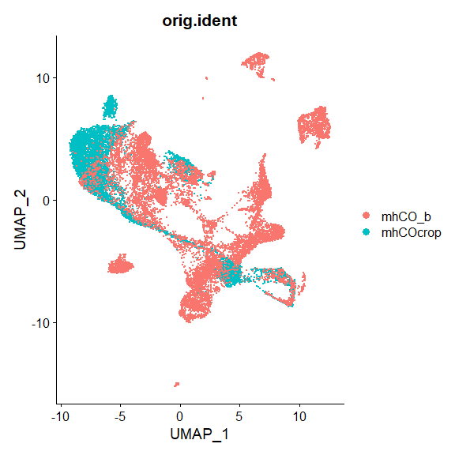
It seems like the two samples are not overlapped at all as per UMAP
projection.

``` r
p2 <- DimPlot(mhCO.combined, reduction = "umap", label = TRUE, repel = TRUE)
p2
```

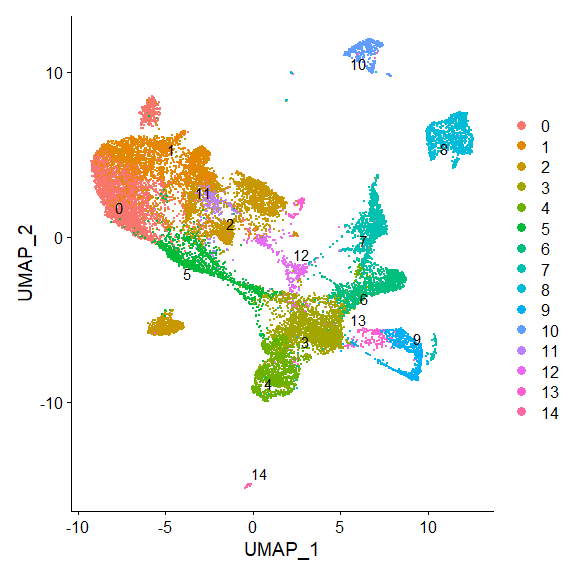

To visualize the two conditions side-by-side, we can use the split.by
argument to show each condition colored by cluster.

``` r
DimPlot(mhCO.combined, reduction = "umap", split.by = "orig.ident")
```

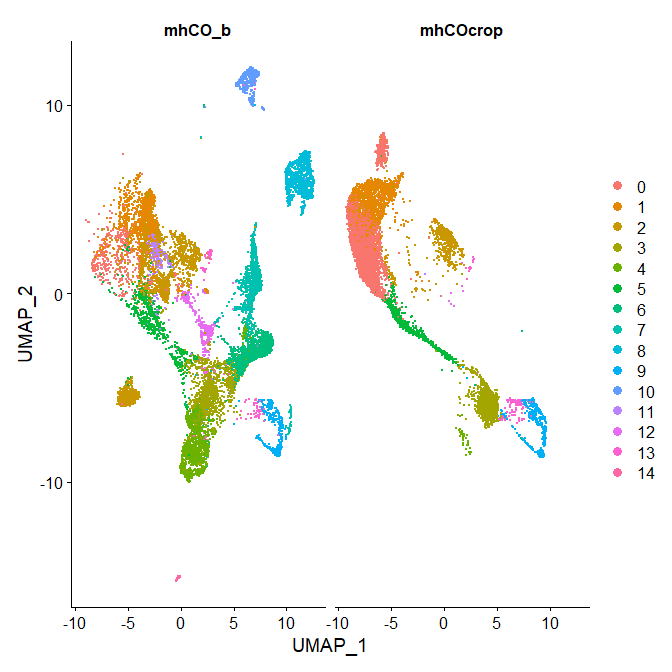
It is clear, that some cluster are not present in CRISPRi sample,
meaning that some cells probably have not even undergone differentiation
into mature cells or died before the library preparation.

For performing differential expression after integration, we switch back
to the original data

``` r
DefaultAssay(mhCO.combined) <- "RNA"
```

We can explore these marker genes for each cluster and use them to
annotate our clusters as specific cell types.

Cortical Neurons(CN), Interneurons(IN) and Neurons

``` r
FeaturePlot(mhCO.combined, features = c("STMN2", "GAP43"), split.by = "orig.ident", max.cutoff = 3,
           cols = c("grey", "red"))
```

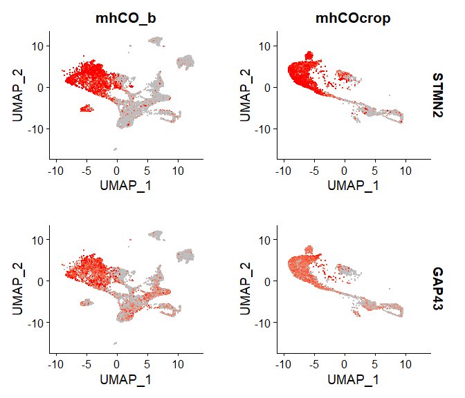

Neuron progenitor cells(NPC)

``` r
FeaturePlot(mhCO.combined, features = c("SOX2", "TOP2A", "MKI67", "SLC1A3"), split.by = "orig.ident", max.cutoff = 3,cols = c("grey", "red"))
```

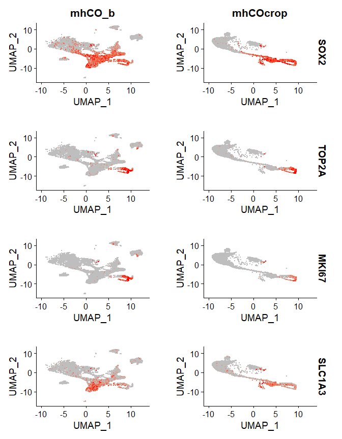<!-- -->

Astrocytes(AS)

``` r
FeaturePlot(mhCO.combined, features = c("GFAP", "SLC1A3"), split.by = "orig.ident", max.cutoff = 3,
             cols = c("grey", "red"))
```

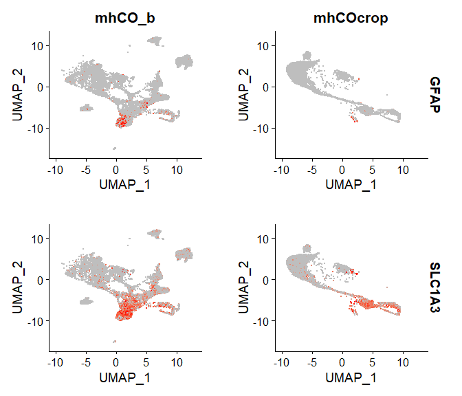

Glia progenitor cells(GPC)/ BMP responsible cell(BRC)

``` r
FeaturePlot(mhCO.combined, features = c("SOX2","BMP4"), split.by = "orig.ident", max.cutoff = 3,
             cols = c("grey", "red"))
```

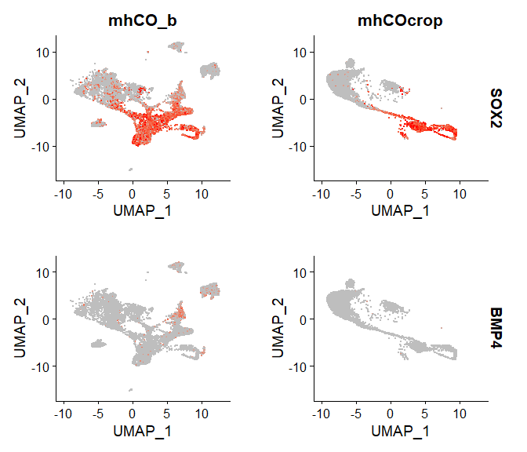

Microglia progenitors cluster A1(MGPA1)

``` r

FeaturePlot(mhCO.combined, features = c("RUNX1", "ST14", "TREM1", "NFKB1"), split.by = "orig.ident", max.cutoff = 3,
             cols = c("grey", "red"))
#> Warning in FeaturePlot(mhCO.combined, features = c("RUNX1", "ST14", "TREM1", :
#> All cells have the same value (0) of ST14.
#> Warning in FeaturePlot(mhCO.combined, features = c("RUNX1", "ST14", "TREM1", :
#> All cells have the same value (0) of TREM1.
```

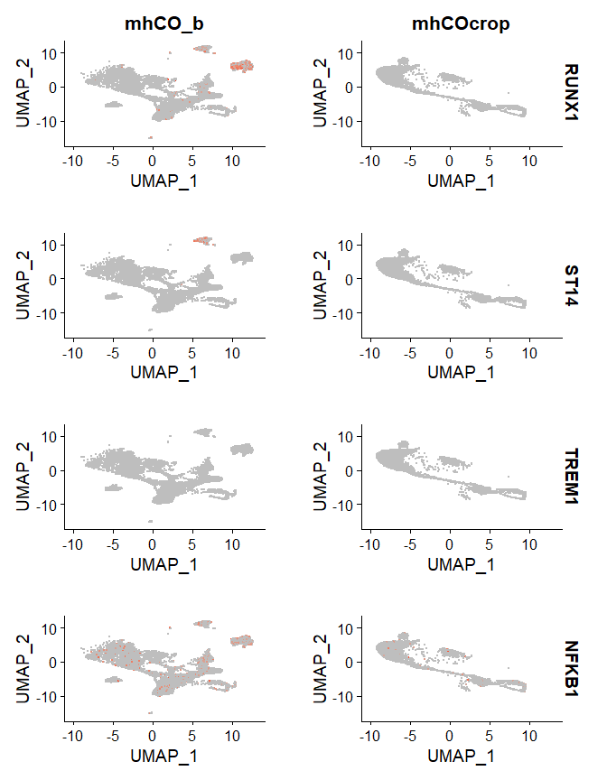<!-- -->

# Labelling clusters

``` r
mhCO.combined <- RenameIdents(mhCO.combined, "0"="CN", "1"="CN", "2"= "Inter", "3"="AS", "4"="AS",
                                     "5"="Neuron", "6"="BRC/CBC", "7" = "BRC/CBC", "8"="PGC", "9"="NPC",         "10"="MGPA2","11"= "IN", "12"="UN", "13"= "NPC", "14"="MGPA1")

DimPlot(mhCO.combined, reduction = "umap", label = TRUE, repel = TRUE)
```

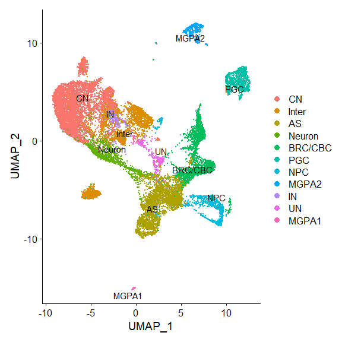<!-- -->

``` r
markers.to.plot <- c("STMN2","GAP43","SOX2","VIM","TOP2A","MKI67","GFAP","SLC1A3",
                     "BMP4","FOJ1","FLT1","KDR","RUNX1","IRF8","C1QA","C1QC","CCL3"
                     ,"CSF1R","CYBB","CTSZ","CTSS","EDN1","PYCARD","ST14","TREM1",
                     "NFKB1","CXCL1","MYB")

DotPlot(mhCO.combined, features = markers.to.plot, cols = c("blue", "red"), dot.scale = 8, split.by = "orig.ident") +
  RotatedAxis()
#> Warning in FetchData.Seurat(object = object, vars = features, cells = cells):
#> The following requested variables were not found: FOJ1
```

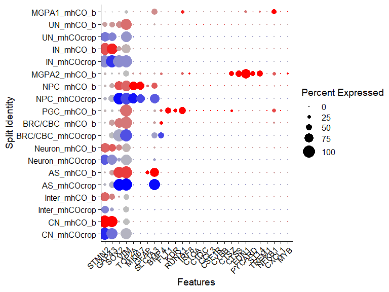

``` r
mg.markers<- c("IRF8","SPI1",'AIF1', 'CSF1R', 'C1QA', 'C1QB', 'CLDN2','CYBB','TREM1',
'CLDN4','CLDN7','KRT5','KRT7','KRT13', 'KRT15',"KRT23", "MYL1","MYH3","EDN1")

DotPlot(mhCO.combined, features = mg.markers, cols = c("blue", "red"), dot.scale = 8, split.by = "orig.ident") +
  RotatedAxis()
```

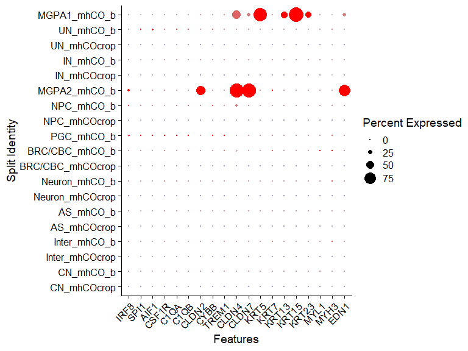

# Gene markers extraction

Since we don’t have microglia in both our datasets, our best option is
to find all markers. With this function we are comparing each cluster
against all other clusters to identify potential marker genes. The cells
in each cluster are treated as replicates, and essentially a
differential expression analysis is performed with some statistical
test.

------------------------------------------------------------------------

<div class="figure" style="text-align: center">


<p class="caption">
FindConserverdMarkers function
</p>

</div>

------------------------------------------------------------------------

This line gets all markers regardless of the sample they come from

``` r

CropALL.mark <- FindAllMarkers(mhCO.combined, only.pos = TRUE, test.use = 't',
                           min.pct = 0.25, min.diff.pct = 0.5, logfc.threshold = 1.25)
#> Calculating cluster CN
#> Calculating cluster Inter
#> Warning in FindMarkers.default(object = data.use, slot = data.slot, counts =
#> counts, : No features pass logfc.threshold threshold; returning empty
#> data.frame
#> Calculating cluster AS
#> Calculating cluster Neuron
#> Calculating cluster BRC/CBC
#> Calculating cluster PGC
#> Calculating cluster NPC
#> Calculating cluster MGPA2
#> Calculating cluster IN
#> Warning in FindMarkers.default(object = data.use, slot = data.slot, counts =
#> counts, : No features pass min.diff.pct threshold; returning empty data.frame
#> Calculating cluster UN
#> Calculating cluster MGPA1
```

Visualize top markers per cluster

``` r
top <- CropALL.mark %>% group_by(cluster) %>% top_n(n = 1, wt = avg_log2FC)
top
#> # A tibble: 9 × 7
#> # Groups:   cluster [9]
#>       p_val avg_log2FC pct.1 pct.2 p_val_adj cluster gene  
#>       <dbl>      <dbl> <dbl> <dbl>     <dbl> <fct>   <chr> 
#> 1 0               2.10 0.996 0.359 0         CN      STMN2 
#> 2 0               2.13 0.796 0.149 0         AS      SLC1A3
#> 3 4.82e-210       1.47 0.681 0.16  1.20e-205 Neuron  INSM1 
#> 4 0               2.56 0.645 0.099 0         BRC/CBC TRPM3 
#> 5 0               6.75 0.979 0.149 0         PGC     COL3A1
#> 6 2.21e-230       3.67 0.792 0.089 5.50e-226 NPC     CENPF 
#> 7 1.26e- 93       4.36 0.706 0.009 3.15e- 89 MGPA2   RBP2  
#> 8 9.57e- 87       2.22 0.868 0.31  2.38e- 82 UN      DDIT3 
#> 9 1.34e- 37       4.30 0.971 0.003 3.34e- 33 MGPA1   KRT15
```

EDN1 - inflammatory gene.

``` r
FeaturePlot(mhCO.combined, features = c("EDN1"), split.by = "orig.ident", max.cutoff = 3,
            cols = c("grey", "red"))
```

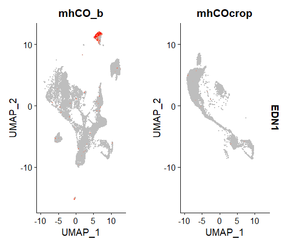<!-- -->

MG activation genes:

``` r
mg.activation.markers <- c("AIF1", "C1QC", "CSF1R", "LCP1", "PTPRC", "CTSS")
DotPlot(mhCO.combined, features = mg.activation.markers, cols = c("blue", "red"), dot.scale = 8, split.by = "orig.ident") +
  RotatedAxis()
```

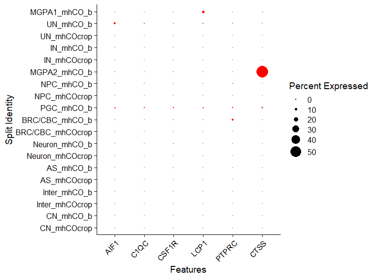

It looks like we have no microglial activation in CRISPRi sample.

### Phagocytosis markers

``` r
phagocytic.markers <- c("NCF4","ANXA2","CYBA","MYH9","CLEC7A","CD44","ITGB2", "FCER1G","ABCA1","CD36", "CD68")

DotPlot(mhCO.combined, features = phagocytic.markers, cols = c("blue", "red"), dot.scale = 8, split.by = "orig.ident") +
  RotatedAxis()
```

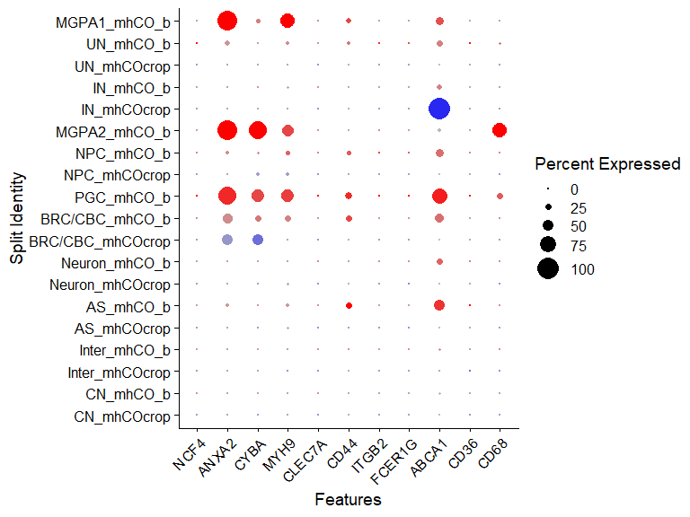

### Ferropotosis mediators markers

``` r
FeaturePlot(mhCO.combined, features = c("PHKG2", "TXNRD1", "PPARG"), split.by = "orig.ident", max.cutoff = 3,
            cols = c("grey", "red"))
```

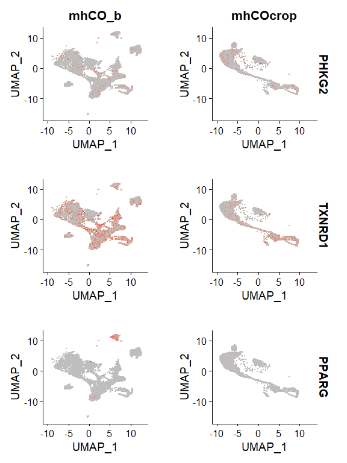<!-- -->

# Gene ontology analysis

We run GO on Unkown cluster to gather some more insights.

``` r
library(GOstats)
#> Warning: il pacchetto 'GOstats' è stato creato con R versione 4.2.1
#> Caricamento del pacchetto richiesto: Category
#> Warning: il pacchetto 'Category' è stato creato con R versione 4.2.1
#> Caricamento del pacchetto richiesto: AnnotationDbi
#> Warning: il pacchetto 'AnnotationDbi' è stato creato con R versione 4.2.1
#> 
#> Caricamento pacchetto: 'AnnotationDbi'
#> Il seguente oggetto è mascherato da 'package:dplyr':
#> 
#>     select
#> Caricamento del pacchetto richiesto: graph
#> Warning: il pacchetto 'graph' è stato creato con R versione 4.2.1
#> 
#> 
#> Caricamento pacchetto: 'GOstats'
#> Il seguente oggetto è mascherato da 'package:AnnotationDbi':
#> 
#>     makeGOGraph
library(GO.db)
library(org.Hs.eg.db)
#> 
hs <- org.Hs.eg.db
```

``` r
GeneUniverse <- read.table("D:/OneDrive - Università degli Studi di Milano/PoliMirco/Secondo anno/Primo semestre/Neurogenomics/Exam/microglia-like/mhCO/GSM5345019_mhCO_features.tsv", header = FALSE )
GeneUniverse.symbols <- GeneUniverse$V2 
Universe_symbol_entrez <- select(hs, keys = GeneUniverse.symbols, columns = c("ENTREZID","SYMBOL"), keytype = "SYMBOL")
#> 'select()' returned many:many mapping between keys and columns
Universe.entrezIDs <- Universe_symbol_entrez$ENTREZID
```

``` r
UN.mark <- CropALL.mark[CropALL.mark$cluster=='UN',]
UN.symbols <- UN.mark$gene
UN_symbol_entrez <- select(hs, keys = UN.symbols, columns = c("ENTREZID","SYMBOL"), keytype = "SYMBOL")
#> 'select()' returned 1:1 mapping between keys and columns
UN.entrezIDs <- UN_symbol_entrez$ENTREZID
```

``` r

upParams = new("GOHyperGParams",geneIds = UN.entrezIDs,universeGeneIds = Universe.entrezIDs,
               annotation="org.Hs.eg.db",ontology="BP",pvalueCutoff=0.01,
               conditional=FALSE, testDirection="over")
#> Warning in makeValidParams(.Object): removing duplicate IDs in universeGeneIds

upBP = hyperGTest(upParams)

summary(upBP)[1:10,]
#>        GOBPID       Pvalue OddsRatio     ExpCount Count Size
#> 1  GO:2000016 0.0001240772       Inf 0.0001240772     1    2
#> 2  GO:1990442 0.0001861158       Inf 0.0001861158     1    3
#> 3  GO:2000015 0.0002481544       Inf 0.0002481544     1    4
#> 4  GO:0032792 0.0003101929       Inf 0.0003101929     1    5
#> 5  GO:0071500 0.0003722315       Inf 0.0003722315     1    6
#> 6  GO:1903026 0.0003722315       Inf 0.0003722315     1    6
#> 7  GO:0032713 0.0004342701       Inf 0.0004342701     1    7
#> 8  GO:0001955 0.0004963087       Inf 0.0004963087     1    8
#> 9  GO:0036500 0.0005583473       Inf 0.0005583473     1    9
#> 10 GO:0048263 0.0005583473       Inf 0.0005583473     1    9
#>                                                                                        Term
#> 1                                   negative regulation of determination of dorsal identity
#> 2                   intrinsic apoptotic signaling pathway in response to nitrosative stress
#> 3                                            regulation of determination of dorsal identity
#> 4                                 negative regulation of CREB transcription factor activity
#> 5                                                   cellular response to nitrosative stress
#> 6  negative regulation of RNA polymerase II regulatory region sequence-specific DNA binding
#> 7                                           negative regulation of interleukin-4 production
#> 8                                                                   blood vessel maturation
#> 9                                                   ATF6-mediated unfolded protein response
#> 10                                                         determination of dorsal identity
```

# ssGSEA

``` r
library(dittoSeq)
#> Warning: il pacchetto 'dittoSeq' è stato creato con R versione 4.2.1
library(escape)
#> Warning: il pacchetto 'escape' è stato creato con R versione 4.2.1
```

Remove metadata that can interfere with computing of Enrichment
Score(ES)

``` r
mhCO.combined@meta.data$nCount_RNA <- NULL
mhCO.combined@meta.data$nFeature_RNA <- NULL
mhCO.combined@meta.data$percent_mito <- NULL
mhCO.combined@meta.data$percent_ribo <- NULL
mhCO.combined@meta.data$type <- NULL
mhCO.combined@meta.data$integrated_snn_res.0.4 <- NULL
```

## Getting Gene Sets

C2 = curated gene sets; C5 = ontology gene sets

``` r
GS.hallmark <- getGeneSets(library = "C2", gene.sets =c("KEGG_ABC_TRANSPORTERS",
                                                        "KEGG_ACUTE_MYELOID_LEUKEMIA",
                                                        "KEGG_ADHERENS_JUNCTION",
                                                        "KEGG_ADIPOCYTOKINE_SIGNALING_PATHWAY",
                                                        "KEGG_ALANINE_ASPARTATE_AND_GLUTAMATE_METABOLISM",
                                                        "KEGG_ALDOSTERONE_REGULATED_SODIUM_REABSORPTION",
                                                        "KEGG_ALLOGRAFT_REJECTION",
                                                        "KEGG_ALPHA_LINOLENIC_ACID_METABOLISM",
                                                        "KEGG_ALZHEIMERS_DISEASE",
                                                        "KEGG_AMINO_SUGAR_AND_NUCLEOTIDE_SUGAR_METABOLISM",
                                                        "KEGG_AMINOACYL_TRNA_BIOSYNTHESIS",
                                                        "KEGG_AMYOTROPHIC_LATERAL_SCLEROSIS_ALS",
                                                        "KEGG_ANTIGEN_PROCESSING_AND_PRESENTATION",
                                                        "KEGG_APOPTOSIS",
                                                        "KEGG_ARACHIDONIC_ACID_METABOLISM",
                                                        "KEGG_ARGININE_AND_PROLINE_METABOLISM",
                                                    "KEGG_ARRHYTHMOGENIC_RIGHT_VENTRICULAR_CARDIOMYOPATHY_ARVC",
                                                        "KEGG_ASCORBATE_AND_ALDARATE_METABOLISM",
                                                        "KEGG_ASTHMA",
                                                        "KEGG_AUTOIMMUNE_THYROID_DISEASE",
                                                        "KEGG_AXON_GUIDANCE",
                                                        "KEGG_B_CELL_RECEPTOR_SIGNALING_PATHWAY",
                                                        "KEGG_BASAL_CELL_CARCINOMA",
                                                        "KEGG_BASAL_TRANSCRIPTION_FACTORS",
                                                        "KEGG_BASE_EXCISION_REPAIR",
                                                        "KEGG_BETA_ALANINE_METABOLISM",
                                                        "KEGG_BIOSYNTHESIS_OF_UNSATURATED_FATTY_ACIDS",
                                                        "KEGG_BLADDER_CANCER",
                                                        "KEGG_BUTANOATE_METABOLISM",
                                                        "KEGG_CALCIUM_SIGNALING_PATHWAY",
                                                        "KEGG_CARDIAC_MUSCLE_CONTRACTION",
                                                        "KEGG_CELL_ADHESION_MOLECULES_CAMS",
                                                        "KEGG_CELL_CYCLE",
                                                        "KEGG_CHEMOKINE_SIGNALING_PATHWAY",
                                                        "KEGG_CHRONIC_MYELOID_LEUKEMIA",
                                                        "KEGG_CIRCADIAN_RHYTHM_MAMMAL",
                                                        "KEGG_CITRATE_CYCLE_TCA_CYCLE",
                                                        "KEGG_COLORECTAL_CANCER",
                                                        "KEGG_COMPLEMENT_AND_COAGULATION_CASCADES",
                                                        "KEGG_CYSTEINE_AND_METHIONINE_METABOLISM",
                                                        "KEGG_CYTOKINE_CYTOKINE_RECEPTOR_INTERACTION",
                                                        "KEGG_CYTOSOLIC_DNA_SENSING_PATHWAY",
                                                        "KEGG_DILATED_CARDIOMYOPATHY",
                                                        "KEGG_DNA_REPLICATION",
                                                        "KEGG_DORSO_VENTRAL_AXIS_FORMATION",
                                                        "KEGG_DRUG_METABOLISM_CYTOCHROME_P450",
                                                        "KEGG_DRUG_METABOLISM_OTHER_ENZYMES",
                                                        "KEGG_ECM_RECEPTOR_INTERACTION",
                                                        "KEGG_ENDOCYTOSIS",
                                                        "KEGG_ENDOMETRIAL_CANCER",
                                              "KEGG_EPITHELIAL_CELL_SIGNALING_IN_HELICOBACTER_PYLORI_INFECTION",
                                                        "KEGG_ERBB_SIGNALING_PATHWAY",
                                                        "KEGG_ETHER_LIPID_METABOLISM",
                                                        "KEGG_FATTY_ACID_METABOLISM",
                                                        "KEGG_FC_EPSILON_RI_SIGNALING_PATHWAY",
                                                        "KEGG_FC_GAMMA_R_MEDIATED_PHAGOCYTOSIS",
                                                        "KEGG_FOCAL_ADHESION",
                                                        "KEGG_FOLATE_BIOSYNTHESIS",
                                                        "KEGG_FRUCTOSE_AND_MANNOSE_METABOLISM",
                                                        "KEGG_GALACTOSE_METABOLISM",
                                                        "KEGG_GAP_JUNCTION",
                                                        "KEGG_GLIOMA",
                                                        "KEGG_GLUTATHIONE_METABOLISM",
                                                        "KEGG_GLYCEROLIPID_METABOLISM",
                                                        "KEGG_GLYCEROPHOSPHOLIPID_METABOLISM",
                                                        "KEGG_GLYCINE_SERINE_AND_THREONINE_METABOLISM",
                                                        "KEGG_GLYCOLYSIS_GLUCONEOGENESIS",
                                                      "KEGG_GLYCOSAMINOGLYCAN_BIOSYNTHESIS_CHONDROITIN_SULFATE",
                                                        "KEGG_GLYCOSAMINOGLYCAN_BIOSYNTHESIS_HEPARAN_SULFATE",
                                                        "KEGG_GLYCOSAMINOGLYCAN_BIOSYNTHESIS_KERATAN_SULFATE",
                                                        "KEGG_GLYCOSAMINOGLYCAN_DEGRADATION",
                                                        "KEGG_GLYCOSPHINGOLIPID_BIOSYNTHESIS_GANGLIO_SERIES",
                                                        "KEGG_GLYCOSPHINGOLIPID_BIOSYNTHESIS_GLOBO_SERIES",
                                              "KEGG_GLYCOSPHINGOLIPID_BIOSYNTHESIS_LACTO_AND_NEOLACTO_SERIES",
                                                  "KEGG_GLYCOSYLPHOSPHATIDYLINOSITOL_GPI_ANCHOR_BIOSYNTHESIS",
                                                        "KEGG_GLYOXYLATE_AND_DICARBOXYLATE_METABOLISM",
                                                        "KEGG_GNRH_SIGNALING_PATHWAY",
                                                        "KEGG_GRAFT_VERSUS_HOST_DISEASE",
                                                        "KEGG_HEDGEHOG_SIGNALING_PATHWAY",
                                                        "KEGG_HEMATOPOIETIC_CELL_LINEAGE",
                                                        "KEGG_HISTIDINE_METABOLISM",
                                                        "KEGG_HOMOLOGOUS_RECOMBINATION",
                                                        "KEGG_HUNTINGTONS_DISEASE",
                                                        "KEGG_HYPERTROPHIC_CARDIOMYOPATHY_HCM",
                                                        "KEGG_INOSITOL_PHOSPHATE_METABOLISM",
                                                        "KEGG_INSULIN_SIGNALING_PATHWAY",
                                                        "KEGG_INTESTINAL_IMMUNE_NETWORK_FOR_IGA_PRODUCTION",
                                                        "KEGG_JAK_STAT_SIGNALING_PATHWAY",
                                                        "KEGG_LEISHMANIA_INFECTION",
                                                        "KEGG_LEUKOCYTE_TRANSENDOTHELIAL_MIGRATION",
                                                        "KEGG_LIMONENE_AND_PINENE_DEGRADATION",
                                                        "KEGG_LINOLEIC_ACID_METABOLISM",
                                                        "KEGG_LONG_TERM_DEPRESSION",
                                                        "KEGG_LONG_TERM_POTENTIATION",
                                                        "KEGG_LYSINE_DEGRADATION",
                                                        "KEGG_LYSOSOME",
                                                        "KEGG_MAPK_SIGNALING_PATHWAY",
                                                        "KEGG_MATURITY_ONSET_DIABETES_OF_THE_YOUNG",
                                                        "KEGG_MELANOGENESIS",
                                                        "KEGG_MELANOMA",
                                                        "KEGG_METABOLISM_OF_XENOBIOTICS_BY_CYTOCHROME_P450",
                                                        "KEGG_MISMATCH_REPAIR",
                                                        "KEGG_MTOR_SIGNALING_PATHWAY",
                                                        "KEGG_N_GLYCAN_BIOSYNTHESIS",
                                                        "KEGG_NATURAL_KILLER_CELL_MEDIATED_CYTOTOXICITY",
                                                        "KEGG_NEUROACTIVE_LIGAND_RECEPTOR_INTERACTION",
                                                        "KEGG_NEUROTROPHIN_SIGNALING_PATHWAY",
                                                        "KEGG_NICOTINATE_AND_NICOTINAMIDE_METABOLISM",
                                                        "KEGG_NITROGEN_METABOLISM",
                                                        "KEGG_NOD_LIKE_RECEPTOR_SIGNALING_PATHWAY",
                                                        "KEGG_NON_HOMOLOGOUS_END_JOINING",
                                                        "KEGG_NON_SMALL_CELL_LUNG_CANCER",
                                                        "KEGG_NOTCH_SIGNALING_PATHWAY",
                                                        "KEGG_NUCLEOTIDE_EXCISION_REPAIR",
                                                        "KEGG_O_GLYCAN_BIOSYNTHESIS",
                                                        "KEGG_OLFACTORY_TRANSDUCTION",
                                                        "KEGG_ONE_CARBON_POOL_BY_FOLATE",
                                                        "KEGG_OOCYTE_MEIOSIS",
                                                        "KEGG_OTHER_GLYCAN_DEGRADATION",
                                                        "KEGG_OXIDATIVE_PHOSPHORYLATION",
                                                        "KEGG_P53_SIGNALING_PATHWAY",
                                                        "KEGG_PANCREATIC_CANCER",
                                                        "KEGG_PANTOTHENATE_AND_COA_BIOSYNTHESIS",
                                                        "KEGG_PARKINSONS_DISEASE",
                                                        "KEGG_PATHOGENIC_ESCHERICHIA_COLI_INFECTION",
                                                        "KEGG_PATHWAYS_IN_CANCER",
                                                        "KEGG_PENTOSE_AND_GLUCURONATE_INTERCONVERSIONS",
                                                        "KEGG_PENTOSE_PHOSPHATE_PATHWAY",
                                                        "KEGG_PEROXISOME",
                                                        "KEGG_PHENYLALANINE_METABOLISM",
                                                        "KEGG_PHOSPHATIDYLINOSITOL_SIGNALING_SYSTEM",
                                                        "KEGG_PORPHYRIN_AND_CHLOROPHYLL_METABOLISM",
                                                        "KEGG_PPAR_SIGNALING_PATHWAY",
                                                        "KEGG_PRIMARY_BILE_ACID_BIOSYNTHESIS",
                                                        "KEGG_PRIMARY_IMMUNODEFICIENCY",
                                                        "KEGG_PRION_DISEASES",
                                                        "KEGG_PROGESTERONE_MEDIATED_OOCYTE_MATURATION",
                                                        "KEGG_PROPANOATE_METABOLISM",
                                                        "KEGG_PROSTATE_CANCER",
                                                        "KEGG_PROTEASOME",
                                                        "KEGG_PROTEIN_EXPORT",
                                                        "KEGG_PROXIMAL_TUBULE_BICARBONATE_RECLAMATION",
                                                        "KEGG_PURINE_METABOLISM",
                                                        "KEGG_PYRIMIDINE_METABOLISM",
                                                        "KEGG_PYRUVATE_METABOLISM",
                                                        "KEGG_REGULATION_OF_ACTIN_CYTOSKELETON",
                                                        "KEGG_REGULATION_OF_AUTOPHAGY",
                                                        "KEGG_RENAL_CELL_CARCINOMA",
                                                        "KEGG_RENIN_ANGIOTENSIN_SYSTEM",
                                                        "KEGG_RETINOL_METABOLISM",
                                                        "KEGG_RIBOFLAVIN_METABOLISM",
                                                        "KEGG_RIBOSOME",
                                                        "KEGG_RIG_I_LIKE_RECEPTOR_SIGNALING_PATHWAY",
                                                        "KEGG_RNA_DEGRADATION",
                                                        "KEGG_RNA_POLYMERASE",
                                                        "KEGG_SELENOAMINO_ACID_METABOLISM",
                                                        "KEGG_SMALL_CELL_LUNG_CANCER",
                                                        "KEGG_SNARE_INTERACTIONS_IN_VESICULAR_TRANSPORT",
                                                        "KEGG_SPHINGOLIPID_METABOLISM",
                                                        "KEGG_SPLICEOSOME",
                                                        "KEGG_STARCH_AND_SUCROSE_METABOLISM",
                                                        "KEGG_STEROID_BIOSYNTHESIS",
                                                        "KEGG_STEROID_HORMONE_BIOSYNTHESIS",
                                                        "KEGG_SULFUR_METABOLISM",
                                                        "KEGG_SYSTEMIC_LUPUS_ERYTHEMATOSUS",
                                                        "KEGG_T_CELL_RECEPTOR_SIGNALING_PATHWAY",
                                                        "KEGG_TASTE_TRANSDUCTION",
                                                        "KEGG_TAURINE_AND_HYPOTAURINE_METABOLISM",
                                                        "KEGG_TERPENOID_BACKBONE_BIOSYNTHESIS",
                                                        "KEGG_TGF_BETA_SIGNALING_PATHWAY",
                                                        "KEGG_THYROID_CANCER",
                                                        "KEGG_TIGHT_JUNCTION",
                                                        "KEGG_TOLL_LIKE_RECEPTOR_SIGNALING_PATHWAY",
                                                        "KEGG_TRYPTOPHAN_METABOLISM",
                                                        "KEGG_TYPE_I_DIABETES_MELLITUS",
                                                        "KEGG_TYPE_II_DIABETES_MELLITUS",
                                                        "KEGG_TYROSINE_METABOLISM",
                                                        "KEGG_UBIQUITIN_MEDIATED_PROTEOLYSIS",
                                                        "KEGG_VALINE_LEUCINE_AND_ISOLEUCINE_BIOSYNTHESIS",
                                                        "KEGG_VALINE_LEUCINE_AND_ISOLEUCINE_DEGRADATION",
                                                        "KEGG_VASCULAR_SMOOTH_MUSCLE_CONTRACTION",
                                                        "KEGG_VASOPRESSIN_REGULATED_WATER_REABSORPTION",
                                                        "KEGG_VEGF_SIGNALING_PATHWAY",
                                                        "KEGG_VIBRIO_CHOLERAE_INFECTION",
                                                        "KEGG_VIRAL_MYOCARDITIS",
                                                        "KEGG_WNT_SIGNALING_PATHWAY") )
```

## Enrichment

The next step is performing the enrichment on the RNA count data The
function enrichIt() can handle either a matrix of raw count data or will
pull that data directly from a Seurat object. The enrichment scores will
be calculated across all individual cells

``` r

ES.mhCO <- enrichIt(obj = mhCO.combined, gene.sets = GS.hallmark, groups = 1000, cores = 4)
#> [1] "Using sets of 1000 cells. Running 21 times."
#> Setting parallel calculations through a SnowParam back-end
#> with workers=4 and tasks=100.
#> Estimating ssGSEA scores for 186 gene sets.
#> [1] "Calculating ranks..."
#> [1] "Calculating absolute values from ranks..."
#> Setting parallel calculations through a SnowParam back-end
#> with workers=4 and tasks=100.
#> Estimating ssGSEA scores for 186 gene sets.
#> [1] "Calculating ranks..."
#> [1] "Calculating absolute values from ranks..."
#> Setting parallel calculations through a SnowParam back-end
#> with workers=4 and tasks=100.
#> Estimating ssGSEA scores for 186 gene sets.
#> [1] "Calculating ranks..."
#> [1] "Calculating absolute values from ranks..."
#> Setting parallel calculations through a SnowParam back-end
#> with workers=4 and tasks=100.
#> Estimating ssGSEA scores for 186 gene sets.
#> [1] "Calculating ranks..."
#> [1] "Calculating absolute values from ranks..."
#> Setting parallel calculations through a SnowParam back-end
#> with workers=4 and tasks=100.
#> Estimating ssGSEA scores for 186 gene sets.
#> [1] "Calculating ranks..."
#> [1] "Calculating absolute values from ranks..."
#> Setting parallel calculations through a SnowParam back-end
#> with workers=4 and tasks=100.
#> Estimating ssGSEA scores for 186 gene sets.
#> [1] "Calculating ranks..."
#> [1] "Calculating absolute values from ranks..."
#> Setting parallel calculations through a SnowParam back-end
#> with workers=4 and tasks=100.
#> Estimating ssGSEA scores for 186 gene sets.
#> [1] "Calculating ranks..."
#> [1] "Calculating absolute values from ranks..."
#> Setting parallel calculations through a SnowParam back-end
#> with workers=4 and tasks=100.
#> Estimating ssGSEA scores for 186 gene sets.
#> [1] "Calculating ranks..."
#> [1] "Calculating absolute values from ranks..."
#> Setting parallel calculations through a SnowParam back-end
#> with workers=4 and tasks=100.
#> Estimating ssGSEA scores for 186 gene sets.
#> [1] "Calculating ranks..."
#> [1] "Calculating absolute values from ranks..."
#> Setting parallel calculations through a SnowParam back-end
#> with workers=4 and tasks=100.
#> Estimating ssGSEA scores for 186 gene sets.
#> [1] "Calculating ranks..."
#> [1] "Calculating absolute values from ranks..."
#> Setting parallel calculations through a SnowParam back-end
#> with workers=4 and tasks=100.
#> Estimating ssGSEA scores for 186 gene sets.
#> [1] "Calculating ranks..."
#> [1] "Calculating absolute values from ranks..."
#> Setting parallel calculations through a SnowParam back-end
#> with workers=4 and tasks=100.
#> Estimating ssGSEA scores for 186 gene sets.
#> [1] "Calculating ranks..."
#> [1] "Calculating absolute values from ranks..."
#> Setting parallel calculations through a SnowParam back-end
#> with workers=4 and tasks=100.
#> Estimating ssGSEA scores for 186 gene sets.
#> [1] "Calculating ranks..."
#> [1] "Calculating absolute values from ranks..."
#> Setting parallel calculations through a SnowParam back-end
#> with workers=4 and tasks=100.
#> Estimating ssGSEA scores for 186 gene sets.
#> [1] "Calculating ranks..."
#> [1] "Calculating absolute values from ranks..."
#> Setting parallel calculations through a SnowParam back-end
#> with workers=4 and tasks=100.
#> Estimating ssGSEA scores for 186 gene sets.
#> [1] "Calculating ranks..."
#> [1] "Calculating absolute values from ranks..."
#> Setting parallel calculations through a SnowParam back-end
#> with workers=4 and tasks=100.
#> Estimating ssGSEA scores for 186 gene sets.
#> [1] "Calculating ranks..."
#> [1] "Calculating absolute values from ranks..."
#> Setting parallel calculations through a SnowParam back-end
#> with workers=4 and tasks=100.
#> Estimating ssGSEA scores for 186 gene sets.
#> [1] "Calculating ranks..."
#> [1] "Calculating absolute values from ranks..."
#> Setting parallel calculations through a SnowParam back-end
#> with workers=4 and tasks=100.
#> Estimating ssGSEA scores for 186 gene sets.
#> [1] "Calculating ranks..."
#> [1] "Calculating absolute values from ranks..."
#> Setting parallel calculations through a SnowParam back-end
#> with workers=4 and tasks=100.
#> Estimating ssGSEA scores for 186 gene sets.
#> [1] "Calculating ranks..."
#> [1] "Calculating absolute values from ranks..."
#> Setting parallel calculations through a SnowParam back-end
#> with workers=4 and tasks=100.
#> Estimating ssGSEA scores for 186 gene sets.
#> [1] "Calculating ranks..."
#> [1] "Calculating absolute values from ranks..."
#> Setting parallel calculations through a SnowParam back-end
#> with workers=4 and tasks=100.
#> Estimating ssGSEA scores for 186 gene sets.
#> [1] "Calculating ranks..."
#> [1] "Calculating absolute values from ranks..."
```

We can then easily add these results back to our Seurat object.

``` r
mhCO.combined <- Seurat::AddMetaData(mhCO.combined, ES.mhCO)
```

### Visualizations

The easiest way to generate almost any visualization for single cell
data is via dittoSeq, which is an extremely flexible visualization
package for both bulk and single-cell RNA-seq data that works very well
for both expression data and metadata.

To keep things consistent, we’ll define a pleasing color scheme.

``` r
colors <- colorRampPalette(c("#0348A6", "#7AC5FF", "#C6FDEC", "#FFB433", "#FF4B20"))
```

Heatmaps A simple way to approach visualizations for enrichment results
is the heatmap:

``` r
dittoHeatmap(mhCO.combined, genes = NULL, metas = names(ES.mhCO), 
             annot.by = "orig.ident", 
             fontsize = 7, 
             cluster_cols = TRUE,
             heatmap.colors = colors(50))              
```

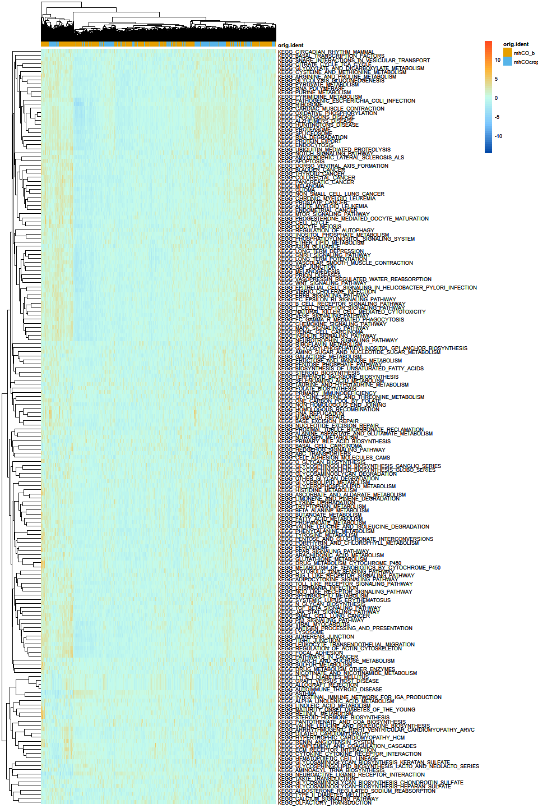

We better produce a heatmap with select gene sets by providing specific
names to the metas parameter. For example, we can isolate gene sets
involved in Alzheimer’s and Parkinson’s disease.

``` r

dittoHeatmap(mhCO.combined, genes = NULL, 
             metas = c("KEGG_ALZHEIMERS_DISEASE", "KEGG_PARKINSONS_DISEASE",
                       "KEGG_HUNTINGTONS_DISEASE"), 
             annot.by = c("seurat_clusters","orig.ident"), 
             fontsize = 7,
             heatmap.colors = colors(50))
```

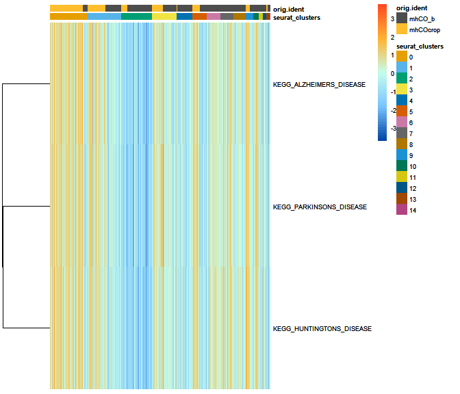

Violin Plots Another way to visualize a subset of gene set enrichment
would be to graph the distribution of enrichment using violin, jitter,
boxplot, or ridgeplots. We can also compare between categorical
variables using the group.by parameter.

``` r
multi_dittoPlot(mhCO.combined, vars = c("KEGG_ALZHEIMERS_DISEASE", "KEGG_PARKINSONS_DISEASE",
                       "KEGG_HUNTINGTONS_DISEASE"), 
                group.by = c("orig.ident"), plots = c("jitter", "vlnplot", "boxplot"), 
                ylab = "Enrichment Scores", 
                theme = theme_classic() + theme(plot.title = element_text(size = 10)))
```

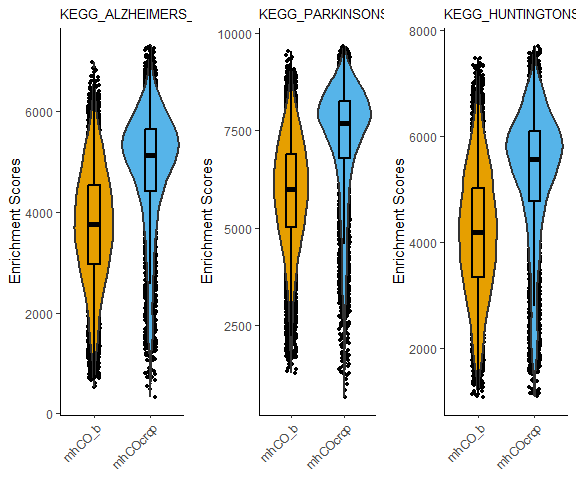

LTD; LTP

``` r
multi_dittoPlot(mhCO.combined, vars = c("KEGG_LONG_TERM_DEPRESSION", "KEGG_LONG_TERM_POTENTIATION"), 
                group.by = c("orig.ident"), plots = c("jitter", "vlnplot", "boxplot"), 
                ylab = "Enrichment Scores", 
                theme = theme_classic() + theme(plot.title = element_text(size = 10)))
```

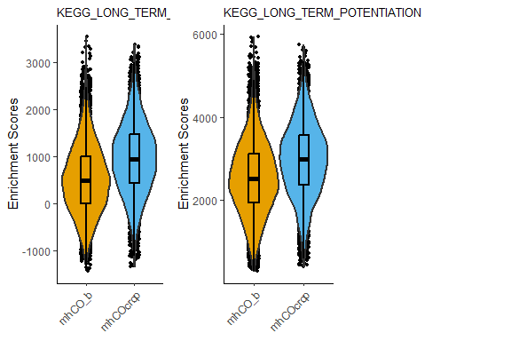<!-- -->

Another interesting point concerns the same analysis performed on
different cell clusters.

``` r
multi_dittoPlot(mhCO.combined, vars = c("KEGG_ALZHEIMERS_DISEASE", "KEGG_PARKINSONS_DISEASE",
                                       "KEGG_HUNTINGTONS_DISEASE"), 
                group.by = c("seurat_clusters"), plots = c("jitter", "vlnplot", "boxplot"), 
                ylab = "Enrichment Scores", 
                theme = theme_classic() + theme(plot.title = element_text(size = 10)))
```

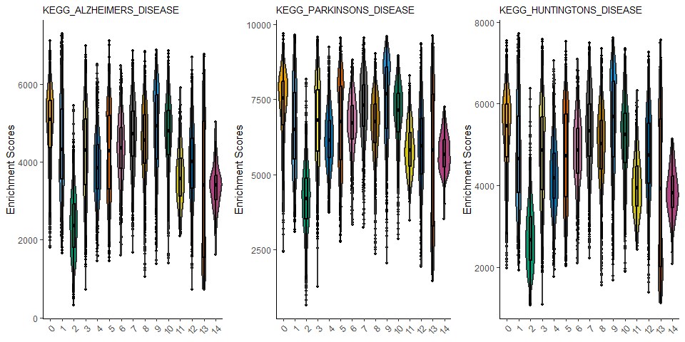

- Hex Density Enrichment Plots

``` r
dittoScatterHex(mhCO.combined, x.var = "KEGG_ALZHEIMERS_DISEASE",
                y.var = "KEGG_PARKINSONS_DISEASE",
                do.contour = TRUE) + 
  scale_fill_gradientn(colors = colors(11))
#> Scale for fill is already present.
#> Adding another scale for fill, which will replace the existing scale.
#> Warning: Computation failed in `stat_binhex()`
#> Caused by error in `compute_group()`:
#> ! The package `hexbin` is required for `stat_binhex()`
```

<!-- -->

Let’s assess the distributions in the different samples.

``` r
dittoScatterHex(mhCO.combined, x.var = "KEGG_ALZHEIMERS_DISEASE", 
                y.var = "KEGG_PARKINSONS_DISEASE", 
                do.contour = TRUE,
                split.by = "orig.ident")  + 
scale_fill_gradientn(colors = colors(11))
#> Scale for fill is already present.
#> Adding another scale for fill, which will replace the existing scale.
#> Warning: Computation failed in `stat_binhex()`
#> Computation failed in `stat_binhex()`
#> Caused by error in `compute_group()`:
#> ! The package `hexbin` is required for `stat_binhex()`
```

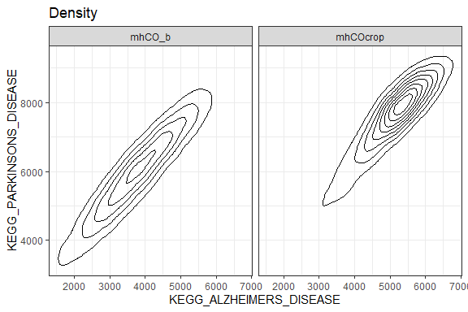<!-- -->

It seems like that, having little microglia-related cells, we recovered
the Alzherimer’s phenotype present in hCO treated with Aβ.

``` r
ES2 <- data.frame(mhCO.combined[[]], Idents(mhCO.combined))
colnames(ES2)[ncol(ES2)] <- "cluster"
```

- Ridge Plots The next step we will do is to evaluate Enrichment score
  per each cell cluster, depicted in the following ridge plots.

First we will assess Alzheimer’s disease ES’s:

``` r
ridgeEnrichment(ES2, gene.set = "KEGG_ALZHEIMERS_DISEASE", group = "cluster", add.rug = TRUE)
#> Picking joint bandwidth of 206
```

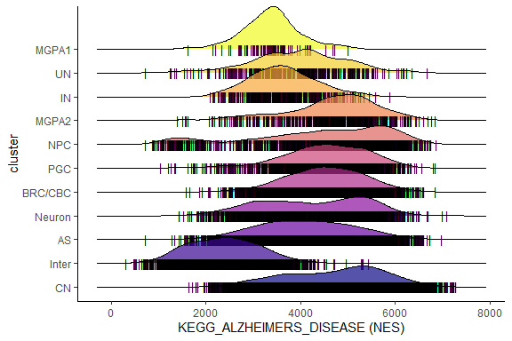<!-- -->

``` r
ridgeEnrichment(ES2, gene.set = "KEGG_ALZHEIMERS_DISEASE", group = "cluster", 
                facet = "orig.ident", add.rug = TRUE)
#> Picking joint bandwidth of 198
#> Picking joint bandwidth of 274
```

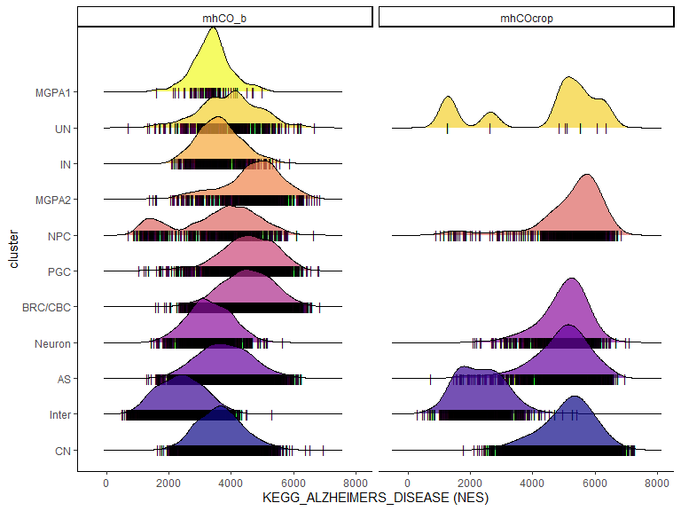

and finally, apoptosis levels:

``` r
ridgeEnrichment(ES2, gene.set = "KEGG_APOPTOSIS", group = "cluster", 
                facet = "orig.ident", add.rug = TRUE)
#> Picking joint bandwidth of 111
#> Picking joint bandwidth of 120
```

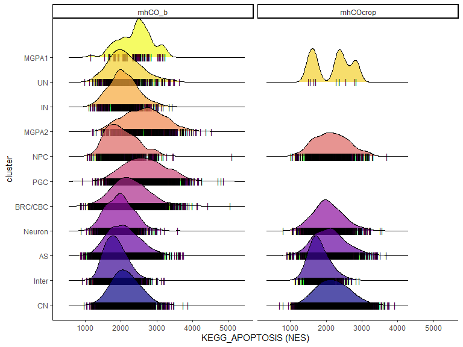

Split Violin Plots

``` r
splitEnrichment(ES2, split = "orig.ident", gene.set = "KEGG_ALZHEIMERS_DISEASE")
```

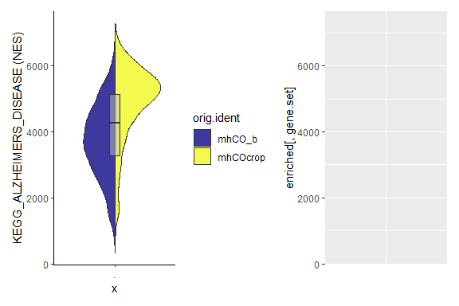<!-- -->

### Expanded Analysis

``` r
PCA <- performPCA(enriched = ES2, groups = c("orig.ident", "cluster"))
pcaEnrichment(PCA, PCx = "PC1", PCy = "PC2", contours = TRUE)
#> Warning: Computation failed in `stat_binhex()`
#> Caused by error in `compute_group()`:
#> ! The package `hexbin` is required for `stat_binhex()`
```

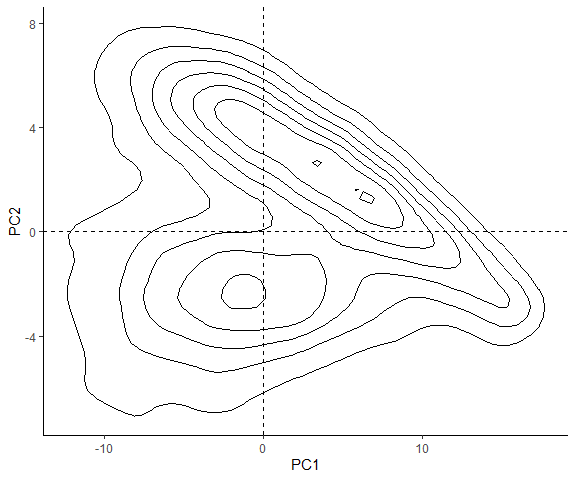
We can also look at the pcaEnrichment() output separated by categorical
factors using the facet parameter, for example using the cluster
assignment.

``` r
pcaEnrichment(PCA, PCx = "PC1", PCy = "PC2", contours = FALSE, facet = "cluster") 
#> Warning: Computation failed in `stat_binhex()`
#> Computation failed in `stat_binhex()`
#> Computation failed in `stat_binhex()`
#> Computation failed in `stat_binhex()`
#> Computation failed in `stat_binhex()`
#> Computation failed in `stat_binhex()`
#> Computation failed in `stat_binhex()`
#> Computation failed in `stat_binhex()`
#> Computation failed in `stat_binhex()`
#> Computation failed in `stat_binhex()`
#> Computation failed in `stat_binhex()`
#> Caused by error in `compute_group()`:
#> ! The package `hexbin` is required for `stat_binhex()`
```

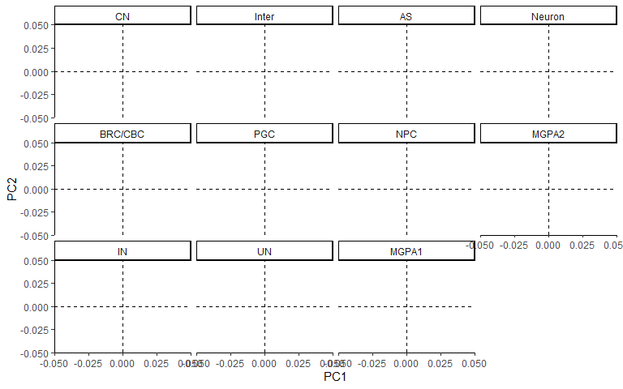

We can more closely examine the construction of the PCA by looking at
the contribution of each gene set to the respective principal component
using masterPCAPlot() with the same input as above with the
pcaEnrichment(). We can also control the number of gene sets plotted
with top.contribution. (currently in development)

``` r

#masterPCAPlot(ES2, PCx = "PC1", PCy = "PC2", top.contribution = 10)
```

### Signficance

We can also look for significant differences using linear modeling from
the limma package, Welch’s T test or one-way ANOVA using
getSignificance().

``` r

output <- getSignificance(ES2, group = "orig.ident", fit = "T.test")
head(output, 20)
#>                                                           T.statistic
#> KEGG_ABC_TRANSPORTERS                                       38.345602
#> KEGG_ACUTE_MYELOID_LEUKEMIA                                  3.662446
#> KEGG_ADHERENS_JUNCTION                                      22.942260
#> KEGG_ADIPOCYTOKINE_SIGNALING_PATHWAY                        28.738856
#> KEGG_ALANINE_ASPARTATE_AND_GLUTAMATE_METABOLISM             25.624047
#> KEGG_ALDOSTERONE_REGULATED_SODIUM_REABSORPTION             -39.914560
#> KEGG_ALLOGRAFT_REJECTION                                    37.468121
#> KEGG_ALPHA_LINOLENIC_ACID_METABOLISM                         8.428261
#> KEGG_ALZHEIMERS_DISEASE                                    -70.940450
#> KEGG_AMINOACYL_TRNA_BIOSYNTHESIS                           -10.750783
#> KEGG_AMINO_SUGAR_AND_NUCLEOTIDE_SUGAR_METABOLISM           -13.888809
#> KEGG_AMYOTROPHIC_LATERAL_SCLEROSIS_ALS                     -35.737134
#> KEGG_ANTIGEN_PROCESSING_AND_PRESENTATION                    22.112449
#> KEGG_APOPTOSIS                                               1.657924
#> KEGG_ARACHIDONIC_ACID_METABOLISM                             9.519410
#> KEGG_ARGININE_AND_PROLINE_METABOLISM                       -19.220331
#> KEGG_ARRHYTHMOGENIC_RIGHT_VENTRICULAR_CARDIOMYOPATHY_ARVC   67.216925
#> KEGG_ASCORBATE_AND_ALDARATE_METABOLISM                      15.582813
#> KEGG_ASTHMA                                                 36.667911
#> KEGG_AUTOIMMUNE_THYROID_DISEASE                             36.430546
#>                                                                 p.value
#> KEGG_ABC_TRANSPORTERS                                     9.162248e-309
#> KEGG_ACUTE_MYELOID_LEUKEMIA                                2.505540e-04
#> KEGG_ADHERENS_JUNCTION                                    5.431791e-115
#> KEGG_ADIPOCYTOKINE_SIGNALING_PATHWAY                      1.719805e-177
#> KEGG_ALANINE_ASPARTATE_AND_GLUTAMATE_METABOLISM           4.677958e-142
#> KEGG_ALDOSTERONE_REGULATED_SODIUM_REABSORPTION             0.000000e+00
#> KEGG_ALLOGRAFT_REJECTION                                  1.063591e-294
#> KEGG_ALPHA_LINOLENIC_ACID_METABOLISM                       3.800906e-17
#> KEGG_ALZHEIMERS_DISEASE                                    0.000000e+00
#> KEGG_AMINOACYL_TRNA_BIOSYNTHESIS                           7.429419e-27
#> KEGG_AMINO_SUGAR_AND_NUCLEOTIDE_SUGAR_METABOLISM           1.305878e-43
#> KEGG_AMYOTROPHIC_LATERAL_SCLEROSIS_ALS                    1.148316e-268
#> KEGG_ANTIGEN_PROCESSING_AND_PRESENTATION                  6.105308e-107
#> KEGG_APOPTOSIS                                             9.735083e-02
#> KEGG_ARACHIDONIC_ACID_METABOLISM                           1.950302e-21
#> KEGG_ARGININE_AND_PROLINE_METABOLISM                       1.555179e-81
#> KEGG_ARRHYTHMOGENIC_RIGHT_VENTRICULAR_CARDIOMYOPATHY_ARVC  0.000000e+00
#> KEGG_ASCORBATE_AND_ALDARATE_METABOLISM                     2.235009e-54
#> KEGG_ASTHMA                                               1.606217e-283
#> KEGG_AUTOIMMUNE_THYROID_DISEASE                           1.662526e-279
#>                                                                     FDR
#> KEGG_ABC_TRANSPORTERS                                     1.346850e-306
#> KEGG_ACUTE_MYELOID_LEUKEMIA                                2.756094e-03
#> KEGG_ADHERENS_JUNCTION                                    5.214520e-113
#> KEGG_ADIPOCYTOKINE_SIGNALING_PATHWAY                      2.046567e-175
#> KEGG_ALANINE_ASPARTATE_AND_GLUTAMATE_METABOLISM           5.098974e-140
#> KEGG_ALDOSTERONE_REGULATED_SODIUM_REABSORPTION             0.000000e+00
#> KEGG_ALLOGRAFT_REJECTION                                  1.531570e-292
#> KEGG_ALPHA_LINOLENIC_ACID_METABOLISM                       1.406335e-15
#> KEGG_ALZHEIMERS_DISEASE                                    0.000000e+00
#> KEGG_AMINOACYL_TRNA_BIOSYNTHESIS                           3.640415e-25
#> KEGG_AMINO_SUGAR_AND_NUCLEOTIDE_SUGAR_METABOLISM           8.096443e-42
#> KEGG_AMYOTROPHIC_LATERAL_SCLEROSIS_ALS                    1.550226e-266
#> KEGG_ANTIGEN_PROCESSING_AND_PRESENTATION                  5.616884e-105
#> KEGG_APOPTOSIS                                             7.788066e-01
#> KEGG_ARACHIDONIC_ACID_METABOLISM                           8.386299e-20
#> KEGG_ARGININE_AND_PROLINE_METABOLISM                       1.353006e-79
#> KEGG_ARRHYTHMOGENIC_RIGHT_VENTRICULAR_CARDIOMYOPATHY_ARVC  0.000000e+00
#> KEGG_ASCORBATE_AND_ALDARATE_METABOLISM                     1.564506e-52
#> KEGG_ASTHMA                                               2.232642e-281
#> KEGG_AUTOIMMUNE_THYROID_DISEASE                           2.294286e-277
#>                                                           median.mhCOcrop
#> KEGG_ABC_TRANSPORTERS                                           -935.4289
#> KEGG_ACUTE_MYELOID_LEUKEMIA                                     2264.5447
#> KEGG_ADHERENS_JUNCTION                                          3217.4268
#> KEGG_ADIPOCYTOKINE_SIGNALING_PATHWAY                            2020.1618
#> KEGG_ALANINE_ASPARTATE_AND_GLUTAMATE_METABOLISM                 1254.1746
#> KEGG_ALDOSTERONE_REGULATED_SODIUM_REABSORPTION                  1415.6364
#> KEGG_ALLOGRAFT_REJECTION                                        -409.1279
#> KEGG_ALPHA_LINOLENIC_ACID_METABOLISM                           -4255.1426
#> KEGG_ALZHEIMERS_DISEASE                                         3751.6401
#> KEGG_AMINOACYL_TRNA_BIOSYNTHESIS                                3622.4303
#> KEGG_AMINO_SUGAR_AND_NUCLEOTIDE_SUGAR_METABOLISM                3604.5922
#> KEGG_AMYOTROPHIC_LATERAL_SCLEROSIS_ALS                          1267.9277
#> KEGG_ANTIGEN_PROCESSING_AND_PRESENTATION                        3476.8505
#> KEGG_APOPTOSIS                                                  2081.7547
#> KEGG_ARACHIDONIC_ACID_METABOLISM                               -3428.4114
#> KEGG_ARGININE_AND_PROLINE_METABOLISM                            1475.3468
#> KEGG_ARRHYTHMOGENIC_RIGHT_VENTRICULAR_CARDIOMYOPATHY_ARVC       2090.4280
#> KEGG_ASCORBATE_AND_ALDARATE_METABOLISM                         -2347.6809
#> KEGG_ASTHMA                                                     -323.4563
#> KEGG_AUTOIMMUNE_THYROID_DISEASE                                -1133.7759
#>                                                           median.mhCO_b
#> KEGG_ABC_TRANSPORTERS                                        -1174.2642
#> KEGG_ACUTE_MYELOID_LEUKEMIA                                   2271.5610
#> KEGG_ADHERENS_JUNCTION                                        2938.6437
#> KEGG_ADIPOCYTOKINE_SIGNALING_PATHWAY                          1831.2546
#> KEGG_ALANINE_ASPARTATE_AND_GLUTAMATE_METABOLISM               1024.1896
#> KEGG_ALDOSTERONE_REGULATED_SODIUM_REABSORPTION                1870.2920
#> KEGG_ALLOGRAFT_REJECTION                                      -675.5730
#> KEGG_ALPHA_LINOLENIC_ACID_METABOLISM                         -4298.5454
#> KEGG_ALZHEIMERS_DISEASE                                       5130.2914
#> KEGG_AMINOACYL_TRNA_BIOSYNTHESIS                              3719.3710
#> KEGG_AMINO_SUGAR_AND_NUCLEOTIDE_SUGAR_METABOLISM              3814.3377
#> KEGG_AMYOTROPHIC_LATERAL_SCLEROSIS_ALS                        1690.0271
#> KEGG_ANTIGEN_PROCESSING_AND_PRESENTATION                      3156.5062
#> KEGG_APOPTOSIS                                                2106.1844
#> KEGG_ARACHIDONIC_ACID_METABOLISM                             -3451.3778
#> KEGG_ARGININE_AND_PROLINE_METABOLISM                          1733.0453
#> KEGG_ARRHYTHMOGENIC_RIGHT_VENTRICULAR_CARDIOMYOPATHY_ARVC     1700.0218
#> KEGG_ASCORBATE_AND_ALDARATE_METABOLISM                       -2559.8892
#> KEGG_ASTHMA                                                   -624.7798
#> KEGG_AUTOIMMUNE_THYROID_DISEASE                              -1383.7430
```
